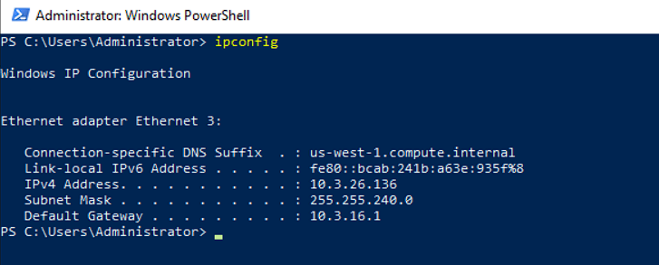
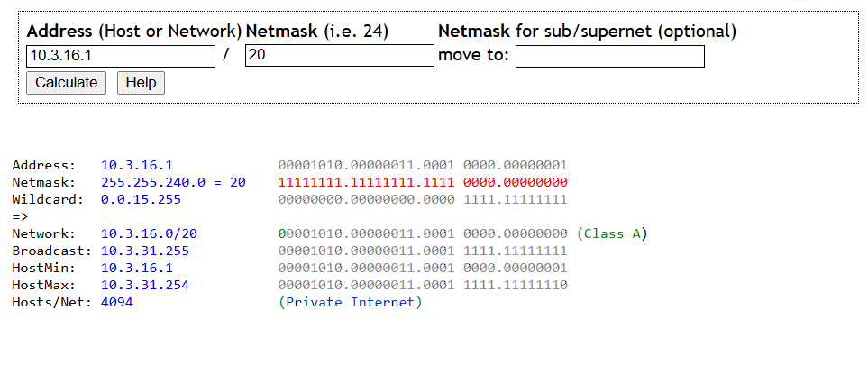
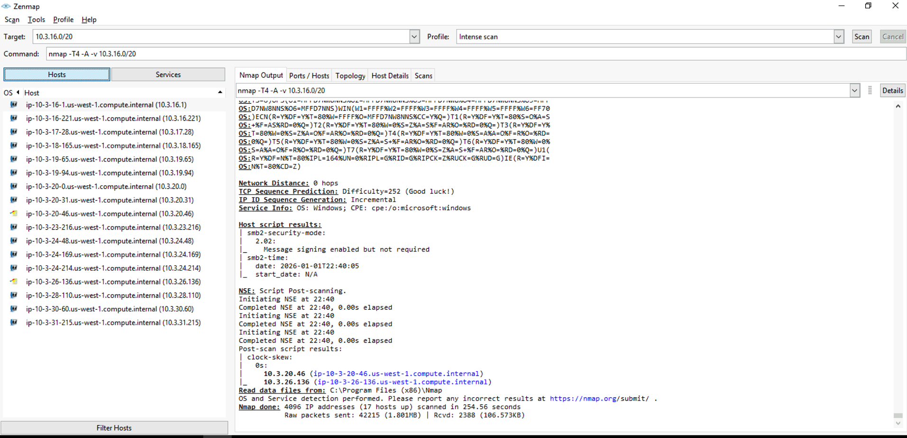
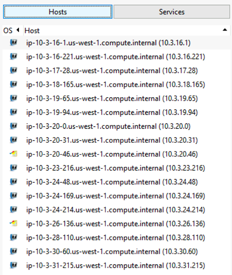
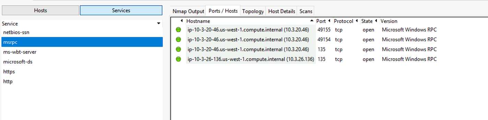
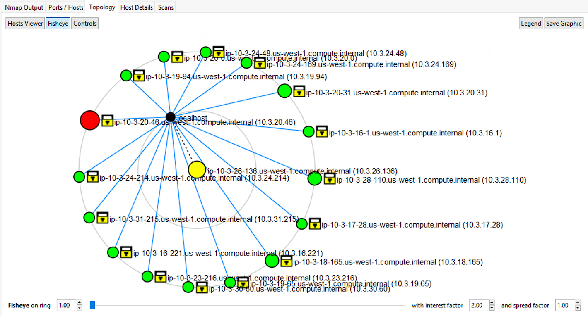
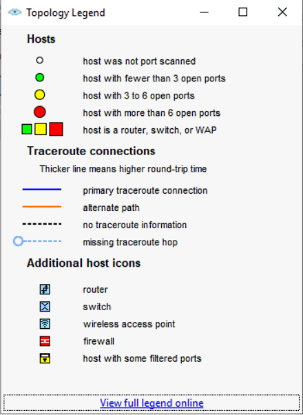

## Windows Recon: Zenmap

### Target
`demo.ine.local`

### Tools used:
* `Zenmap`

### Objectives: 
Discover all available live hosts.

---
`Zenmap` is just the GUI version of nmap. SInce we have been given a subnet mask of `255.255.240.0` or a CIDR of `20` and since we should be on the same network, we first try to get the network mask.  
We first try to find our own IP.  
  
From here, we apply the subnet mask to find the network IP.  
  
Now we use this to launch a default scan via `zenmap`.  
  
We have a list of all the available hosts in here  
  
We also have a list of all the services and clicking on any of the service lists the hosts on which these services are running.
  
We can also see the topology of all the machines found with th help of a graph.  
  
we can see the target machine in yellow and our own machine as the localhost in black. the rest of the legend are as follows.  
