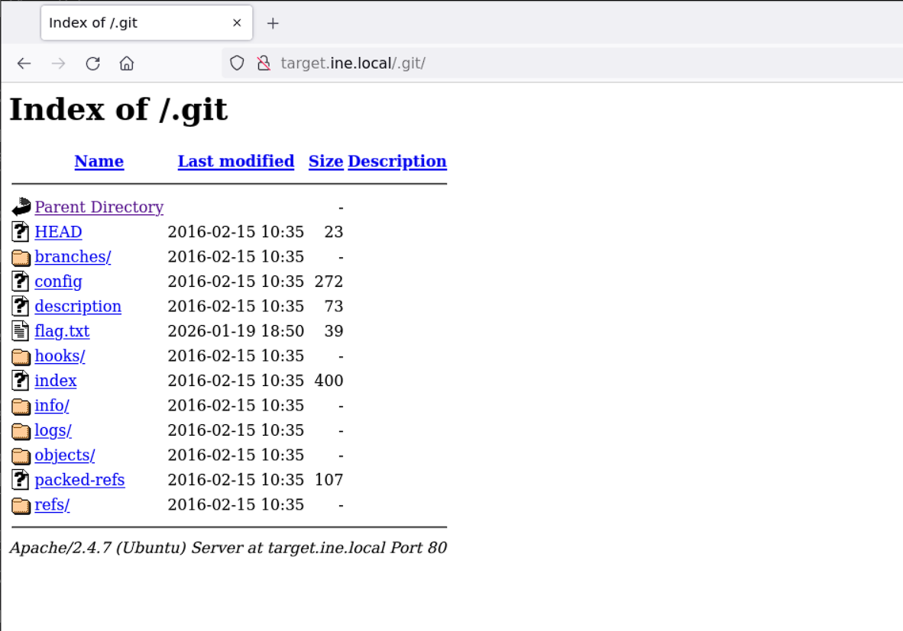
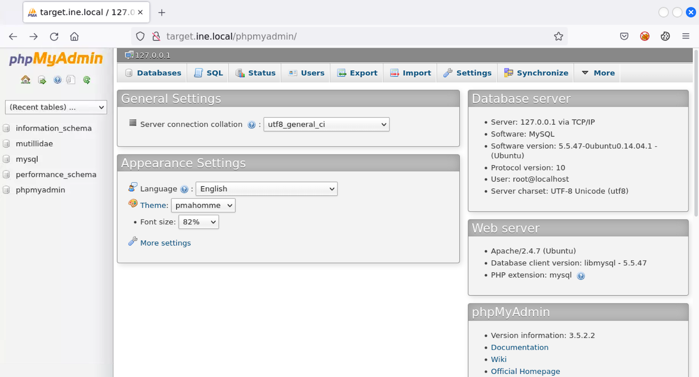
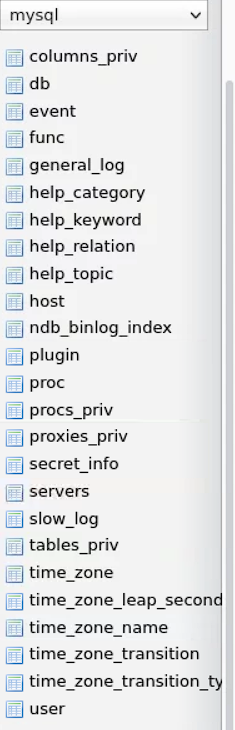
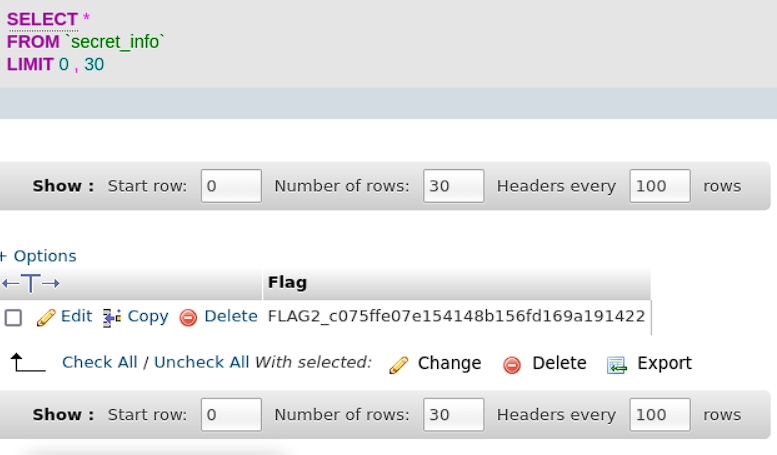
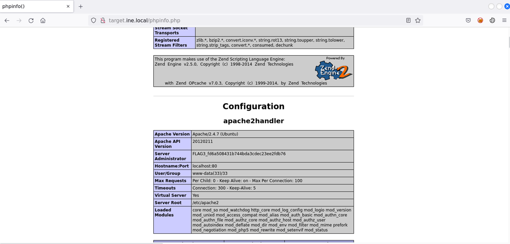
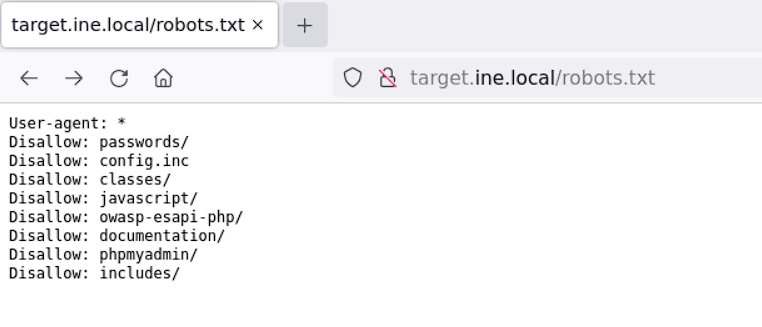
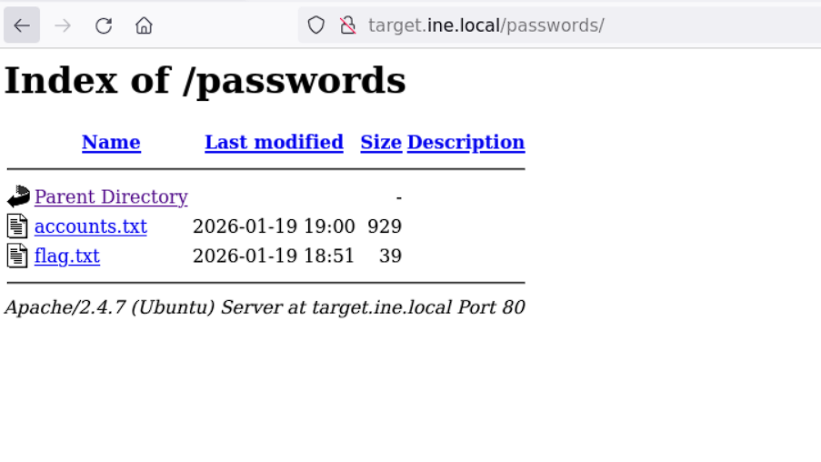
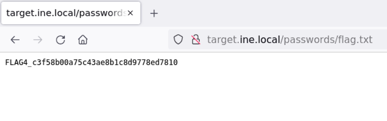

# Assessment Methodologies: Vulnerability Assessment CTF 1

### Target
`target.ine.local`

### Tools
- `namp`


### Flag 1: Explore hidden directories for version control artifacts that might reveal valuable information.
We first open the webpage and take a look at it to see what we are working against.  
[alt text](image.png)  
Next we run a simple port scan on the target  
```bash
root@INE:~# nmap -Pn target.ine.local
Starting Nmap 7.92 ( https://nmap.org ) at 2026-01-20 00:22 IST
Nmap scan report for target.ine.local (192.123.62.3)
Host is up (0.000028s latency).
Not shown: 998 closed tcp ports (reset)
PORT     STATE SERVICE
80/tcp   open  http
3306/tcp open  mysql
MAC Address: 02:42:C0:7B:3E:03 (Unknown)
```  
We see that it has two open ports. We target the **http** port first and see if we can find anything via a script scan.
```bash
Nmap done: 1 IP address (1 host up) scanned in 0.25 seconds
root@INE:~# nmap -Pn target.ine.local -p80 -sC
Starting Nmap 7.92 ( https://nmap.org ) at 2026-01-20 00:23 IST
Nmap scan report for target.ine.local (192.123.62.3)
Host is up (0.000042s latency).

PORT   STATE SERVICE
80/tcp open  http
| http-git: 
|   192.123.62.3:80/.git/
|     Git repository found!
|     Repository description: Unnamed repository; edit this file 'description' to name the...
|     Remotes:
|_      https://github.com/fermayo/hello-world-lamp.git
|_http-title: Site doesn't have a title (text/html).
| http-robots.txt: 8 disallowed entries 
| passwords/ config.inc classes/ javascript/ 
|_owasp-esapi-php/ documentation/ phpmyadmin/ includes/
| http-cookie-flags: 
|   /: 
|     PHPSESSID: 
|_      httponly flag not set
MAC Address: 02:42:C0:7B:3E:03 (Unknown)
```
We see that there is a github repo we can access. We navigate through the webpage and dicover the ***flag.txt*** file.  
  
  
This file gives us the first flag.  
flag: **FLAG1_cd7213fd70164d769b4adbe225edb807**

### Flag 2: The data storage has some loose security measures. Can you find the flag hidden within it?
Next we try to enumerate for any hidden webpages via the **http-enum** script on ***nmap***.  
```bash
root@INE:~# nmap -Pn target.ine.local -p80 --script http-enum
Starting Nmap 7.92 ( https://nmap.org ) at 2026-01-20 00:32 IST
Nmap scan report for target.ine.local (192.123.62.3)
Host is up (0.000080s latency).

PORT   STATE SERVICE
80/tcp open  http
| http-enum: 
|   /test/: Test page
|   /robots.txt: Robots file
|   /phpinfo.php: Possible information file
|   /phpmyadmin/: phpMyAdmin
|   /.git/HEAD: Git folder
|   /classes/: Potentially interesting directory w/ listing on 'apache/2.4.7 (ubuntu)'
|   /config/: Potentially interesting directory w/ listing on 'apache/2.4.7 (ubuntu)'
|   /data/: Potentially interesting directory w/ listing on 'apache/2.4.7 (ubuntu)'
|   /documentation/: Potentially interesting directory w/ listing on 'apache/2.4.7 (ubuntu)'
|   /images/: Potentially interesting directory w/ listing on 'apache/2.4.7 (ubuntu)'
|   /includes/: Potentially interesting directory w/ listing on 'apache/2.4.7 (ubuntu)'
|   /javascript/: Potentially interesting directory w/ listing on 'apache/2.4.7 (ubuntu)'
|   /passwords/: Potentially interesting directory w/ listing on 'apache/2.4.7 (ubuntu)'
|_  /styles/: Potentially interesting directory w/ listing on 'apache/2.4.7 (ubuntu)'
MAC Address: 02:42:C0:7B:3E:03 (Unknown)
```
We discover quite a few hidden webpages. Since the hint talks about an unsecured dadta storage, we first focus on the ***phpmyadmin*** webpage. Navigating to it, we find a list of tables and schemas.  
  
As we enumerate through the schemas we discover a tbale named ***secret_info*** under ***mysql***.  
  
  
Opening the table. we find the flag.  
Flag: **FLAG2_c075ffe07e154148b156fd169a191422**  

### Flag 3: A PHP file that displays server information might be worth examining. What could be hidden in plain sight?  
Based on the hint, we focus on the ***phpinfo.php*** file. Navigating through it, we find the flag.  
  
Flag: **FLAG3_fd6a508431b744bda3cdec23ee2fdb76**

### Flag 4: Sensitive directories might hold critical information. Search through carefully for hidden gems.   
Finally, we shift our focus to the ***robots.txt*** file. Here we discover an interesting file named ***passwords***. Opening the page and navigating through it, we find the flag.  
  
  
  
Flag: **FLAG4_c3f58b00a75c43ae8b1c8d9778ed7810**