# Host & Network Penetration Testing: Network-Based Attacks CTF 1

### Target
* `http://target1.ine.local`
* `http://target2.ine.local`

### Tools used:
* `wireshark`

---
## Flag 1: What is the domain name(abcd.site) accessed by the infected user that returned a 200 OK response code?
Since the response returned was a ***200 OK***, we just use that as the filter and search for the packets
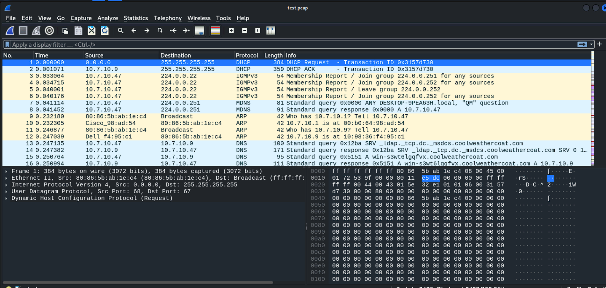
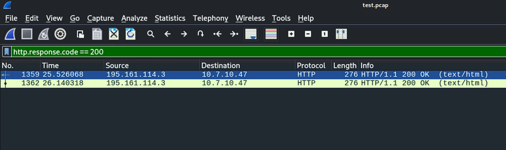
We see that there are two packets, once we go through one of them, we find the website name.
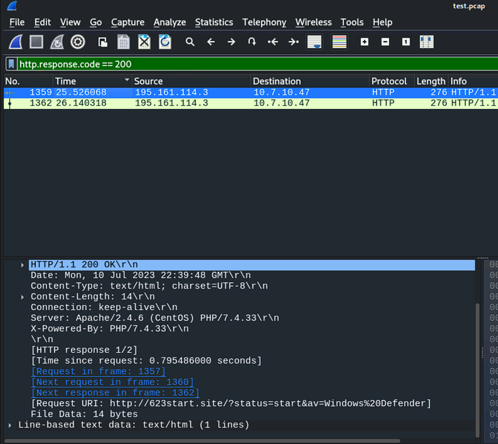  
Flag: **623start.site**

## Flag 2: What is the IP address, MAC address of the infected Windows client?
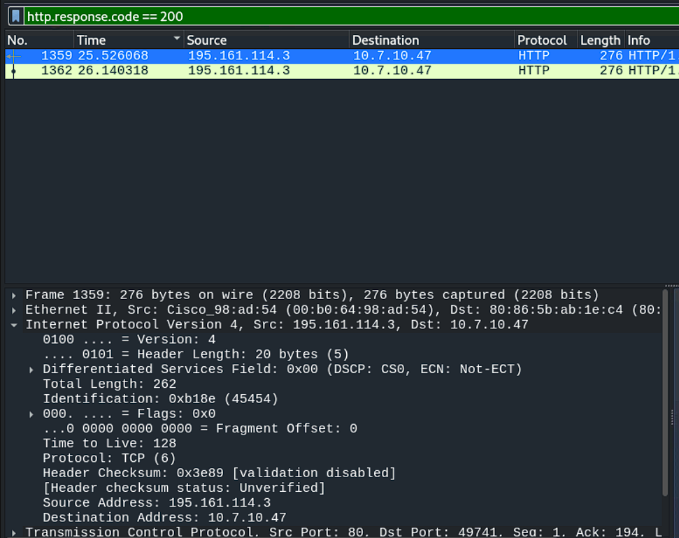
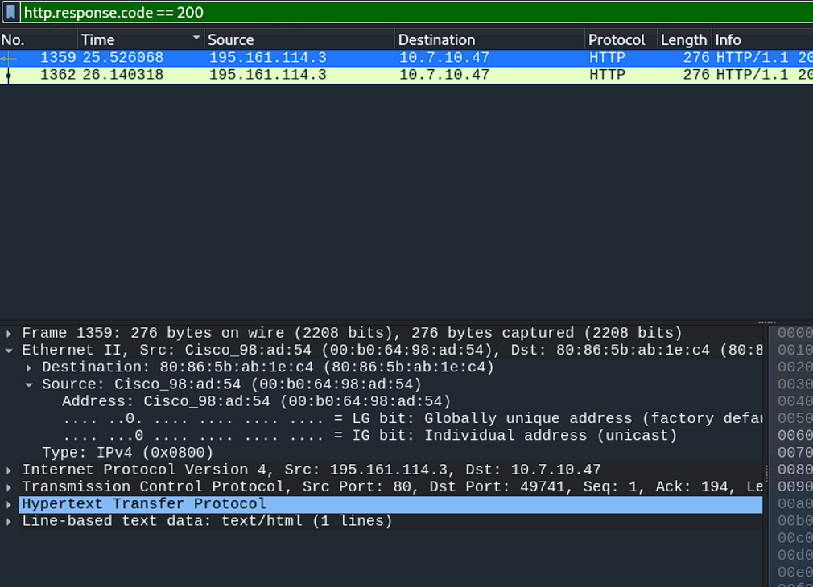  
This packet is from the server, so destination IP is the answer  
Flag: **10.7.10.47, 80:86:5b:ab:1e:c4**

## Flag 3: Which Wireshark filter can you use to determine the victim’s hostname from NetBIOS Name Service traffic, and what is the detected hostname for this malware infection?
The wireshark filter used is `nbns`, the results give us the desktop name.  
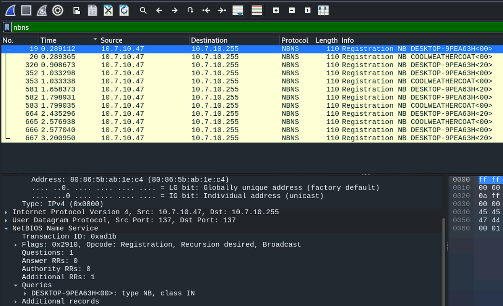  
Flag: **nbns, DESKTOP-9PEA63H**

## Flag 4: Which user got infected and ran the mystery_file.ps1 PowerShell script?
We just search for the `mystery_file.ps1` in the packet capture to get the required packets  
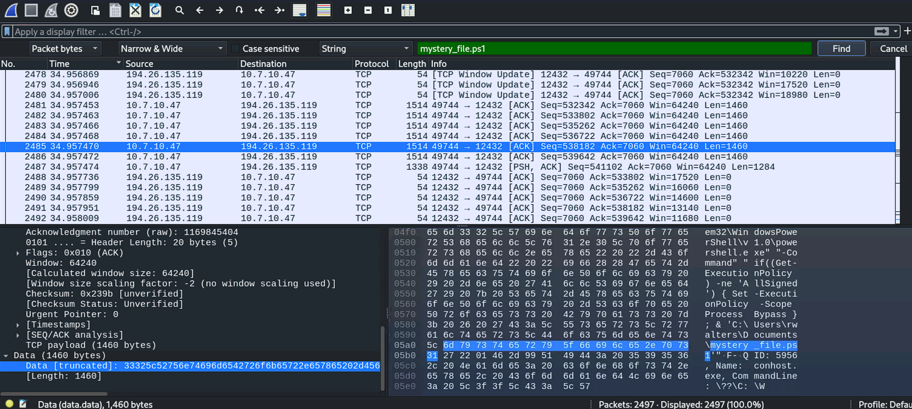  
Once we go through the packets, we find the required username.  
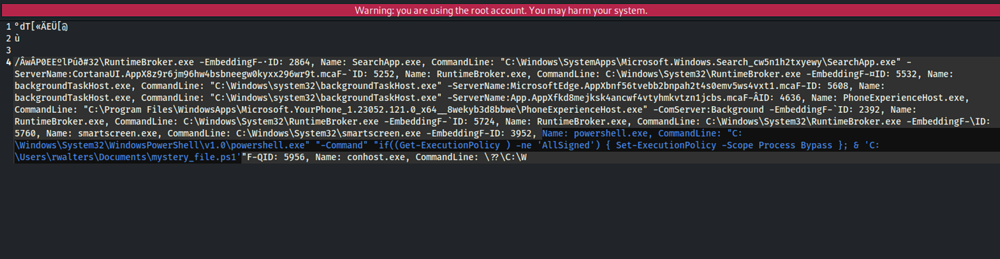
Flag: **rwalters**

## Flag 5: What User-Agent string indicates the traffic generated by a PowerShell script?
Again, we just search for `powershell in the user agent` and find the flag.  
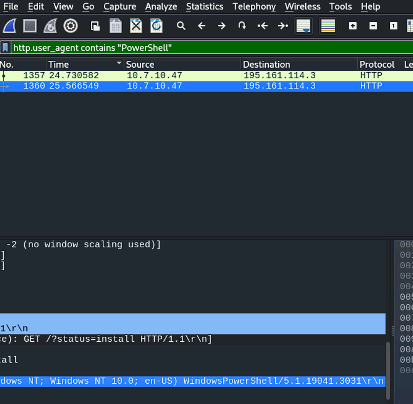  
Flag: **WindowsPowerShell**

## Flag 6: Which wallet extension ID is associated with the Coinbase wallet?
This time we search for the term `Coinbase`. Once we get the packets we just search through them to get the wallet id.  
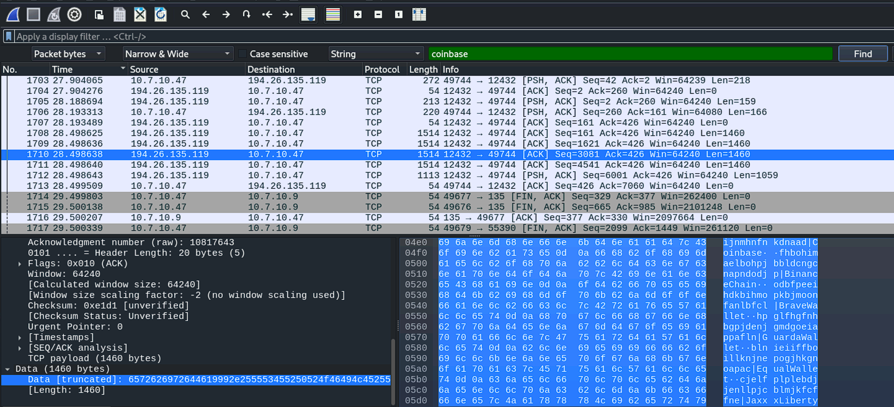
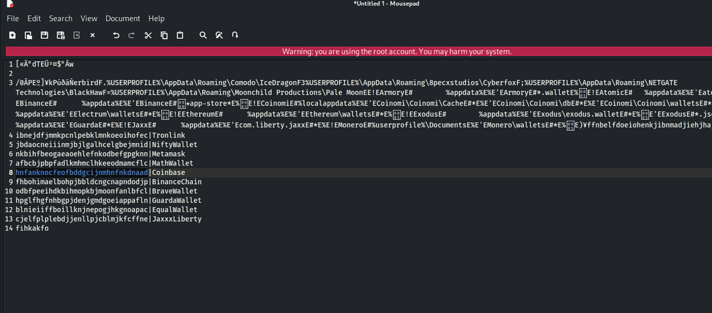  
Flag: **hnfanknocfeofbddgcijnmhnfnkdnaad**