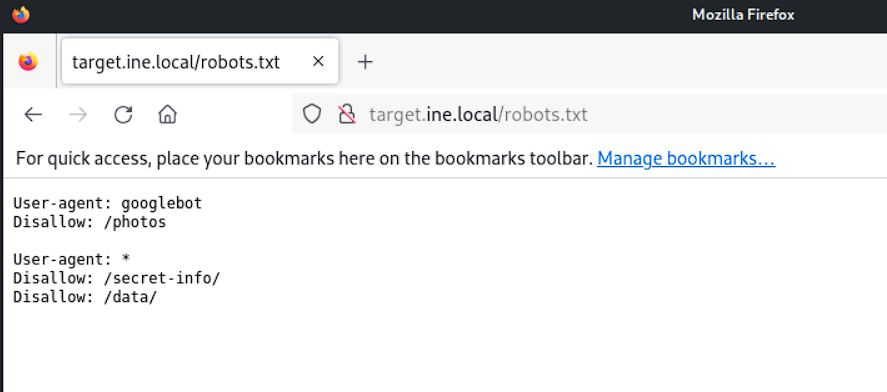
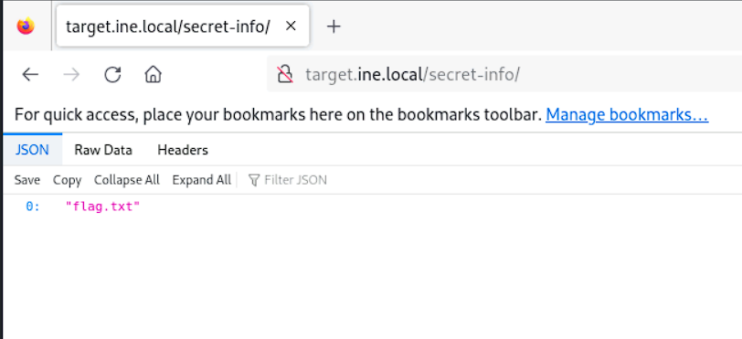
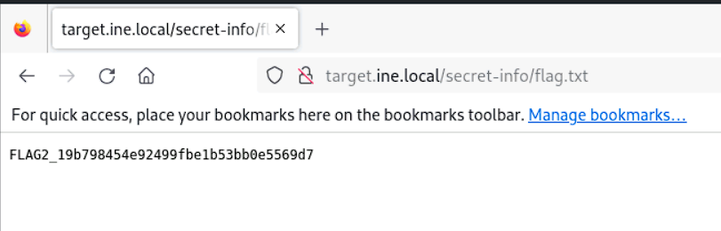

# Footprinting and Scanning CTF 1

### Target
`http://target.ine.local`

### Tools used:
* `nmap`
* `ftp`
* `mysql`

---

## Flag 1: The server proudly announces its identity in every response. Look closely; you might find something unusual
Since the server announces its identity in every response, we just need to capture the http response to get the result. We use `curl` with the flag **-v** to get the http details and then **pipe** it get the flag.
```bash
┌──(root㉿INE)-[~]
└─# curl -v http://target.ine.local | grep FLAG                                                                                                                                            
  % Total    % Received % Xferd  Average Speed   Time    Time     Time  Current
                                 Dload  Upload   Total   Spent    Left  Speed
  0     0    0     0    0     0      0      0 --:--:-- --:--:-- --:--:--     0* Host target.ine.local:80 was resolved.
* IPv6: (none)
* IPv4: 192.69.122.3
*   Trying 192.69.122.3:80...
* Connected to target.ine.local (192.69.122.3) port 80
> GET / HTTP/1.1
> Host: target.ine.local
> User-Agent: curl/8.8.0
> Accept: */*
> 
* Request completely sent off
< HTTP/1.1 200 OK
< Server: Werkzeug/3.0.6 Python/3.10.12
< Date: Wed, 06 Aug 2025 18:57:55 GMT
< Content-Type: text/html; charset=utf-8
< Content-Length: 2557
< Server: FLAG1_f9d89895902b4d73be06d5f3fbafc3eb
< Connection: close
< 
{ [2557 bytes data]
100  2557  100  2557    0     0  1041k      0 --:--:-- --:--:-- --:--:-- 1248k
* Closing connection
            Capture the Flag (CTF) challenges are a special kind of information security competition. Participants solve security-related challenges to find 'FLAGs' hidden in various tasks.
```
Flag: **FLAG1_f9d89895902b4d73be06d5f3fbafc3eb**

## Flag 2: The gatekeeper's instructions often reveal what should remain unseen. Don't forget to read between the lines.
The statement above hints at the **robots.txt** webpage. We visit it to get the flag.

The file **secret-info** looks interresting, we look deeper into that.  
  
Looks like we found the file containing the flag.  
  

Flag: **FLAG2_19b798454e92499fbe1b53bb0e5569d7**

## Flag 3: Anonymous access sometimes leads to forgotten treasures. Connect and explore the directory; you might stumble upon something valuable.

Let's run a full `nmap` scan to get a list of open ports. We run it with **-sC** for the scripts, **-Pn** since we already know the host, **-sV** for a list of the versions around and then **-T4** for a faster scan.  
```bash
┌──(root㉿INE)-[~]
└─# nmap -Pn -sV -sC -T4 target.ine.local
Starting Nmap 7.94SVN ( https://nmap.org ) at 2025-08-07 20:49 IST
Nmap scan report for target.ine.local (192.112.20.3)
Host is up (0.000024s latency).
Not shown: 993 closed tcp ports (reset)
PORT     STATE SERVICE  VERSION
21/tcp   open  ftp      vsftpd 3.0.5
| ftp-syst: 
|   STAT: 
| FTP server status:
|      Connected to ::ffff:192.112.20.2
|      Logged in as ftp
|      TYPE: ASCII
|      No session bandwidth limit
|      Session timeout in seconds is 300
|      Control connection is plain text
|      Data connections will be plain text
|      At session startup, client count was 1
|      vsFTPd 3.0.5 - secure, fast, stable
|_End of status
| ftp-anon: Anonymous FTP login allowed (FTP code 230)
| -rw-r--r--    1 0        0              22 Oct 28  2024 creds.txt
|_-rw-r--r--    1 0        0              39 Aug 07 15:17 flag.txt
22/tcp   open  ssh      OpenSSH 8.9p1 Ubuntu 3ubuntu0.10 (Ubuntu Linux; protocol 2.0)
| ssh-hostkey: 
|   256 a5:93:0f:6b:5a:77:f1:77:e8:2e:c9:31:e7:df:66:06 (ECDSA)
|_  256 b6:0d:e4:92:36:30:79:b7:31:91:3b:a0:1f:c1:ee:85 (ED25519)
25/tcp   open  smtp     Postfix smtpd
|_smtp-commands: localhost.members.linode.com, PIPELINING, SIZE 10240000, VRFY, ETRN, STARTTLS, ENHANCEDSTATUSCODES, 8BITMIME, DSN, SMTPUTF8, CHUNKING
| ssl-cert: Subject: commonName=localhost
| Subject Alternative Name: DNS:localhost
| Not valid before: 2024-10-28T06:10:50
|_Not valid after:  2034-10-26T06:10:50
|_ssl-date: TLS randomness does not represent time
80/tcp   open  http     Werkzeug/3.0.6 Python/3.10.12                                                                                                                                                                                      
|_http-title: CTF Challenge
| fingerprint-strings: 
|   GetRequest: 
|     HTTP/1.1 200 OK
|     Server: Werkzeug/3.0.6 Python/3.10.12
|     Date: Thu, 07 Aug 2025 15:19:37 GMT
|     Content-Type: text/html; charset=utf-8
|     Content-Length: 2557
|     Server: FLAG1_23422c8c52f345ce97beeb86999874bb
|     Connection: close
|     <!DOCTYPE html>
|     <html lang="en">
|     <head>
|     <meta charset="UTF-8">
|     <meta name="viewport" content="width=device-width, initial-scale=1.0">
|     <link rel="shortcut icon" href="#">
|     <title>CTF Challenge</title>
|     <style>
|     body {
|     font-family: 'Arial', sans-serif;
|     margin: 0;
|     padding: 0;
|     background-color: #1c1c1c;
|     color: #fff;
|     background-color: #333;
|     padding: 15px;
|     text-align: center;
|     list-style: none;
|     margin: 0;
|     padding: 0;
|     display:
|   HTTPOptions: 
|     HTTP/1.1 200 OK
|     Server: Werkzeug/3.0.6 Python/3.10.12
|     Date: Thu, 07 Aug 2025 15:19:37 GMT
|     Content-Type: text/html; charset=utf-8
|     Allow: OPTIONS, HEAD, GET
|     Server: FLAG1_23422c8c52f345ce97beeb86999874bb
|     Content-Length: 0
|_    Connection: close
|_http-server-header: Werkzeug/3.0.6 Python/3.10.12
| http-robots.txt: 3 disallowed entries 
|_/photos /secret-info/ /data/
143/tcp  open  imap     Dovecot imapd (Ubuntu)
|_imap-capabilities: IMAP4rev1 LOGIN-REFERRALS Pre-login post-login LITERAL+ listed ENABLE have IDLE OK STARTTLS capabilities LOGINDISABLEDA0001 ID SASL-IR more
|_ssl-date: TLS randomness does not represent time
| ssl-cert: Subject: commonName=localhost
| Subject Alternative Name: DNS:localhost
| Not valid before: 2024-10-28T06:10:50
|_Not valid after:  2034-10-26T06:10:50
993/tcp  open  ssl/imap Dovecot imapd (Ubuntu)
|_imap-capabilities: LOGIN-REFERRALS AUTH=PLAINA0001 listed LITERAL+ post-login ENABLE have IDLE OK Pre-login capabilities SASL-IR ID IMAP4rev1 more
|_ssl-date: TLS randomness does not represent time
| ssl-cert: Subject: commonName=localhost
| Subject Alternative Name: DNS:localhost
| Not valid before: 2024-10-28T06:10:50
|_Not valid after:  2034-10-26T06:10:50
3306/tcp open  mysql    MySQL 8.0.39-0ubuntu0.22.04.1
| ssl-cert: Subject: commonName=MySQL_Server_8.0.39_Auto_Generated_Server_Certificate
| Not valid before: 2024-10-28T06:11:13
|_Not valid after:  2034-10-26T06:11:13
|_ssl-date: TLS randomness does not represent time
| mysql-info: 
|   Protocol: 10
|   Version: 8.0.39-0ubuntu0.22.04.1
|   Thread ID: 15
|   Capabilities flags: 65535
|   Some Capabilities: IgnoreSpaceBeforeParenthesis, FoundRows, Support41Auth, Speaks41ProtocolOld, SwitchToSSLAfterHandshake, SupportsCompression, SupportsTransactions, InteractiveClient, ODBCClient, Speaks41ProtocolNew, LongColumnFlag, ConnectWithDatabase, SupportsLoadDataLocal, LongPassword, IgnoreSigpipes, DontAllowDatabaseTableColumn, SupportsAuthPlugins, SupportsMultipleStatments, SupportsMultipleResults
|   Status: Autocommit
|   Salt: \x06a,OqFtV\x1A(\x18\x1F5D@/uy\x1C\x16
|_  Auth Plugin Name: caching_sha2_password
1 service unrecognized despite returning data. If you know the service/version, please submit the following fingerprint at https://nmap.org/cgi-bin/submit.cgi?new-service :
SF-Port80-TCP:V=7.94SVN%I=7%D=8/7%Time=6894C409%P=x86_64-pc-linux-gnu%r(Ge
SF:tRequest,ADD,"HTTP/1\.1\x20200\x20OK\r\nServer:\x20Werkzeug/3\.0\.6\x20
SF:Python/3\.10\.12\r\nDate:\x20Thu,\x2007\x20Aug\x202025\x2015:19:37\x20G
SF:MT\r\nContent-Type:\x20text/html;\x20charset=utf-8\r\nContent-Length:\x
SF:202557\r\nServer:\x20FLAG1_23422c8c52f345ce97beeb86999874bb\r\nConnecti
SF:on:\x20close\r\n\r\n<!DOCTYPE\x20html>\n<html\x20lang=\"en\">\n<head>\n
SF:\x20\x20\x20\x20<meta\x20charset=\"UTF-8\">\n\x20\x20\x20\x20<meta\x20n
SF:ame=\"viewport\"\x20content=\"width=device-width,\x20initial-scale=1\.0
SF:\">\n\x20\x20\x20\x20<link\x20rel=\"shortcut\x20icon\"\x20href=\"#\">\n
SF:\x20\x20\x20\x20<title>CTF\x20Challenge</title>\n\x20\x20\x20\x20<style
SF:>\n\x20\x20\x20\x20\x20\x20\x20\x20body\x20{\n\x20\x20\x20\x20\x20\x20\
SF:x20\x20\x20\x20\x20\x20font-family:\x20'Arial',\x20sans-serif;\n\x20\x2
SF:0\x20\x20\x20\x20\x20\x20\x20\x20\x20\x20margin:\x200;\n\x20\x20\x20\x2
SF:0\x20\x20\x20\x20\x20\x20\x20\x20padding:\x200;\n\x20\x20\x20\x20\x20\x
SF:20\x20\x20\x20\x20\x20\x20background-color:\x20#1c1c1c;\n\x20\x20\x20\x
SF:20\x20\x20\x20\x20\x20\x20\x20\x20color:\x20#fff;\n\x20\x20\x20\x20\x20
SF:\x20\x20\x20}\n\n\x20\x20\x20\x20\x20\x20\x20\x20nav\x20{\n\x20\x20\x20
SF:\x20\x20\x20\x20\x20\x20\x20\x20\x20background-color:\x20#333;\n\x20\x2
SF:0\x20\x20\x20\x20\x20\x20\x20\x20\x20\x20padding:\x2015px;\n\x20\x20\x2
SF:0\x20\x20\x20\x20\x20\x20\x20\x20\x20text-align:\x20center;\n\x20\x20\x
SF:20\x20\x20\x20\x20\x20}\n\n\x20\x20\x20\x20\x20\x20\x20\x20nav\x20ul\x2
SF:0{\n\x20\x20\x20\x20\x20\x20\x20\x20\x20\x20\x20\x20list-style:\x20none
SF:;\n\x20\x20\x20\x20\x20\x20\x20\x20\x20\x20\x20\x20margin:\x200;\n\x20\
SF:x20\x20\x20\x20\x20\x20\x20\x20\x20\x20\x20padding:\x200;\n\x20\x20\x20
SF:\x20\x20\x20\x20\x20}\n\n\x20\x20\x20\x20\x20\x20\x20\x20nav\x20ul\x20l
SF:i\x20{\n\x20\x20\x20\x20\x20\x20\x20\x20\x20\x20\x20\x20display:\x20")%
SF:r(HTTPOptions,F8,"HTTP/1\.1\x20200\x20OK\r\nServer:\x20Werkzeug/3\.0\.6
SF:\x20Python/3\.10\.12\r\nDate:\x20Thu,\x2007\x20Aug\x202025\x2015:19:37\
SF:x20GMT\r\nContent-Type:\x20text/html;\x20charset=utf-8\r\nAllow:\x20OPT
SF:IONS,\x20HEAD,\x20GET\r\nServer:\x20FLAG1_23422c8c52f345ce97beeb8699987
SF:4bb\r\nContent-Length:\x200\r\nConnection:\x20close\r\n\r\n");
MAC Address: 02:42:C0:70:14:03 (Unknown)
Service Info: Host:  localhost.members.linode.com; OSs: Unix, Linux; CPE: cpe:/o:linux:linux_kernel

Service detection performed. Please report any incorrect results at https://nmap.org/submit/ .
Nmap done: 1 IP address (1 host up) scanned in 89.34 seconds
```
We see that the ftp server allows for **anonymous** login. So we try that out with an empty password.  
```bash
┌──(root㉿INE)-[~]
└─# ftp target.ine.local                                                                                                                                                                                                                   
Connected to target.ine.local.
220 (vsFTPd 3.0.5)
Name (target.ine.local:root): anonymous
331 Please specify the password.
Password: 
230 Login successful.
Remote system type is UNIX.
Using binary mode to transfer files.
ftp> ls
229 Entering Extended Passive Mode (|||30438|)
150 Here comes the directory listing.
-rw-r--r--    1 0        0              22 Oct 28  2024 creds.txt
-rw-r--r--    1 0        0              39 Aug 06 19:37 flag.txt
226 Directory send OK.
ftp> get creds.txt
local: creds.txt remote: creds.txt
229 Entering Extended Passive Mode (|||20778|)
150 Opening BINARY mode data connection for creds.txt (22 bytes).
100% |**********************************************************************************************************************************************|    22      244.14 KiB/s    00:00 ETA
226 Transfer complete.
22 bytes received in 00:00 (39.27 KiB/s)
ftp> get flag.txt
local: flag.txt remote: flag.txt
229 Entering Extended Passive Mode (|||50674|)
150 Opening BINARY mode data connection for flag.txt (39 bytes).
100% |**********************************************************************************************************************************************|    39      624.35 KiB/s    00:00 ETA
226 Transfer complete.
39 bytes received in 00:00 (130.87 KiB/s)
ftp> q
?Ambiguous command.
ftp> exit
221 Goodbye.
```
We download the two files present in the server and check them out. 
```bash
┌──(root㉿INE)-[~]
└─# cat creds.txt                                                                                                                                                                          
db_admin:password@123

┌──(root㉿INE)-[~]
└─# cat flag.txt 
FLAG3_6e772bdc435445799249075d8031543b
```
Flag: **FLAG3_6e772bdc435445799249075d8031543b**

## Flag 4: A well-named database can be quite revealing. Peek at the configurations to discover the hidden treasure.

One of the files found previously was the flag, but the other seems like the username and password for the mysql server.  
We use them to login into the server and check for any tables or databases.  
```bash
┌──(root㉿INE)-[~]
└─# mysql -h target.ine.local  -P 3306 -p'password@123' -u db_admin
Welcome to the MariaDB monitor.  Commands end with ; or \g.
Your MySQL connection id is 21
Server version: 8.0.39-0ubuntu0.22.04.1 (Ubuntu)

Copyright (c) 2000, 2018, Oracle, MariaDB Corporation Ab and others.

Support MariaDB developers by giving a star at https://github.com/MariaDB/server
Type 'help;' or '\h' for help. Type '\c' to clear the current input statement.

MySQL [(none)]> show tables;
ERROR 1046 (3D000): No database selected
MySQL [(none)]> show databases
    -> 
    -> ;
+----------------------------------------+
| Database                               |
+----------------------------------------+
| FLAG4_e466fc1c38004c4ab488009c564ca106 |
| information_schema                     |
| mysql                                  |
| performance_schema                     |
| sys                                    |
+----------------------------------------+
5 rows in set (0.003 sec)

MySQL [(none)]> 
```
We get the flag.  
Flag: **FLAG4_e466fc1c38004c4ab488009c564ca106**