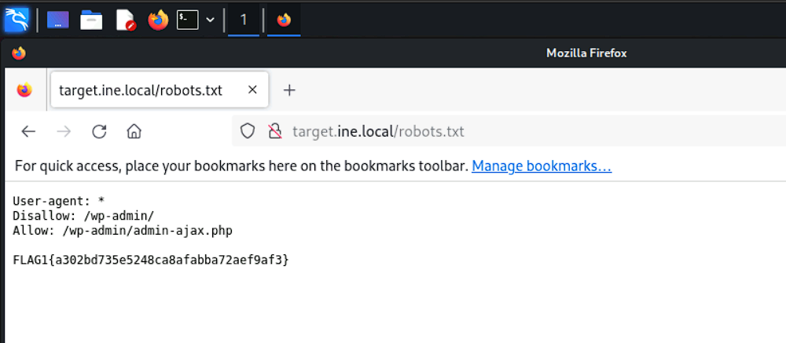
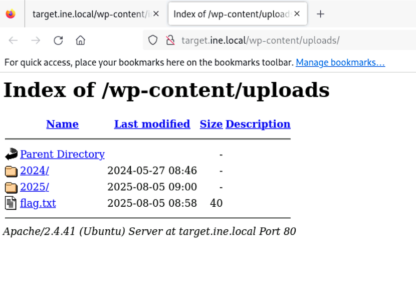
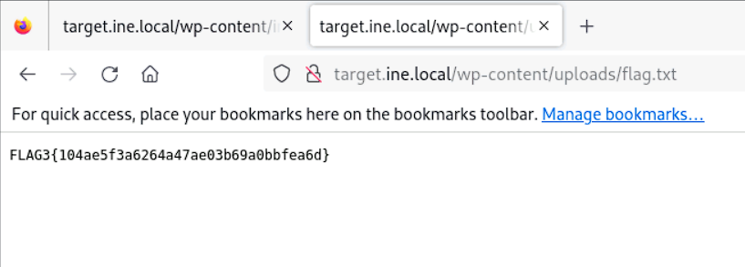
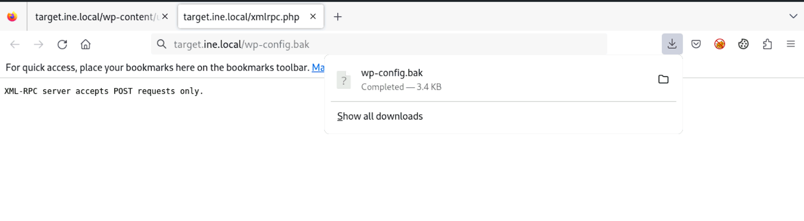

# Assessment Methodologies: Information Gathering CTF 1

### Target : 
`http://target.ine.local`

### Tools used: 

* `nmap`: network utility tool, used here for port scanning
* `dirb`: It is a command-line web content scanner used in penetration testing to brute-force directories and files on web servers. t works by making HTTP requests to a target URL, appending words from a wordlist, and checking the server's responses and is commonly used to find hidden or unlinked content like:
  * admin
  * backup.zip
  * index.php.bak
  * flag.txt
* `gobuster`: Same as `dirb` but faster and more flexible
* `httrack`: Downloads an entire website for offline browsing and inspection.

---
---

## Flag 1: This tells search engines what to and what not to avoid
The ***robots.txt*** file is used to tell web crawlers what to show and what to avoid. We just append this to the target and get the flag.  
  
Flag: **FLAG1{a302bd735e5248ca8afabba72aef9af3}**


## Flag 2: What website is running on the target, and what is its version?  
To find the website running on the target and the version we use `nmap` with the **version** scan. This gives us the flag.  
```bash
┌──(root㉿INE)-[~]
└─# nmap -sV -A target.ine.local                                                                                                                                                           
Starting Nmap 7.94SVN ( https://nmap.org ) at 2025-08-05 14:41 IST
Nmap scan report for target.ine.local (192.151.173.3)
Host is up (0.000085s latency).
Not shown: 999 closed tcp ports (reset)
PORT   STATE SERVICE VERSION
80/tcp open  http    Apache httpd 2.4.41 ((Ubuntu))
|_http-generator: WordPress 6.5.3 - FL@G2{2c2c03164d66402dbeb6dd5e406e135d}
|_http-title: INE
|_http-server-header: Apache/2.4.41 (Ubuntu)
| http-robots.txt: 1 disallowed entry 
|_/wp-admin/
MAC Address: 02:42:C0:97:AD:03 (Unknown)
No exact OS matches for host (If you know what OS is running on it, see https://nmap.org/submit/ ).
TCP/IP fingerprint:
OS:SCAN(V=7.94SVN%E=4%D=8/5%OT=80%CT=1%CU=32391%PV=N%DS=1%DC=D%G=Y%M=0242C0
OS:%TM=6891CAE9%P=x86_64-pc-linux-gnu)SEQ(SP=103%GCD=1%ISR=107%TI=Z%CI=Z%TS
OS:=A)SEQ(SP=103%GCD=1%ISR=107%TI=Z%CI=Z%II=I%TS=A)OPS(O1=M5B4ST11NW7%O2=M5
OS:B4ST11NW7%O3=M5B4NNT11NW7%O4=M5B4ST11NW7%O5=M5B4ST11NW7%O6=M5B4ST11)WIN(
OS:W1=7C70%W2=7C70%W3=7C70%W4=7C70%W5=7C70%W6=7C70)ECN(R=Y%DF=Y%T=40%W=7D78
OS:%O=M5B4NNSNW7%CC=Y%Q=)T1(R=Y%DF=Y%T=40%S=O%A=S+%F=AS%RD=0%Q=)T2(R=N)T3(R
OS:=N)T4(R=Y%DF=Y%T=40%W=0%S=A%A=Z%F=R%O=%RD=0%Q=)T5(R=Y%DF=Y%T=40%W=0%S=Z%
OS:A=S+%F=AR%O=%RD=0%Q=)T6(R=Y%DF=Y%T=40%W=0%S=A%A=Z%F=R%O=%RD=0%Q=)T7(R=Y%
OS:DF=Y%T=40%W=0%S=Z%A=S+%F=AR%O=%RD=0%Q=)U1(R=Y%DF=N%T=40%IPL=164%UN=0%RIP
OS:L=G%RID=G%RIPCK=G%RUCK=G%RUD=G)IE(R=Y%DFI=N%T=40%CD=S)

Network Distance: 1 hop

TRACEROUTE
HOP RTT     ADDRESS
1   0.09 ms target.ine.local (192.151.173.3)

OS and Service detection performed. Please report any incorrect results at https://nmap.org/submit/ .
Nmap done: 1 IP address (1 host up) scanned in 19.67 seconds

```
Flag: **FL@G2{2c2c03164d66402dbeb6dd5e406e135d}**

## Flag 3: Directory browsing might reveal where files are stored.
The hint for the flag shows that the directories for the website might contain the flag itself. So we use `dirb` to list all possible directories of the websites.  
```bash
┌──(root㉿INE)-[~]
└─# dirb http://target.ine.local                                                                                                                                                           

-----------------
DIRB v2.22    
By The Dark Raver
-----------------

START_TIME: Tue Aug  5 14:52:31 2025
URL_BASE: http://target.ine.local/
WORDLIST_FILES: /usr/share/dirb/wordlists/common.txt

-----------------

GENERATED WORDS: 4612                                                          

---- Scanning URL: http://target.ine.local/ ----
+ http://target.ine.local/index.php (CODE:301|SIZE:0)                                                                                                                                     
+ http://target.ine.local/robots.txt (CODE:200|SIZE:108)                                                                                                                                  
+ http://target.ine.local/server-status (CODE:403|SIZE:281)                                                                                                                               
==> DIRECTORY: http://target.ine.local/wp-admin/                                                                                                                                          
==> DIRECTORY: http://target.ine.local/wp-content/                                                                                                                                        
==> DIRECTORY: http://target.ine.local/wp-includes/                                                                                                                                       
+ http://target.ine.local/xmlrpc.php (CODE:405|SIZE:42)                                                                                                                                   
                                                                                                                                                                                          
---- Entering directory: http://target.ine.local/wp-admin/ ----
+ http://target.ine.local/wp-admin/admin.php (CODE:302|SIZE:0)                                                                                                                            
==> DIRECTORY: http://target.ine.local/wp-admin/css/                                                                                                                                      
==> DIRECTORY: http://target.ine.local/wp-admin/images/                                                                                                                                   
==> DIRECTORY: http://target.ine.local/wp-admin/includes/                                                                                                                                 
+ http://target.ine.local/wp-admin/index.php (CODE:302|SIZE:0)                                                                                                                            
==> DIRECTORY: http://target.ine.local/wp-admin/js/                                                                                                                                       
==> DIRECTORY: http://target.ine.local/wp-admin/maint/                                                                                                                                    
==> DIRECTORY: http://target.ine.local/wp-admin/network/                                                                                                                                  
==> DIRECTORY: http://target.ine.local/wp-admin/user/                                                                                                                                     
                                                                                                                                                                                          
---- Entering directory: http://target.ine.local/wp-content/ ----
+ http://target.ine.local/wp-content/index.php (CODE:200|SIZE:0)                                                                                                                          
==> DIRECTORY: http://target.ine.local/wp-content/plugins/                                                                                                                                
==> DIRECTORY: http://target.ine.local/wp-content/themes/                                                                                                                                 
==> DIRECTORY: http://target.ine.local/wp-content/uploads/                                                                                                                                
                                                                                                                                                                                          
---- Entering directory: http://target.ine.local/wp-includes/ ----
(!) WARNING: Directory IS LISTABLE. No need to scan it.                        
    (Use mode '-w' if you want to scan it anyway)
                                                                                                                                                                                          
---- Entering directory: http://target.ine.local/wp-admin/css/ ----
(!) WARNING: Directory IS LISTABLE. No need to scan it.                        
    (Use mode '-w' if you want to scan it anyway)
                                                                                                                                                                                          
---- Entering directory: http://target.ine.local/wp-admin/images/ ----
(!) WARNING: Directory IS LISTABLE. No need to scan it.                        
    (Use mode '-w' if you want to scan it anyway)
                                                                                                                                                                                          
---- Entering directory: http://target.ine.local/wp-admin/includes/ ----
(!) WARNING: Directory IS LISTABLE. No need to scan it.                        
    (Use mode '-w' if you want to scan it anyway)
                                                                                                                                                                                          
---- Entering directory: http://target.ine.local/wp-admin/js/ ----
(!) WARNING: Directory IS LISTABLE. No need to scan it.                        
    (Use mode '-w' if you want to scan it anyway)
                                                                                                                                                                                          
---- Entering directory: http://target.ine.local/wp-admin/maint/ ----
(!) WARNING: Directory IS LISTABLE. No need to scan it.                        
    (Use mode '-w' if you want to scan it anyway)
                                                                                                                                                                                          
---- Entering directory: http://target.ine.local/wp-admin/network/ ----
+ http://target.ine.local/wp-admin/network/admin.php (CODE:302|SIZE:0)                                                                                                                    
+ http://target.ine.local/wp-admin/network/index.php (CODE:302|SIZE:0)                                                                                                                    
                                                                                                                                                                                          
---- Entering directory: http://target.ine.local/wp-admin/user/ ----
+ http://target.ine.local/wp-admin/user/admin.php (CODE:302|SIZE:0)                                                                                                                       
+ http://target.ine.local/wp-admin/user/index.php (CODE:302|SIZE:0)                                                                                                                       
                                                                                                                                                                                          
---- Entering directory: http://target.ine.local/wp-content/plugins/ ----
+ http://target.ine.local/wp-content/plugins/index.php (CODE:200|SIZE:0)                                                                                                                  
                                                                                                                                                                                          
---- Entering directory: http://target.ine.local/wp-content/themes/ ----
+ http://target.ine.local/wp-content/themes/index.php (CODE:200|SIZE:0)                                                                                                                   
                                                                                                                                                                                          
---- Entering directory: http://target.ine.local/wp-content/uploads/ ----
(!) WARNING: Directory IS LISTABLE. No need to scan it.                        
    (Use mode '-w' if you want to scan it anyway)
                                                                               
-----------------
END_TIME: Tue Aug  5 14:52:45 2025
DOWNLOADED: 32284 - FOUND: 13

```
We manually go through the directories and quickly discover that the ***wp-content/uploads/*** directory has a file called ***flag.txt***.  
  
Opening it, we get the flag.  
  
Flag: **FLAG3{104ae5f3a6264a47ae03b69a0bbfea6d}**

## Flag 4: An overlooked backup file in the webroot can be problematic if it reveals sensitive configuration details.
Similar to before we use `gobuster` this time and ask it to iterate through the webpages but this time with the extensions ***zip,tar.gz,bak,old,sql*** appended since we are specifically looking for a backup.  
```bash
┌──(root㉿INE)-[~/Desktop/wordlists]
└─# gobuster dir -u http://target.ine.local -w /usr/share/wordlists/dirb/common.txt -x zip,tar.gz,bak,old,sql
===============================================================
Gobuster v3.6
by OJ Reeves (@TheColonial) & Christian Mehlmauer (@firefart)
===============================================================
[+] Url:                     http://target.ine.local
[+] Method:                  GET
[+] Threads:                 10
[+] Wordlist:                /usr/share/wordlists/dirb/common.txt
[+] Negative Status codes:   404
[+] User Agent:              gobuster/3.6
[+] Extensions:              zip,tar.gz,bak,old,sql
[+] Timeout:                 10s
===============================================================
Starting gobuster in directory enumeration mode
===============================================================
/.hta                 (Status: 403) [Size: 281]
/.hta.bak             (Status: 403) [Size: 281]
/.hta.zip             (Status: 403) [Size: 281]
/.hta.old             (Status: 403) [Size: 281]
/.hta.tar.gz          (Status: 403) [Size: 281]
/.htaccess.sql        (Status: 403) [Size: 281]
/.hta.sql             (Status: 403) [Size: 281]
/.htaccess.bak        (Status: 403) [Size: 281]
/.htaccess.old        (Status: 403) [Size: 281]
/.htaccess.zip        (Status: 403) [Size: 281]
/.htaccess.tar.gz     (Status: 403) [Size: 281]
/.htaccess            (Status: 403) [Size: 281]
/.htpasswd.zip        (Status: 403) [Size: 281]
/.htpasswd            (Status: 403) [Size: 281]
/.htpasswd.tar.gz     (Status: 403) [Size: 281]
/.htpasswd.old        (Status: 403) [Size: 281]
/.htpasswd.sql        (Status: 403) [Size: 281]
/.htpasswd.bak        (Status: 403) [Size: 281]
/index.php            (Status: 301) [Size: 0] [--> http://target.ine.local/]
/robots.txt           (Status: 200) [Size: 108]
/server-status        (Status: 403) [Size: 281]
/wp-admin             (Status: 301) [Size: 323] [--> http://target.ine.local/wp-admin/]
/wp-config.bak        (Status: 200) [Size: 3438]
/wp-content           (Status: 301) [Size: 325] [--> http://target.ine.local/wp-content/]
/wp-includes          (Status: 301) [Size: 326] [--> http://target.ine.local/wp-includes/]
/xmlrpc.php           (Status: 405) [Size: 42]

===============================================================
Finished
===============================================================

```
The ***.bak*** looks interesting. So we download it and `grep` through it for any mentions of the word **FLAG**.  
  

```bash
┌──(root㉿INE)-[~/Downloads]
└─# cat wp-config.bak | grep FLAG
/** FLAG4{726fb4fa175f498e87781509fca56550} */
```
Doing so, we find the flag.  
Flag: **FLAG4{726fb4fa175f498e87781509fca56550}**

---

## Flag 5: Certain files may reveal something interesting when mirrored.
Here there is a hint in the question itself. To mirror a website means to create a local copy of everything that's publicly accessible on that site. We use `httrack` to mirror the website.  
```bash
┌──(root㉿INE)-[~/Downloads]
└─# httrack --mirror http://target.ine.local
WARNING! You are running this program as root!
It might be a good idea to run as a different user
Mirror launched on Tue, 05 Aug 2025 15:13:19 by HTTrack Website Copier/3.49-5 [XR&CO'2014]
mirroring http://target.ine.local with the wizard help..
* target.ine.local/wp-admin/load-scripts.php?c=0&load%5Bchunk_0%5D=jquery-core,jquery-migrate,zxcvbn-async,wp-polyfill-inert,regenerator-runtime,wp-polyfill,wp-hooks&ver=6.5.3 (159181 byt40/52: target.ine.local/wp-admin/load-scripts.php?c=0&load%5Bchunk_0%5D=jquery-core,jquery-migrate,zxcvbn-async,wp-polyfill-inert,regenerator-runtime,wp-polyfill,wp-hooks&ver=6.5.3 (0 bytDone.: target.ine.local/wp-login.php (4105 bytes) - OK
Thanks for using HTTrack!
```
Since there are too many iterations for **FLAG**, we `grep` for **FLAG5** and get the flag.  
```bash
┌──(root㉿INE)-[~]
└─# grep -R 'FLAG5' Downloads/                                                                                                                                                            
Downloads/target.ine.local/xmlrpc0db0.php:                              <api name="FLAG5{04d0475696d44eadbeea2e661745ceaa}" blogID="1" preferred="false" apiLink="http://target.ine.local/xmlrpc.php" />

```
Flag: **FLAG5{04d0475696d44eadbeea2e661745ceaa}**